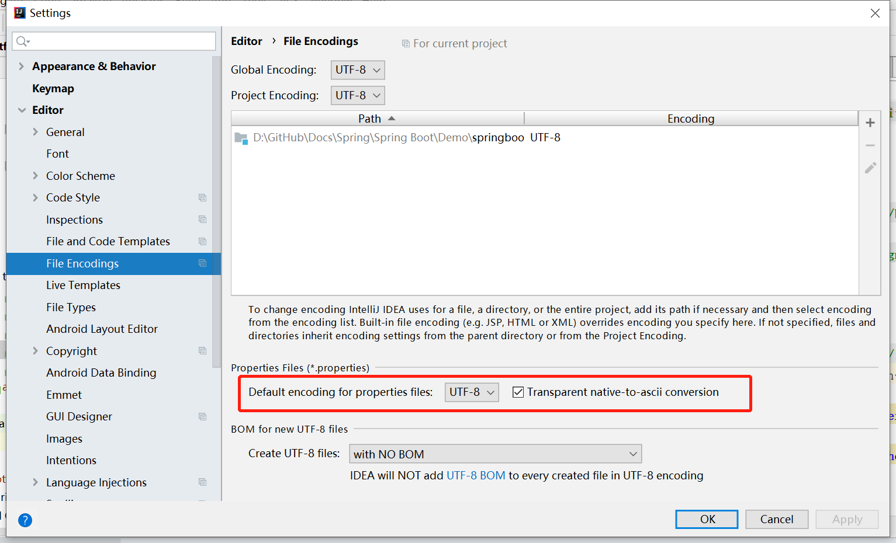
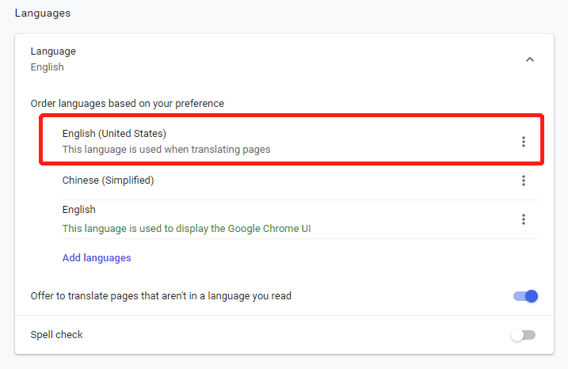

### 1.国际化时由于编码问题出现乱码

现象：中文出现乱码

原因：配置文件的编码设置有问题

处理：修改项目的File Encodings,如下



### 2. 国际化时由于版本问题出现乱码

现象：


原因：我的容器中，没有messagesource bean，也就是说，在给容器自动配置的过程中，没有引进messages class，所以无法调用其中的数据了。最后发现其实是版本库问题。

处理：将spring-boot-starter-parent的版本从1.5.9.RELEASE改为1.5.10.RELEASE

```xml
    <parent>
        <groupId>org.springframework.boot</groupId>
        <artifactId>spring-boot-starter-parent</artifactId>
        <version>1.5.10.RELEASE</version>
    </parent>
```


### 3.国际化时改变浏览器语言后页面的语言没有反应

现象：中文页面正常显示，但是当浏览器切换语言为英语，页面还是显示中文

原因：项目的国际化配置文件包括login.properties、login_en_US.properties和login_zh_CN.properties，浏览器选择的英语不是美国英语，导致不匹配

处理：添加美国英语

