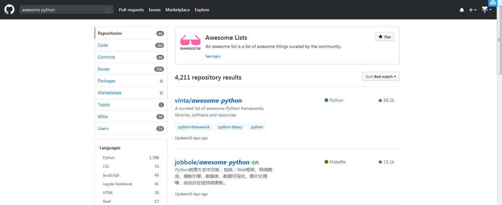
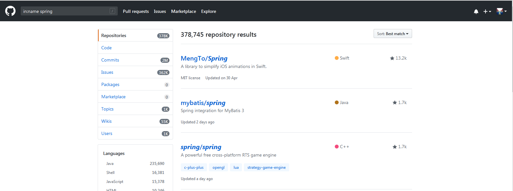
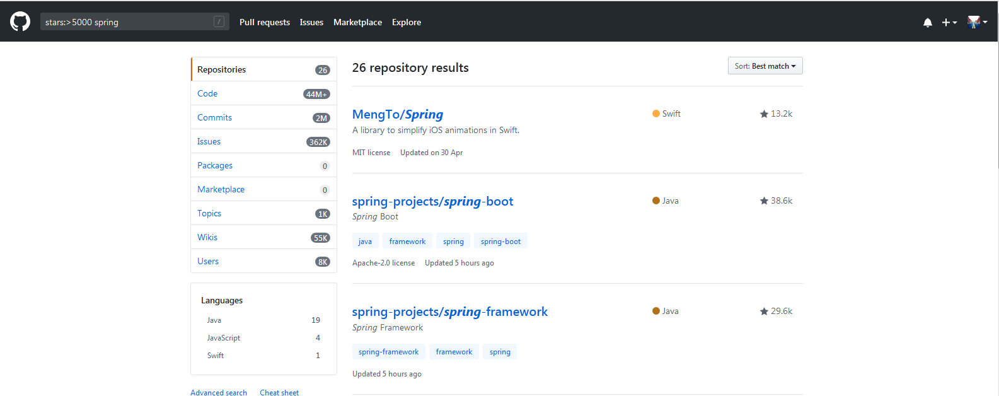
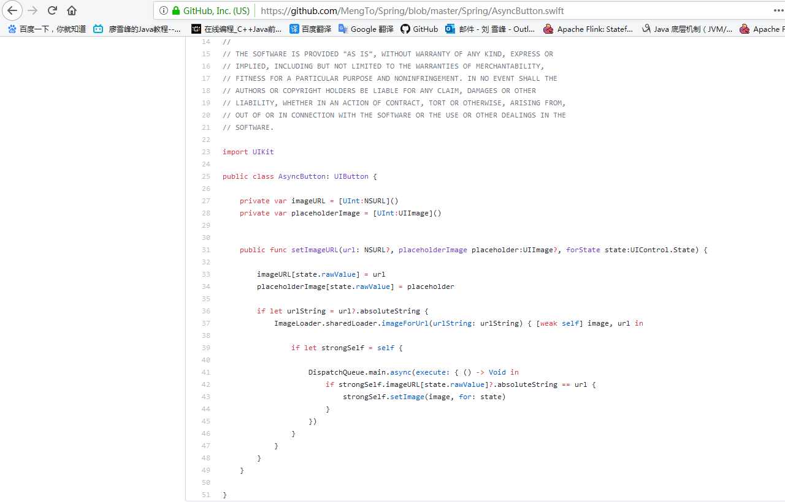
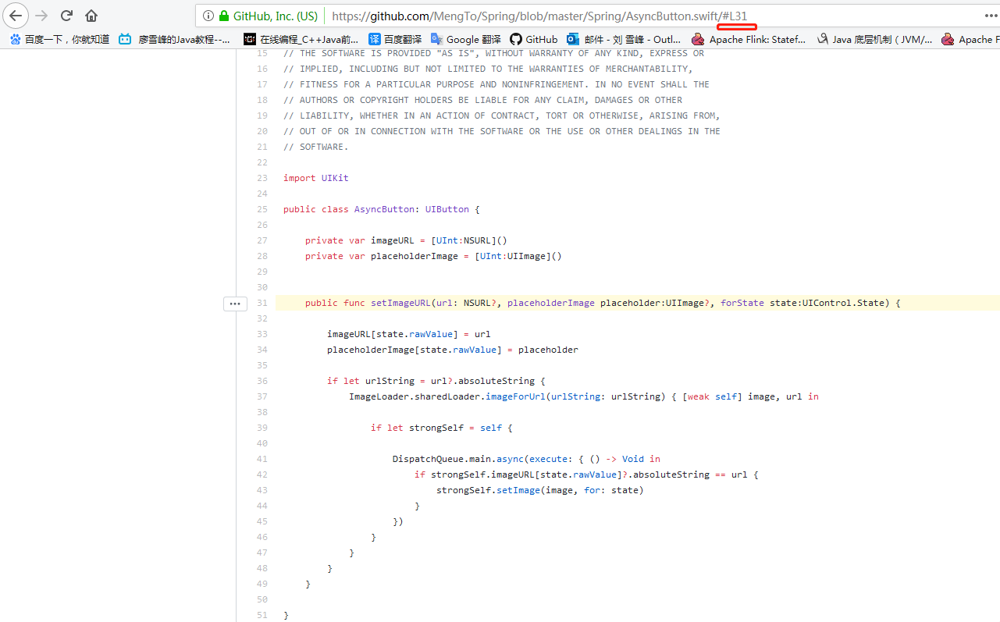
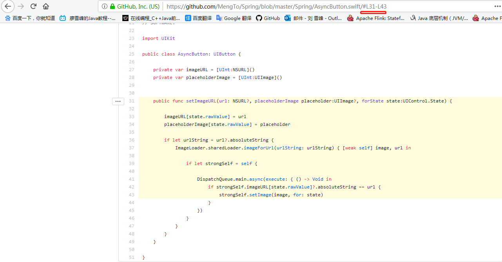
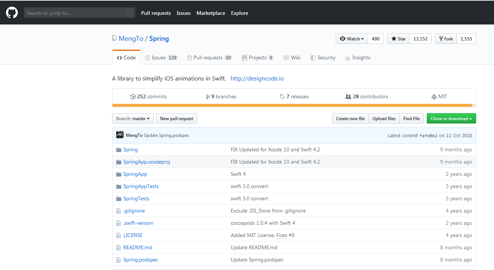
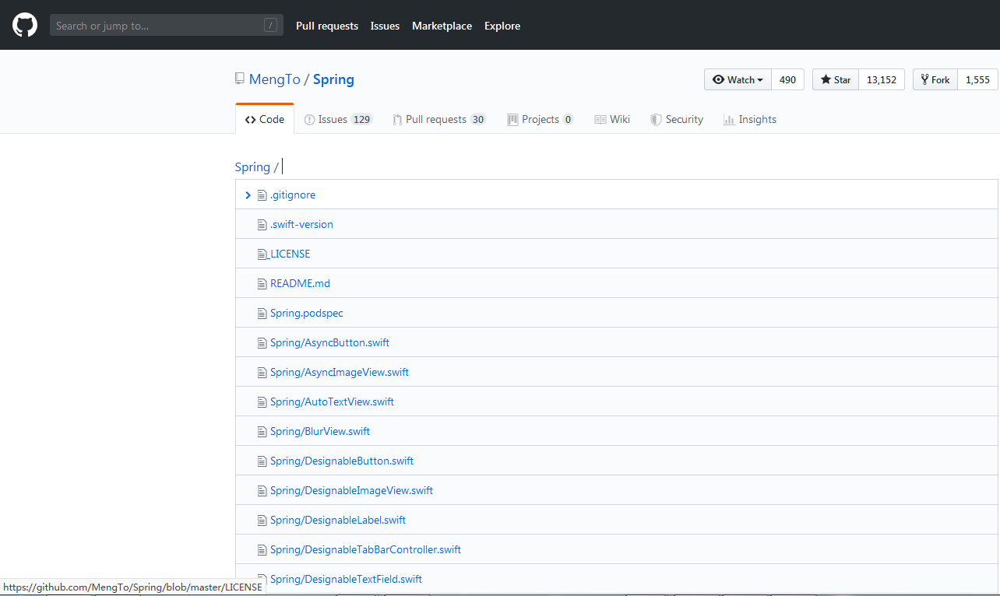

# Github骚操作

### awesome

- 作用：神奇的awesome项目，往往整合了大量的同一领域的资料，让大家可以更好的学习。

- 用法：awesome 关键字

- 效果：

### in

- 作用：明确搜索仓库标题、仓库描述、README

- 用法：

  - in:name 关键字

    仓库名称包含关键字

  - in:description 关键字

    仓库描述包含关键字

  - in:readme 关键字

    仓库README文件包含关键字

  - 也可组合使用   in:name,description,readme 关键字

    仓库名称或描述或README文件包含关键字

- 效果：

  

###  stars、forks

- 作用：一个项目 star 数的或 fork 数多少，一般代表该项目有受欢迎程度，可以查找通过限制star数或fork数来缩小搜索范围

- 用法：

  - stars:>=数字  关键字
  
  - stars:>数字  关键字
  
  - stars:数字1..数字2  关键字
  
  - forks用法与stars相同
  
  - 组合使用示例：stars:>5000 forks:>2000 spring

- 效果：

  

### #L数字

- 作用：高亮显示Github某个仓库某一行或某几行代码

- 用法：
  - 一行：地址+#L行号
  
  - 多行：地址+#L起始行号-L结束行号

- 效果：

  - 打开一个源文件

  

  - 高亮显示1行

    

  - 高亮显示多行

    

### T

- 作用：便捷地查看源文件

- 用法：进入某个仓库，按下t，会显示文件列表

- 效果：进入一个仓库

  - 

  - 按下t

    