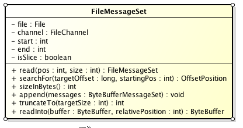
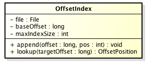
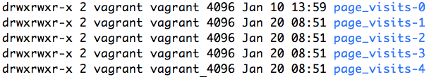
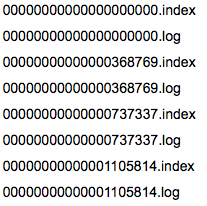
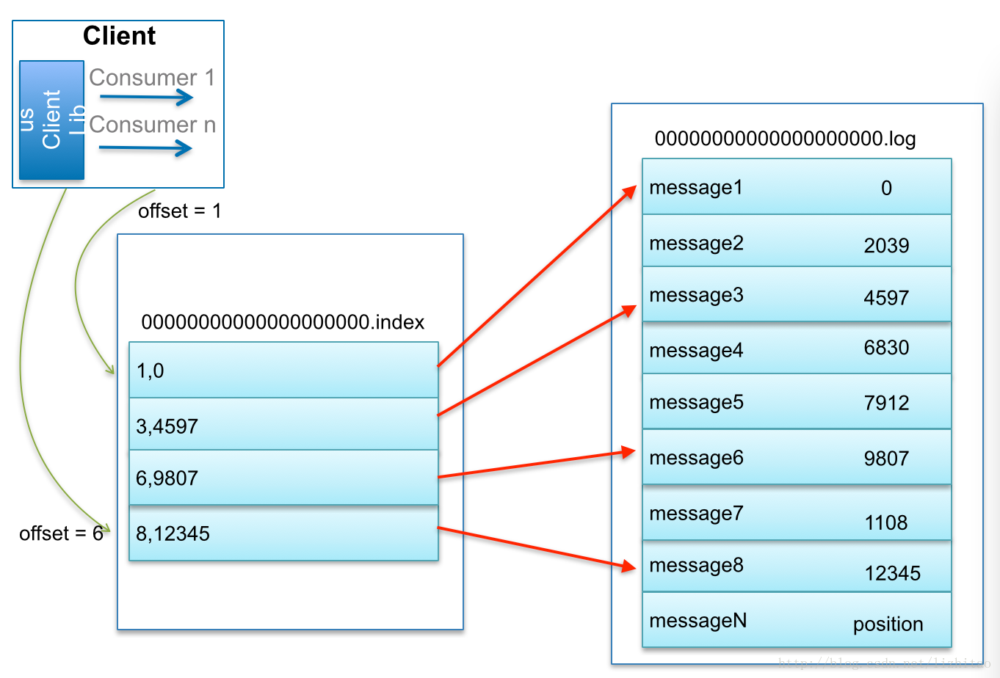

# kafka的log存储解析——topic的分区partition分段segment以及索引等

### 转自

http://blog.csdn.net/jewes/article/details/42970799

### 引言

Kafka中的Message是以topic为基本单位组织的，不同的topic之间是相互独立的。每个topic又可以分成几个不同的partition(每个topic有几个partition是在创建topic时指定的)，每个partition存储一部分Message。借用官方的一张图，可以直观地看到topic和partition的关系。

partition是以文件的形式存储在文件系统中，比如，创建了一个名为page_visits的topic，其有5个partition，那么在Kafka的数据目录中(由配置文件中的log.dirs指定的)中就有这样5个目录:  page_visits-0，  page_visits-1，page_visits-2，page_visits-3，page_visits-4，其命名规则为<topic_name>-<partition_id>，里面存储的分别就是这5个partition的数据。

接下来，本文将分析partition目录中的文件的存储格式和相关的代码所在的位置。

## Partition的数据文件

Partition中的每条Message由offset来表示它在这个partition中的偏移量，这个offset不是该Message在partition数据文件中的实际存储位置，而是逻辑上一个值，它唯一确定了partition中的一条Message。因此，可以认为offset是partition中Message的id。partition中的每条Message包含了以下三个属性：

- offset
- MessageSize
- data

其中offset为long型，MessageSize为int32，表示data有多大，data为message的具体内容。它的格式和[Kafka通讯协议](http://blog.csdn.net/jewes/article/details/42744855)中介绍的MessageSet格式是一致。

Partition的数据文件则包含了若干条上述格式的Message，按offset由小到大排列在一起。它的实现类为FileMessageSet，类图如下：

它的主要方法如下：

- append: 把给定的ByteBufferMessageSet中的Message写入到这个数据文件中。

- searchFor:  从指定的startingPosition开始搜索找到第一个Message其offset是大于或者等于指定的offset，并返回其在文件中的位置Position。它的实现方式是从startingPosition开始读取12个字节，分别是当前MessageSet的offset和size。如果当前offset小于指定的offset，那么将position向后移动LogOverHead+MessageSize（其中LogOverHead为offset+messagesize，为12个字节）。

- read：准确名字应该是slice，它截取其中一部分返回一个新的FileMessageSet。它不保证截取的位置数据的完整性。

- sizeInBytes: 表示这个FileMessageSet占有了多少字节的空间。

- truncateTo: 把这个文件截断，这个方法不保证截断位置的Message的完整性。

- readInto: 从指定的相对位置开始把文件的内容读取到对应的ByteBuffer中。

我们来思考一下，如果一个partition只有一个数据文件会怎么样？

1. 新数据是添加在文件末尾（调用FileMessageSet的append方法），不论文件数据文件有多大，这个操作永远都是O(1)的。

2. 查找某个offset的Message（调用FileMessageSet的searchFor方法）是顺序查找的。因此，如果数据文件很大的话，查找的效率就低。

那Kafka是如何解决查找效率的的问题呢？有两大法宝：1) 分段 2) 索引。

### 数据文件的分段

Kafka解决查询效率的手段之一是将数据文件分段，比如有100条Message，它们的offset是从0到99。假设将数据文件分成5段，第一段为0-19，第二段为20-39，以此类推，每段放在一个单独的数据文件里面，数据文件以该段中最小的offset命名。这样在查找指定offset的Message的时候，用二分查找就可以定位到该Message在哪个段中。

### 为数据文件建索引

数据文件分段使得可以在一个较小的数据文件中查找对应offset的Message了，但是这依然需要顺序扫描才能找到对应offset的Message。为了进一步提高查找的效率，Kafka为每个分段后的数据文件建立了索引文件，文件名与数据文件的名字是一样的，只是文件扩展名为.index。

索引文件中包含若干个索引条目，每个条目表示数据文件中一条Message的索引。索引包含两个部分（均为4个字节的数字），分别为相对offset和position。

- 相对offset（long）：因为数据文件分段以后，每个数据文件的起始offset不为0，相对offset表示这条Message相对于其所属数据文件中最小的offset的大小。举例，分段后的一个数据文件的offset是从20开始，那么offset为25的Message在index文件中的相对offset就是25-20  = 5。存储相对offset可以减小索引文件占用的空间。

- position（int），表示该条Message在数据文件中的绝对位置。只要打开文件并移动文件指针到这个position就可以读取对应的Message了。

index文件中并没有为数据文件中的每条Message建立索引，而是采用了稀疏存储的方式，每隔一定字节的数据建立一条索引。这样避免了索引文件占用过多的空间，从而可以将索引文件保留在内存中。但缺点是没有建立索引的Message也不能一次定位到其在数据文件的位置，从而需要做一次顺序扫描，但是这次顺序扫描的范围就很小了。

在Kafka中，索引文件的实现类为OffsetIndex，它的类图如下：

主要的方法有：

- append方法，添加一对offset和position到index文件中，这里的offset将会被转成相对的offset。

- lookup, 用二分查找的方式去查找小于或等于给定offset的最大的那个offset（因为每一个索引条目大小相等，整个索引文件内容可以认为是一个数组，可以做到随机读取，所以才可以用二分查找）

## 小结

我们以几张图来总结一下Message是如何在Kafka中存储的，以及如何查找指定offset的Message的。

Message是按照topic来组织，每个topic可以分成多个的partition，比如：有5个partition的名为为page_visits的topic的目录结构为：

partition是分段的，每个段叫LogSegment，包括了一个数据文件和一个索引文件，下图是某个partition目录下的文件：

可以看到，这个partition有4个LogSegment。

借用博主[@lizhitao](http://blog.csdn.net/lizhitao/)博客上的一张图来展示是如何查找Message的。

比如：要查找绝对offset为7的Message：

1. 首先是用二分查找确定它是在哪个LogSegment中，自然是在第一个Segment中。

2. 打开这个Segment的index文件，也是用二分查找找到offset小于或者等于指定offset的索引条目中最大的那个offset。自然offset为6的那个索引是我们要找的，通过索引文件我们知道offset为6的Message在数据文件中的位置为9807。

3. 打开数据文件，从位置为9807的那个地方开始顺序扫描直到找到offset为7的那条Message。

这套机制是建立在offset是有序的。索引文件被映射到内存中，所以查找的速度还是很快的。

一句话，Kafka的Message存储采用了分区(partition)，分段(LogSegment)和稀疏索引这几个手段来达到了高效性。