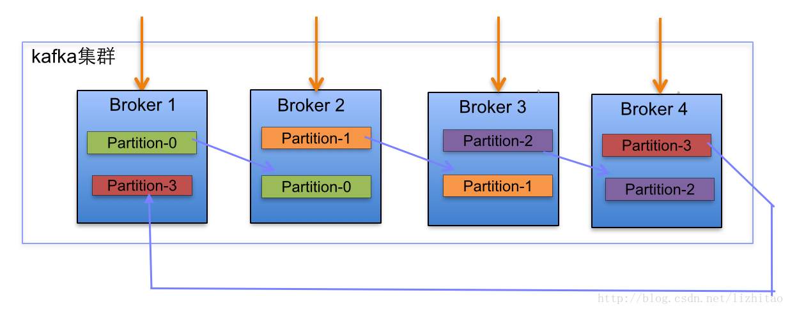
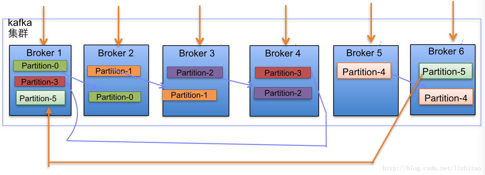

# Kafka集群partitions/replicas默认分配解析

#### Kafka集群partition replication默认自动分配分析

- 下面以一个Kafka集群中4个Broker举例，创建1个topic包含4个Partition，2 Replication；数据Producer流动如图所示：

  

- 当集群中新增2节点，Partition增加到6个时分布情况如下：

### 副本分配逻辑规则如下：

- 在Kafka集群中，每个Broker都有均等分配Partition的Leader机会。

- 上述图Broker Partition中，箭头指向为副本，以Partition-0为例:broker1中parition-0为Leader，Broker2中Partition-0为副本。

- 上述图中每个Broker(按照BrokerId有序)依次分配主Partition,下一个Broker为副本，如此循环迭代分配，多副本都遵循此规则。

### 副本分配算法如下：

- 将所有N Broker和待分配的i个Partition排序

- 将第i个Partition分配到第(i mod n)个Broker上

- 将第i个Partition的第j个副本分配到第((i + j) mod n)个Broker上.

---------------------
作者：幽灵之使 
来源：CSDN 
原文：https://blog.csdn.net/lizhitao/article/details/41778193 
版权声明：本文为博主原创文章，转载请附上博文链接！