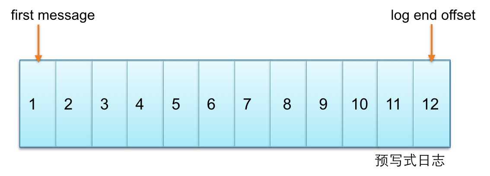
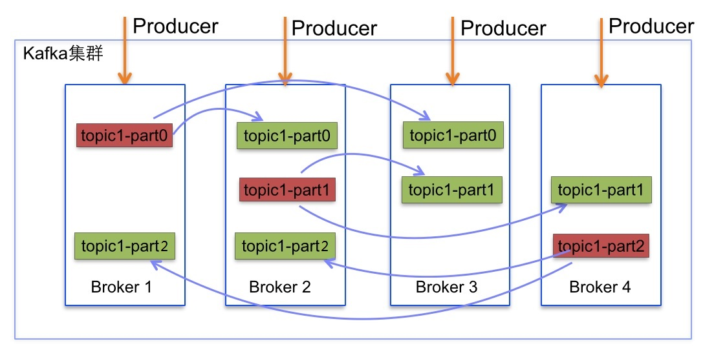
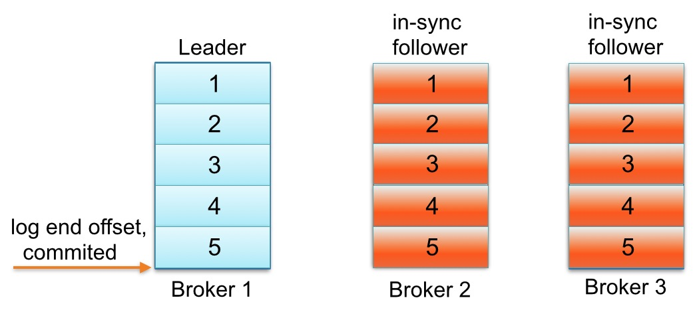
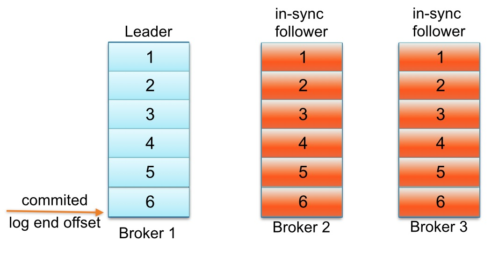
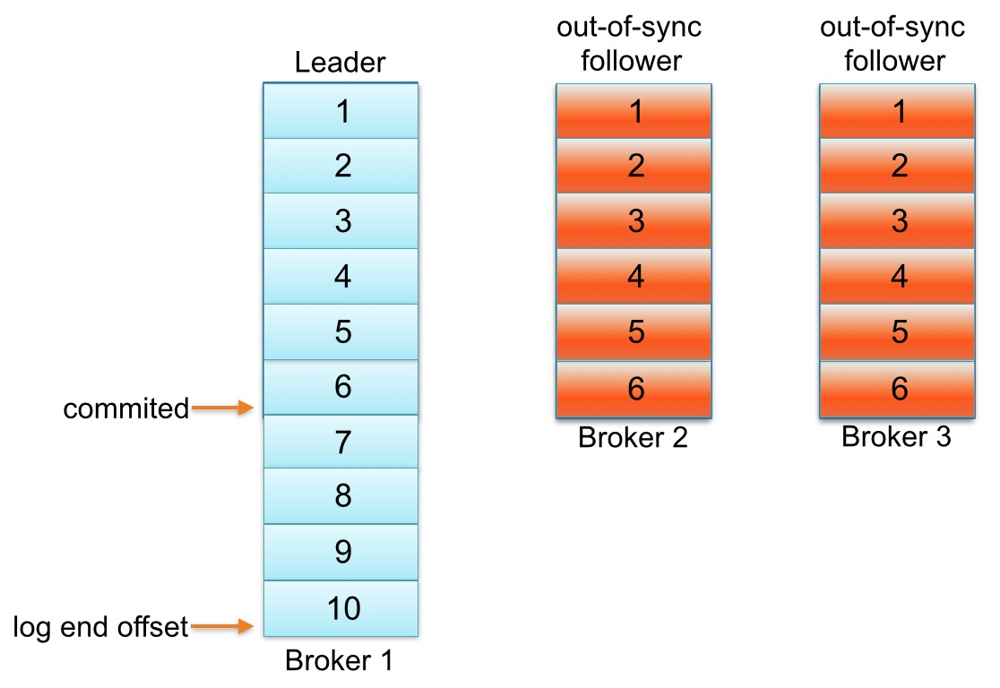
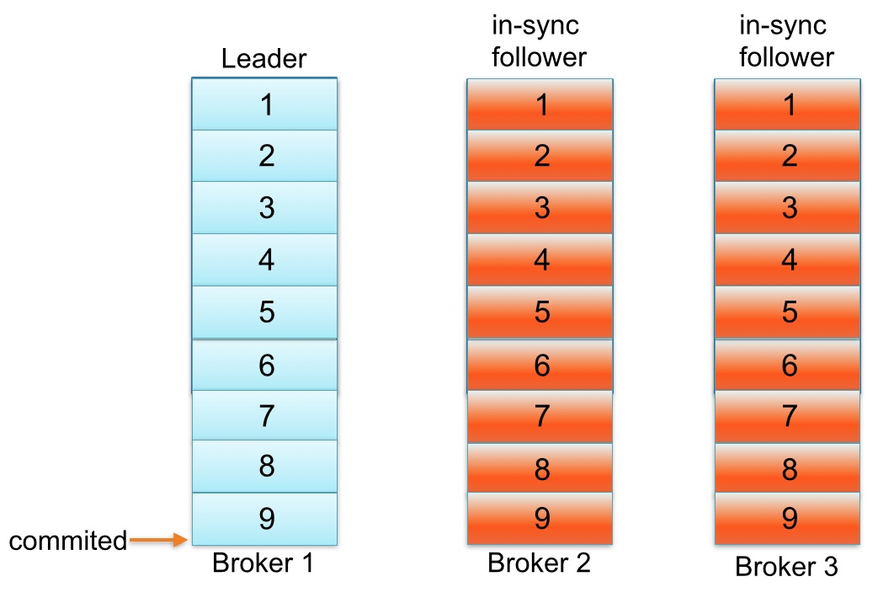

# Kafka副本同步机制理解

### 前言

Apache Kafka的流行归功于它设计和操作简单、存储系统高效、充分利用磁盘顺序读写等特性、非常适合在线日志收集等高吞吐场景。

Apache Kafka特性之一是它的复制协议。对于单个集群中每个Broker不同工作负载情况下，如何自动调优Kafka副本的工作方式是比较有挑战的。它的挑战之一是要知道如何避免follower进入和退出同步副本列表(即ISR)。从用户的角度来看，如果生产者发送一大批海量消息，可能会引起Kafka Broker很多警告。这些警报表明一些topics处于“under replicated”状态，即，这些副本处于同步失败或失效状态，更意味着数据没有被复制到足够数量Broker从而增加数据丢失的概率。因此Kafka集群中处于“under replicated”中Partition数要密切监控。这个警告应该来自于Broker失效,减慢或暂停等状态，而不是生产者写不同大小消息引起的。在这篇文章中,我将讨论这种问题的根源以及我们如何修复它。

关键信息——根据使用经验和运行环境配置相关参数，不要靠猜测。

### Kafka副本

Kafka中主题的每个Partition有一个预写式日志文件，每个Partition都由一系列有序的、不可变的消息组成，这些消息被连续的追加到Partition中，Partition中的每个消息都有一个连续的序列号叫做offset, 确定它在分区日志中唯一的位置。 

Kafka每个topic的partition有N个副本，其中N是topic的复制因子。Kafka通过多副本机制实现故障自动转移，当Kafka集群中一个Broker失效情况下仍然保证服务可用。在Kafka中发生复制时确保partition的预写式日志有序地写到其他节点上。N个replicas中。其中一个replica为leader，其他都为follower，leader处理partition的所有读写请求，与此同时，follower会被动定期地去复制leader上的数据。 

Kafka必须提供数据复制算法保证，如果leader发生故障或挂掉，Kafka确保从ISR（同步副本列表）中选举一个同步最快的副本为leader，新leader将接受客户端的读写请求。通常情况下，leader接受producer消息并写入，follower定期从leader拉取数据，直到ISR中的副本都写入成功，最新的消息提交成功。leader负责维护和跟踪ISR中所有follower滞后状态。消息复制延迟受最慢的follower限制,重要的是快速检测慢副本,如果follower”落后”太多或者失效,leader将会把它从replicas从ISR移除。

### partition的follower追上leader含义

Kafka中每个partition的follower没有“赶上”leader的日志可能会从同步副本列表中移除。下面用一个例子解释一下“追赶”到底是什么意思。请看一个例子：主题名称为foo  1 partition 3 replicas。假如partition的replication分布在Brokers 1、2和3上，并且Broker 3消息已经成功提交。同步副本列表中1为leader、2和3为follower。假设replica.lag.max.messages设置为4，表明只要follower落后leader不超过3，就不会从同步副本列表中移除。replica.lag.time.max设置为500 ms，表明只要follower向leader发送fetch请求时间间隔不超过500 ms，就不会被标记为死亡,也不会从同步副本列中移除。

 

下面看看，生产者发送下一条消息写入leader，与此同时follower Broker 3 GC暂停，如下图所示: 

直到follower Broker 3从同步副本列表中移除或追赶上log end offset，最新的消息才会认为提交。注意,因为follower Broker 3小于replica.lag.max.messages= 4落后于leader Broker 1，Kafka不会从同步副本列表中移除。在这种情况下,这意味着follower Broker 3需要迎头追赶上知道offset = 6,如果是,那么它完全“赶上” leader Broker 1 log end offset。让我们假设代理3出来的GC暂停在100 ms和追赶上领袖的日志结束偏移量。在这种状态下，下面partition日志会看起来像这样 

是什么原因导致分区的副本与leader不同步
一个副本可以不同步Leader有如下几个原因
慢副本：在一定周期时间内follower不能追赶上leader。最常见的原因之一是I / O瓶颈导致follower追加复制消息速度慢于从leader拉取速度。
卡住副本：在一定周期时间内follower停止从leader拉取请求。follower replica卡住了是由于GC暂停或follower失效或死亡。
新启动副本：当用户给主题增加副本因子时，新的follower不在同步副本列表中，直到他们完全赶上了leader日志。
一个partition的follower落后于leader足够多时，被认为不在同步副本列表或处于滞后状态。在Kafka-0.8.2.x中,副本滞后判断依据是副本落后于leader最大消息数量(replica.lag.max.messages)或replicas响应partition leader的最长等待时间(replica.lag.time.max.ms)。前者是用来检测缓慢的副本,而后者是用来检测失效或死亡的副本

如何确定副本是滞后的
这个模型检测不同步卡住副本列表工作下所有情况都适用。它追踪follower replica时间内没有向leader发送拉取请求,表明它已经死了。另一方面,如果均匀流量模式情况下，为一个主题或多个主题设置这些参数检测模型不同步慢副本列表消息的数量会工作很好,但我们发现生产环境中它不扩展到所有主题各种工作负载。

接着上面的例子,如果主题foo获取数据速率2 msg/sec，leader单次批量接收一般不会超过3条消息,然后你知道主题参数replica.lag.max.messages设置为4。为什么?因为follower replica从leader复制消息前，已经有大批量消息写leader，follower replica落后于leader不超过3条消息 。另一方面，如果主题foo的follower replica初始落后于leader持续超过3消息,leader会从同步副本列表中移除慢副本，避免消息写延迟增加。

这本质上是replica.lag.max.messages的目标。能够检测follower与leader不一致且从同步副本列表移除。然而,主题在流量高峰期发送了一批消息(4条消息),等于replica.lag.max.messages = 4配置值。在那一瞬间,2个follower replica将被认为是”out-of-sync”并且leader会从同步副本列表中移除。 

2个follower replica都是活着,下次拉取请求他们会赶上leader log end offset并重新加入同步副本列表。重复相同的过程，如果生产者继续发送相对一批较大消息到leader。这种情况演示了当follower replica频繁在从同步副本列表移除和重新加入同步副本列表之间来回切换时，不必要触发虚假警报。 

参数replica.lag.max.messages指向核心问题。它的配置值根据队列流量大小和集群一般负载情况做出判断并设置一个合适值!

副本配置规则
笔者认为真正重要的事情是检测卡或慢副本,这段时间follower replica是“out-of-sync”落后于leader。在服务端现在只有一个参数需要配置replica.lag.time.max.ms。这个参数解释replicas响应partition leader的最长等待时间。检测卡住或失败副本的探测——如果一个replica失败导致发送拉取请求时间间隔超过replica.lag.time.max.ms。Kafka会认为此replica已经死亡会从同步副本列表从移除。检测慢副本机制发生了变化——如果一个replica开始落后leader超过replica.lag.time.max.ms。Kafka会认为太缓慢并且会从同步副本列表中移除。除非replica请求leader时间间隔大于replica.lag.time.max.ms，因此即使leader使流量激增和大批量写消息。Kafka也不会从同步副本列表从移除该副本。
--------------------- 
作者：幽灵之使 
来源：CSDN 
原文：https://blog.csdn.net/lizhitao/article/details/51718185 
版权声明：本文为博主原创文章，转载请附上博文链接！