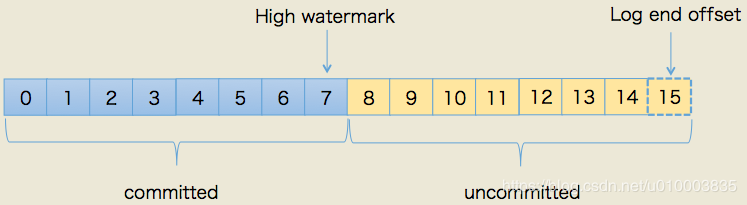
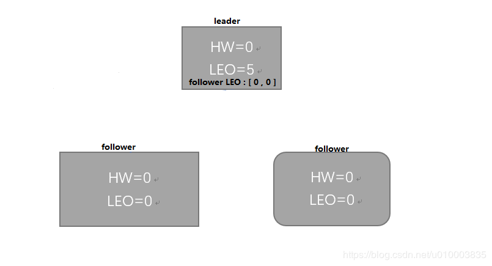
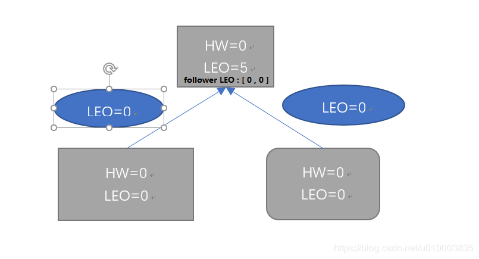
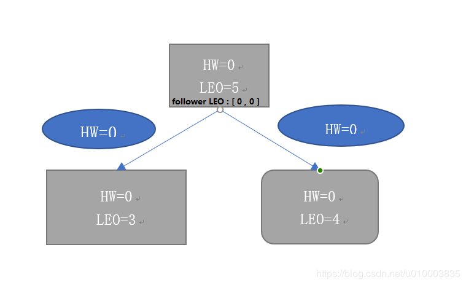
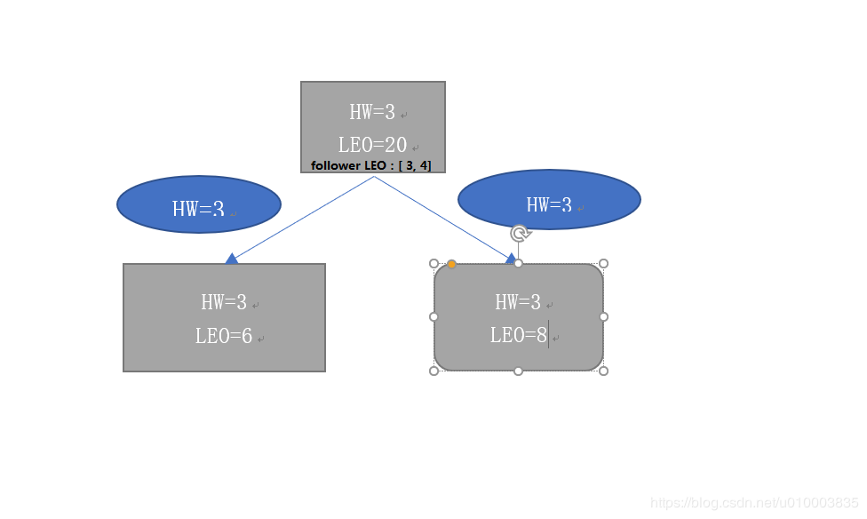

# kafka副本同步机制

### 1 副本相关概念

#### AR

AR ( Assigned Replicas) : 分区中所有的副本都称为 AR

#### ISR

ISR (In-Sync-Replicas) : ISR 是 AR 集合中的一个子集。 ISR 描述的是各个分区的与主 Leader 保持同步的 Follower.

**注意**： 我们这里要知道什么是保持同步的Follower

**在Kafka 较为低的版本（Kafka 0.9.*）有两个参数影响 ISR 的判断**：

- ~~replica.lag.max.messages   默认为 4000 （废弃）~~

  - 参数解释：如果 replica 节点落后 leader 节点此值大小的消息数量，leader节点就会将其从ISR中移除
  
  - 废弃原因：由于4000 是一个经验值，对于大的流量，反而会显得比较小。而对于小的流量，QPS 为 50 record/ s ，这个参数值又显得不够合理，故该值被废弃掉

- replica.lag.time.max.ms  默认为 10000 单位 ms

  - 参数解释： 在此窗口时间内没有收到 follower的 fetch请求，leader 会将其从 ISR(in-sync replicas)中移除。

**副本不同步的异常情况：**

- 慢副本：在一定周期时间内follower不能追赶上leader。最常见的原因之一是I / O瓶颈导致follower追加复制消息速度慢于从leader拉取速度。

- 卡住副本：在一定周期时间内follower停止从leader拉取消息。follower replica卡住了是由于GC暂停或follower失效或死亡。

- 新启动副本：当用户给主题增加副本因子时，新的follower不在同步副本列表中，直到他们完全赶上了leader日志。

#### OSR

OSR 指的是 （Out-of-sync Replicas）, 与Leader 滞后过多的副本会被放到OSR列表中。如何判断滞后，请参考之前的ISR，还有，当用户给主题增加副本因子时，新的follower刚启动时也在OSR

我们知道了 AR, ISR , OSR 的概念，那么3者之间有什么关系呢？ 

AR = ISR + OSR

#### HW

HW 是 High Watermark 的缩写，俗称高水位，水印，它标识了一个特定的消息偏移量（Offset ）,消费者只能拉取到这个 Offset 之前的消息。这样就保证了如果leader所在的broker失效，该消息仍然可以从新选举的leader中获取。对于来自内部broKer的读取请求，没有HW的限制。

**注意** ： HW 标识的是已经确认的消息的下一条消息。

#### LEO

LEO 是 Log End Offset 的缩写， 它标识了当前日志文件中 下一条待写入消息的 Offset .

**注意** ：LEO 标识的是下一条待写入消息的 Offset

 

### 2 副本在集群中的分布

Kafka每个topic的partition有N个副本，其中N是topic的复制因子。Kafka通过多副本机制实现故障自动转移，当Kafka集群中一个Broker失效情况下仍然保证服务可用。在Kafka中发生复制时确保partition的预写式日志有序地写到其他节点上。N个replicas中，其中一个replica为leader，其他都为follower，leader处理partition的所有读写请求，与此同时，follower会被动定期地去复制leader上的数据。

如下图所示，Kafka集群中有4个broker, 某topic有3个partition,且复制因子即副本个数也为3：

 

Kafka提供了数据复制算法保证，如果leader发生故障或挂掉，Kafka确保从同步副本列表中选举一个副本为leader，新leader负责客户端的消息读取和写入。leader负责维护和跟踪同步副本列表中所有follower滞后的状态。当producer发送一条消息到broker后，leader写入消息并复制到所有follower。消息复制延迟受最慢的follower限制，重要的是快速检测慢副本，如果follower“落后”太多或者失效，leader将会把它从ISR中删除。

Kafka的复制机制既不是完全的同步复制，也不是单纯的异步复制。事实上，同步复制要求所有能工作的follower都复制完，这条消息才会被commit，这种复制方式极大的影响了吞吐率。而异步复制方式下，follower异步的从leader复制数据，数据只要被leader写入log就被认为已经commit，这种情况下如果follower都还没有复制完，落后于leader时，突然leader宕机，则会丢失数据。而Kafka的这种使用ISR的方式则很好的均衡了确保数据不丢失以及吞吐率。

Kafka的ISR的管理最终都会反馈到Zookeeper节点上。具体位置为：/brokers/topics/[topic]/partitions/[partition]/state。目前有两个地方会对这个Zookeeper的节点进行维护：

- Controller来维护：Kafka集群中的其中一个Broker会被选举为Controller，主要负责Partition管理和副本状态管理，也会执行类似于重分配partition之类的管理任务。在符合某些特定条件下，Controller下的LeaderSelector会选举新的leader，ISR和新的leader_epoch及controller_epoch写入Zookeeper的相关节点中。同时发起LeaderAndIsrRequest通知所有的replicas。

- leader来维护：leader有单独的线程定期检测ISR中follower是否脱离ISR, 如果发现ISR变化，则会将新的ISR的信息反馈到Zookeeper的相关节点中。

### 3  LEO和HW 什么时候会被更新

Kafka有两套follower副本LEO：

- 一套LEO保存在follower副本所在broker的副本管理机中；

- 另一套LEO保存在leader副本所在broker的副本管理机中——换句话说，leader副本机器上保存了所有的follower副本的LEO。

#### LEO的更新

1. leader副本LEO何时更新？

  leader写log时就会自动地更新它自己的LEO值。

2. follower端的follower副本LEO何时更新？

 follower端的follower副本LEO值就是其底层日志的LEO值，也就是说每当新写入一条消息，其LEO值就会被更新(类似于LEO += 1)。当follower发送FETCH请求后，leader将数据返回给follower，此时follower开始向底层log写数据，从而自动地更新LEO值

3. leader端的follower副本LEO何时更新？

  leader副本端的follower副本LEO的更新发生在leader在处理follower FETCH请求时。一旦leader接收到follower发送的FETCH请求，它首先会从自己的log中读取相应的数据，但是在给follower返回数据之前，它先去更新follower副本的LEO(即上面所说的第二套LEO)

#### HW 的更新

1. leader副本何时更新HW值？

前面说过了，leader的HW值就是分区HW值，因此何时更新这个值是我们最关心的，因为它直接影响了分区数据对于consumer的可见性 。以下4种情况下leader会尝试去更新分区HW——切记是尝试，有可能因为不满足条件而不做任何更新：

- 副本成为leader副本时：当某个副本成为了分区的leader副本，Kafka会尝试去更新分区HW。这是显而易见的道理，毕竟分区leader发生了变更，这个副本的状态是一定要检查的！不过，本文讨论的是当系统稳定后且正常工作时备份机制可能出现的问题，故这个条件不在我们的讨论之列。

- broker出现崩溃导致副本被踢出ISR时：若有broker崩溃则必须查看下是否会波及此分区，因此检查下分区HW值是否需要更新是有必要的。本文不对这种情况做深入讨论

- producer向leader副本写入消息时：因为写入消息会更新leader的LEO，故有必要再查看下HW值是否也需要修改

- leader处理follower FETCH请求时：当leader处理follower的FETCH请求时首先会从底层的log读取数据，之后会尝试更新分区HW值

特别注意上面4个条件中的最后两个。它揭示了一个事实——当Kafka broker都正常工作时，分区HW值的更新时机有两个：leader处理PRODUCE请求时和leader处理FETCH请求时。另外，leader是如何更新它的HW值的呢？前面说过了，leader broker上保存了一套follower副本的LEO以及它自己的LEO。当尝试确定分区HW时，它会选出所有满足条件的副本，比较它们的LEO(当然也包括leader自己的LEO)，并选择最小的LEO值作为HW值。这里的满足条件主要是指副本要满足以下两个条件之一：

   - 处于ISR中
   - 副本LEO落后于leader LEO的时长不大于replica.lag.time.max.ms参数值(默认是10s)

2. follower副本何时更新HW？

follower更新HW发生在其更新LEO之后，一旦follower向log写完数据，它会尝试更新它自己的HW值。具体算法就是比较当前LEO值与FETCH响应中leader的HW值，取两者的小者作为新的HW值。这告诉我们一个事实：如果follower的LEO值超过了leader的HW值，那么follower HW值是不会越过leader HW值的。

### 4  对于0.11 之前版本，只有 HW , LEO 概念的 Kafka 的主从节点更新 LEO, HW 的流程

**Step1：**  生产者向Leader副本中写入消息。某一时刻，leader 副本的 LEO 增长至 5， 副本的 HW 还为0.

**Step2：**  之后 follower 副本向 Leader 副本拉取消息，在拉取的请求中会带有 自身的LEO信息，这个 LEO 信息对应的是 FetchRequest 请求中的 fetch_offset.

**step3：** Leader 副本返回给 follower 副本相应的信息，并且还带有自身的HW信息， 这个HW 信息对应的是 FetchResponse 中的 high_watermark

 

此时两个 follower 副本各自拉取到了消息，并且更新各自的LEO 为3和4. 与此同时，follower 副本还会更新自己的 HW,  更新 HW 的算法是比较当前 LEO 和 Leader 传过来的 HW 的值，取最小值作为自己的HW 值。

当前两个follower 副本的HW 都等于0 （min(LEO,0)=0 ） 

**Step4：** 接下来 follower 副本再次请求拉去 leader 副本中的消息。

​	此时Leader 副本收到来自 follower 副本的 FetchRequest 请求，其中带有 LEO 的相关信息，选取其中的最小值作为新的 HW , 即 min(15, 3, 4) =3 。然后连同消息 和 HW  一起返回 FetchResponse 给 Follower 副本。注意 Leader 副本 的HW 是一个很重要的东西，因为它直接影响了分区数据对消费者的可见性。

**Step5：** 两个Follower 副本在收到新的消息之后。更新LEO , 并且更新HW 为3 ， min(LEO, 3) = 3

 

注意： 这就是正常情况下的 LEO 与 HW 更新流程

除此之外，Leader 副本所在的节点会记录所有副本的LEO, follower 副本所在的节点只会记录自身的 LEO, 而不会记录其他副本的LEO。 对HW 而言，各个副本所在的节点 都只记录它自身的HW.

------------------
作者：高达一号 
来源：CSDN 
原文：https://blog.csdn.net/u010003835/article/details/88683871 
版权声明：本文为博主原创文章，转载请附上博文链接！

