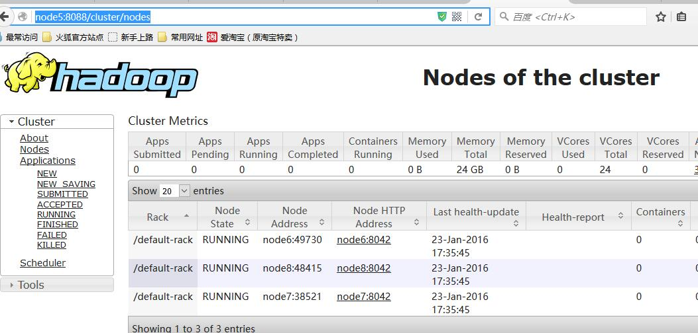
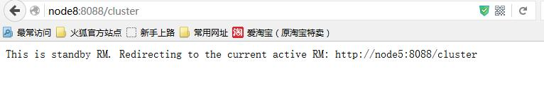

hdfs ha搭建步骤

来源：

https://www.cnblogs.com/raphael5200/p/5154325.html

**前提条件**

先搭建 http://www.cnblogs.com/raphael5200/p/5152004.html 的环境，然后在其基础上进行修改

**一、安装Zookeeper**

由于环境有限，所以在仅有的4台虚拟机上完成多个操作；

a.在4台虚拟中选3台安装Zookeeper,我选 node5 node6 node7

b.在4台虚拟中选3台作为JournalNode的节点，我选node6  node7  node8

c..在4台虚拟中选2台作为NameNode ，我选node5(Active)   node8(Standby)

**1.解压并移动**

下载并解压zookper压缩包，将zookeeper复制到/usr/local/zookeeper目录下；

**2.配置Zookeeper**


```
$ cd /usr/local/zookeeper/
$ vim /conf/zoo.cfg
#写入 
tickTime=2000
dataDir=/opt/zookeeper  #指定Zookeeper的Data目录
clientPort=2181
initLimit=5
syncLimit=2
# 3台节点
server.1=node5:2888:3888
server.2=node6:2888:3888
server.3=node7:2888:3888
```


**3.配置zookeeper的环境变量**

```
$ vim /root/.bash_profile
#写入
PATH=$PATH:/usr/local/zookeeper-3.4.6/bin
```

**4.覆盖node6 和 node7的zookeeper配置文件和.bash_profil**e

**5.创建myid**

分别在node5 node6 node7的dataDir目录中创建一个myid的文件，文件内容分别为1，2，3（即server的id）


```
Node 5:
$ vim /opt/zookeeper/myid
#写入 
1

Node 6:
$ vim /opt/zookeeper/myid
#写入 
2

Node 7:
$ vim /opt/zookeeper/myid
#写入 
3
```


 

**6.启动zookeeper**

```
$ cd /usr/local/zookeeper
$ bin/zkServer.sh start
# 显示：Starting zookeeper ... STARTED 表示启动成功
```

**二、免密码登录**

node5  node8 两台NameNode相互做免密码登录，在上一文中已经在node5上做了免密码登录，下面只在Node8上做node5的免密码登录：

```
Node8:
$ ssh-keygen -t dsa -P '' -f ~/.ssh/id_dsa
$ scp ~/.ssh/id_dsa.pub root@node5:/opt
Node5:
$ cat /opt/id_dsa.pub >> ~/.ssh/authorized_keys
```

完成以后，测试一下  node8 $: ssh node5

**三、配置HDFS  高可用**

**1.配置HDFS配置文件**


```
$ cd  /usr/local/hadoop-2.5.1/etc/hadoop
$ vi hdfs-site.xml
#写入
<configuration>
#配置NameService 名字随便起
 <property>
  <name>dfs.nameservices</name>
  <value>raphael</value>
 </property>
# 这里的最后一个名字就是上面的nameService   value是两台NameNode的节点
<property>
  <name>dfs.ha.namenodes.raphael</name>
  <value>node5,node8</value>
</property>
# node5和node8的rpc地址
<property>
  <name>dfs.namenode.rpc-address.raphael.node5</name>
  <value>node5:8020</value>
</property>
<property>
  <name>dfs.namenode.rpc-address.raphael.node8</name>
  <value>node8:8020</value>
</property>
# node5和node8的http地址
<property>
  <name>dfs.namenode.http-address.raphael.node5</name>
  <value>node5:50070</value>
</property>
<property>
  <name>dfs.namenode.http-address.raphael.node8</name>
  <value>node8:50070</value>
</property>
# 3台JournalNode地址，后台跟名字，但后面的名字不能与nameService相同
<property>
  <name>dfs.namenode.shared.edits.dir</name>
 <value>qjournal://node6:8485;node7:8485;node8:8485/raphael5200</value>
</property>
#配置客户端调用接口
<property>
  <name>dfs.client.failover.proxy.provider.raphael</name>
 <value>org.apache.hadoop.hdfs.server.namenode.ha.ConfiguredFailoverProxyProvider</value>
</property>
<property>
  <name>dfs.ha.fencing.methods</name>
  <value>sshfence</value>
</property>
<property>
  <name>dfs.ha.fencing.ssh.private-key-files</name>
  <value>/root/.ssh/id_dsa</value>
</property>
<property>
  <name>dfs.ha.fencing.methods</name>
  <value>sshfence</value>
</property>
<property>
  <name>dfs.ha.fencing.ssh.connect-timeout</name>
  <value>30000</value>
</property>
#配置journalnode目录
<property>
  <name>dfs.journalnode.edits.dir</name>
  <value>/opt/journalnode</value>
</property>
<property>
   <name>dfs.ha.automatic-failover.enabled</name>
   <value>true</value>
 </property>
```


```
$ vi core-site.xml
#这里的value就是NameService的名字
   <property>
        <name>fs.defaultFS</name>
        <value>hdfs://raphael</value>
    </property>

    <property>
        <name>hadoop.tmp.dir</name>
        <value>/opt/hadoop</value>
    </property>
#3台zookeeper节点
 <property>
   <name>ha.zookeeper.quorum</name>
   <value>node5:2181,node6:2181,node7:2181</value>
 </property>
```


a.删除node5 node6 node7 node8 etc/hadoop/masters文件(这里已经不需要standry了)

b.删除node5 node6 node7 node8 上的hadoop.tmp.dir  目录

```
$ rm -rf /opt/hadoop
```

c.将node5 配置好的文件，覆盖到node6 node7 node8

```
$ scp -r etc/hadoop/* root@node6:/usr/local/hadoop/etc/hadoop
$ scp -r etc/hadoop/* root@node7:/usr/local/hadoop/etc/hadoop
$ scp -r etc/hadoop/* root@node8:/usr/local/hadoop/etc/hadoop
```

**2.覆盖并启动**

a.启动三台JournalNode node6 node7 node8

```
# 前提是要先把zookeeper启动起来
$ sbin/hadoop-daemon.sh start journalnode
```

b.在其中一个NameNode上格式化hadoop.tmp.dir 并初始化

```
Node5:$ bin/hdfs namenode -format
```

c.把格式化后的元数据拷备到另一台NameNode节点上

```
$ scp -r /opt/hadoop root@node8:/opt/hadoop
```

d.启动NameNode

```
Node5:
$ sbin/hadoop-daemon.sh start namenode

Node8:
$ bin/hdfs namenode -bootstrapStandby
遇到选择，选择N
$ sbin/hadoop-daemon.sh start namenode
```

e.初始化zkfc

```
Node5:
$ bin/hdfs zkfc -formatZK
```

f.全面停止并全面启动

```
Node5:
$ sbin/stop-dfs.sh
$ sbin/start-dfs.sh
```

注：在启动JournalNode和其他项时，没有其他好的方法较验是否启动成功，只能查看日志文件，如果日志文件没有报错，则表示启动成功；

**3.访问NameNode**

访问两台NameNode node5和node8的50070端口，会显示一个端口是Active   另一个端口是Standby 如下图：

http://node5:50070   http://node8:50070


注：如果Node5突然挂掉了，那么node8备用的NameNode会自动的补上，替换为Active，测试方法：Kill node5 的nameNode进程，然后再刷新Node8：

```
$ jps #ps是显示当前系统进程 ，jps就是显示当前系统的java 进程
$ kill -9 进程ID  #杀掉进程
```

**四、使用Yarn来调度HDFS**

 

```
#先所有的Hadoop相关进程
$ stop-dfs.sh
```

 

**1.配置yarn-site.xml**

```
$ cd /usr/local/hadoop/
$ vim etc/hadoop/yarn-site.xml
<property>
   <name>yarn.resourcemanager.ha.enabled</name>
   <value>true</value>
 </property>
# 该cluster-id不能与nameService相同
 <property>
   <name>yarn.resourcemanager.cluster-id</name>
   <value>raphael521</value>
 </property>
#指定2台Resource Manager (即Name Node )节点
 <property>
   <name>yarn.resourcemanager.ha.rm-ids</name>
   <value>rm1,rm2</value>
 </property>
 <property>
   <name>yarn.resourcemanager.hostname.rm1</name>
   <value>node5</value>
 </property>
 <property>
   <name>yarn.resourcemanager.hostname.rm2</name>
   <value>node8</value>
 </property>
#指定zookeeper 节点
 <property>
   <name>yarn.resourcemanager.zk-address</name>
   <value>node6:2181,node7:2181,node8:2181</value>
 </property>  
 <property>
   <name>yarn.nodemanager.aux-services</name>
   <value>mapreduce_shuffle</value>
 </property>
 <!--启用自动恢复--> 
 <property>
   <name>yarn.resourcemanager.recovery.enabled</name>
   <value>true</value>
 </property>
 
 <!--指定resourcemanager的状态信息存储在zookeeper集群--> 
 <property>
   <name>yarn.resourcemanager.store.class</name>              			   	  
<value>org.apache.hadoop.yarn.server.resourcemanager.recovery.ZKRMStateStore</value>
 </property>

 </configuration>
```


**2.配置etc/hadoop/mapred-site.xml**


```
$ vim etc/hadoop/mapred-site.xml
<configuration>
    <property>
        <name>mapreduce.framework.name</name>
        <value>yarn</value>
    </property>
</configuration>
```


**3.将mapred-site.xml yarn-site.xml 覆盖到其他的节点上**

**4.启动 yarn**


```
#单独启动yarn使用命令： 
$ sbin/start-yarn.sh
#启动完成以后，另一台NameNode需要手动启动
sbin/yarn-daemon.sh start resourcemanager
```


**5.访问** 

访问yarn的端口 http://node5:8088  http://node8:8088  可以看到：



说明：当访问Node5的时候能够正常的显示界面，并且在Nodes下还能加载出集群的所有节点，但是访问node8的时候，则不会显示，而是提示页面将跳到Active的Resource Manager (RM)节点上,然后页面就跳了；

当node5突然挂掉了，zookeeper会立刻将RM切换到node8上，将node8做为Active的RM，然后在Nodes下会在几十秒内加载出所有节点；