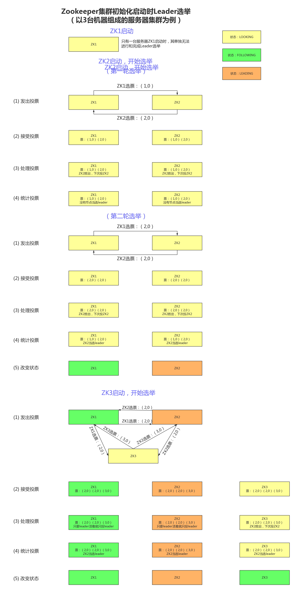

# zookeeper选举机制

>Leader选举是保证分布式数据一致性的关键所在。Leader选举分为Zookeeper集群初始化启动时选举和Zookeeper集群运行期间Leader重新选举两种情况。在讲解Leader选举前先了解一下Zookeeper节点4种可能状态和事务ID概念。

### Zookeeper节点状态

- LOOKING：寻找Leader状态，处于该状态需要进入选举流程    
- LEADING：领导者状态，处于该状态的节点说明角色已经是Leader
- FOLLOWING：跟随者状态，表示Leader已经选举出来，当前节点角色是follower    
- OBSERVER：观察者状态，表明当前节点角色是observer

### 事务ID

- ZooKeeper状态的每次变化都接收一个ZXID（Zookeeper事务id）形式的标记。ZXID是一个64位的数字，由Leader统一分配，全局唯一，不断递增。

- ZXID展示了所有的Zookeeper的变更顺序。每次变更会有一个唯一的zxid，如果zxid1小于zxid2说明zxid1在zxid2之前发生。

### Zookeeper集群初始化启动时Leader选举

> 若进行Leader选举，至少需要两台机器，这里选取3台机器组成的服务器集群为例。

初始化启动期间Leader选举流程如下图所示：

在集群初始化阶段，当有一台服务器ZK1启动时，其单独无法进行和完成Leader选举，当第二台服务器ZK2启动时，此时两台机器可以相互通信，每台机器都试图找到Leader，于是进入Leader选举过程。选举过程开始，过程如下：

  1. 每个Server发出一个投票。由于是初始情况，ZK1和ZK2都会将自己作为Leader服务器来进行投票，每次投票会包含所推举的服务器的myid和ZXID，使用(myid, ZXID)来表示，此时ZK1的投票为(1, 0)，ZK2的投票为(2, 0)，然后各自将这个投票发给集群中其他机器。

  2.  接受来自各个服务器的投票。集群的每个服务器收到投票后，首先判断该投票的有效性，如检查是否是本轮投票、是否是来自LOOKING状态的服务器。

  3.  处理投票。针对每一个投票，服务器都需要将别人的投票和自己的投票进行比较，规则如下：

     - 优先检查ZXID。ZXID比较大的服务器优先作为Leader。

     - 如果ZXID相同，那么就比较myid。myid较大的服务器作为Leader服务器。

     - 对于ZK1而言，它的投票是(1, 0)，接收ZK2的投票为(2, 0)，首先会比较两者的ZXID，均为0，再比较myid，此时ZK2的myid最大，于是ZK2胜。ZK1更新自己的投票为(2, 0)，并将投票重新发送给ZK2。

4. 统计投票。每次投票后，服务器都会统计投票信息，判断是否已经有过半机器接受到相同的投票信息，对于ZK1、ZK2而言，都统计出集群中已经有两台机器接受了(2, 0)的投票信息，此时便认为已经选出ZK2作为Leader。

5.  改变服务器状态。一旦确定了Leader，每个服务器就会更新自己的状态，如果是Follower，那么就变更为FOLLOWING，如果是Leader，就变更为LEADING。

6. 当新的Zookeeper节点ZK3启动时，再发起一次选举，处于FOLLOWING和LEADING的节点不会改变选票，它们只会投给leader，所以选举结果还是ZK2。

### Zookeeper集群运行期间Leader重新选

​	在Zookeeper运行期间，如果Leader节点挂了，那么整个Zookeeper集群将暂停对外服务，进入新一轮Leader选举。

​	假设正在运行的有ZK1、ZK2、ZK3三台服务器，当前Leader是ZK2，若某一时刻Leader挂了，此时便开始Leader选举。过程如下：

　　(1) 变更状态。Leader挂后，余下的非Observer服务器都会将自己的服务器状态变更为LOOKING，然后开始进入Leader选举过程。

　　(2) 每个Server会发出一个投票。在运行期间，每个服务器上的ZXID可能不同，此时假定ZK1的ZXID为124，ZK3的ZXID为123；在第一轮投票中，ZK1和ZK3都会投自己，产生投票(1, 124)，(3, 123)，然后各自将投票发送给集群中所有机器。

　　(3) 接收来自各个服务器的投票。与启动时过程相同。

　　(4) 处理投票。与启动时过程相同，由于ZK1事务ID大，ZK1将会成为Leader。

　　(5) 统计投票。与启动时过程相同。

　　(6) 改变服务器的状态。与启动时过程相同。

### 参考
---------------------
作者：程裕强 
来源：CSDN 
原文：https://blog.csdn.net/chengyuqiang/article/details/79190061 
版权声明：本文为博主原创文章，转载请附上博文链接！