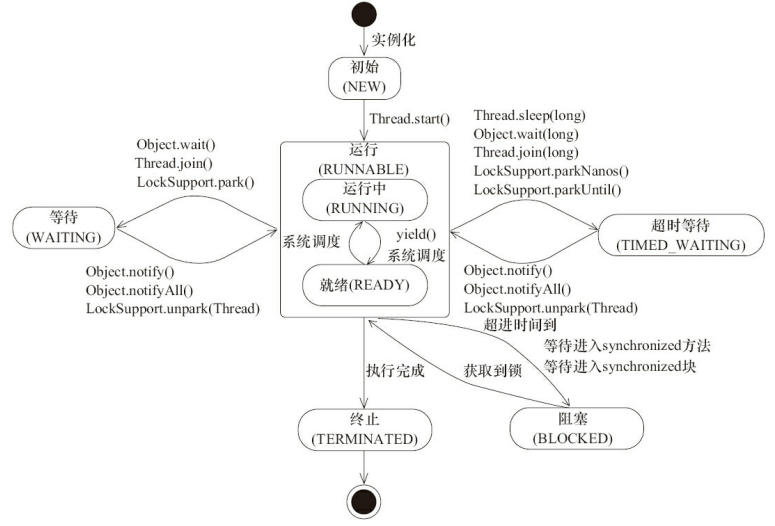

# 进程与线程的区别？

> 以java虚拟机为例

### 进程和线程

​	当我们运行一个java类（修饰符为public , 且有main方法）时，会启动一个JVM虚拟机，这个JVM虚拟机就是一个进程，操作系统需要为它分配内存资源，包括堆区和方法区，这些资源对于线程来说是共享的。

​	虚拟机启动之后，首先会执行main方法，main方法就是一个线程，称为main线程。main线程执行过程中可能会创建别的线程，比如线程A、线程B等等。操作系统也要为这些线程分配少量的内存资源，称为虚拟机栈（虚拟机栈内存有局部变量表、操作数栈，程序计数器等）。

### CPU执行过程：

CPU加载JVM进程的上下文 -----> CPU加载main线程上下文 -----> CPU执行main线程 -----> CPU保存mian线程上下文 -----> CPU加载A线程上下文 -----> CPU执行A线程 -----> CPU保存A线程上下文 -----> CPU加载B线程上下文 -----> CPU执行B线程 -----> CPU保存B线程上下文 -----> CPU保存JVM进程上下文 

### java线程的状态

### Java 线程状态变迁

