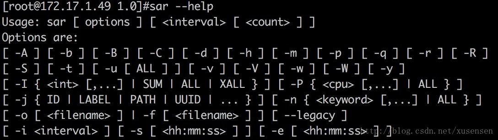
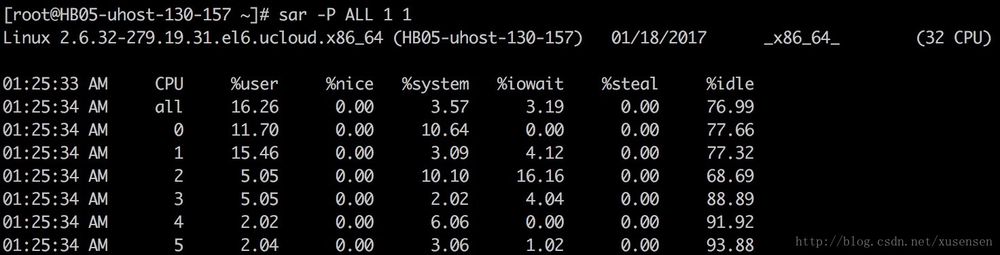
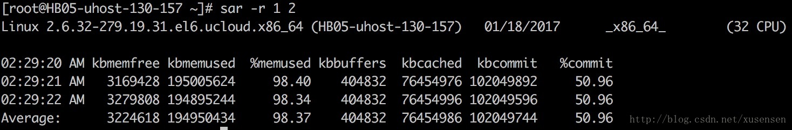
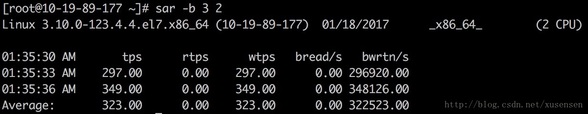
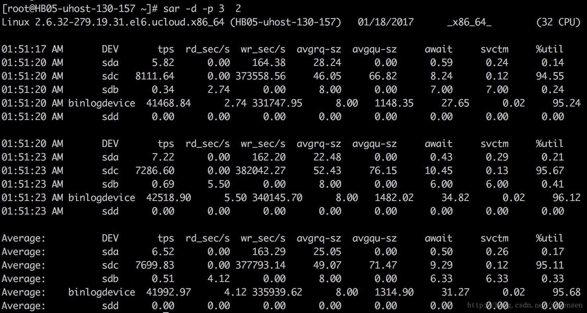
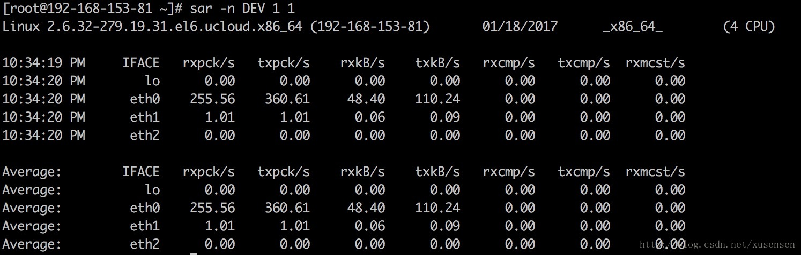

# sar简介

> sar（System Activity Reporter, 系统活动情况报告）: 是用于监控Linux系统各个性能的优秀工具，包括：文件的读写情况、系统调用的使用情况、磁盘I/O、CPU效率、内存使用状况、进程活动及IPC有关的活动等。

### sar命令常用格式
`sar [options] [interval] [count] `



其中： 
interval: 采样周期，单位是秒； 
count：采样次数，默认值是连续采样； 
options：命令行选项。

sar命令的选项很多，下面只列出常用选项： 

| 选项 | 含义                                  |
| ---- | ------------------------------------- |
| -A   | 所有报告的总和                        |
| -u   | 输出整体CPU使用情况的统计信息         |
| -v   | 输出inode、文件和其他内核表的统计信息 |
| -d   | 输出每一个块设备的活动信息            |
| -r   | 输出内存和交换空间的统计信息          |
| -b   | 显示I/O和传送速率的统计信息           |
| -a   | 文件读写情况                          |
| -c   | 输出进程统计信息，每秒创建的进程数    |
| -R   | 输出内存页面的统计信息                |
| -y   | 终端设备活动情况                      |
| -w   | 输出系统交换活动信息                  |

### sar常用性能数据分析

下文将说明如何使用sar获取以下性能分析数据： 

- 整体CPU使用统计 
- 各个CPU使用统计 
- 内存使用情况统计 
- 整体I/O情况 
- 各个I/O设备情况 
- 网络统计

### 整体CPU使用统计(-u)

使用-u选项，sar输出整体CPU的使用情况，不加选项时，默认使用的就是-u选项。以下命令显示采样时间为3s，采样次数为2次，整体CPU的使用情况： 
`sar 3 2 (或者 sar -u 3 2)`

```
[root@HB05-uhost-130-157 tmp]# sar 3 2
Linux 2.6.32-279.19.31.el6.ucloud.x86_64 (HB05-uhost-130-157)   01/17/2017  _x86_64_    (32 CPU)

11:58:50 PM     CPU     %user     %nice   %system   %iowait    %steal     %idle
11:58:53 PM     all     13.25      0.00      3.16      3.72      0.00     79.87
11:58:56 PM     all     12.69      0.00      3.04      4.77      0.00     79.50
Average:        all     12.97      0.00      3.10      4.25      0.00     79.69
[root@HB05-uhost-130-157 tmp]# sar -u 3 2
Linux 2.6.32-279.19.31.el6.ucloud.x86_64 (HB05-uhost-130-157)   01/17/2017  _x86_64_    (32 CPU)

11:59:02 PM     CPU     %user     %nice   %system   %iowait    %steal     %idle
11:59:05 PM     all     22.24      0.00      3.60      8.14      0.00     66.02
11:59:08 PM     all     21.26      0.00      4.28      6.95      0.00     67.51
Average:        all     21.75      0.00      3.94      7.55      0.00     66.77
```

输出项说明： 

| 输出项  | 含义                                                         |
| ------- | ------------------------------------------------------------ |
| CPU     | all表示统计信息为所有CPU的平均值                             |
| %usr    | CPU在用户态执行进程的时间百分比                              |
| %nice   | CPU在用户态模式下，用于nice操作，所占用CPU总时间的百分比     |
| %system | CPU处在内核态执行进程的时间百分比                            |
| %iowait | CPU用于等待I/O操作占用CPU总时间的百分比                      |
| %steal  | 管理程序(hypervisor)为另一个虚拟进程提供服务而等待虚拟CPU的百分比 |
| %idle   | CPU空闲时间百分比                                            |

注意： 

1. 若 %iowait 的值过高，表示硬盘存在I/O瓶颈 
2. 若 %idle 的值高但系统响应慢时，有可能是 CPU 等待分配内存，此时应加大内存容量 
3. 若 %idle 的值持续低于1，则系统的 CPU 处理能力相对较低，表明系统中最需要解决的资源是 CPU

### 各个CPU使用统计(-P)
“-P ALL”选项指示对每个内核输出统计信息： 



其中”CPU”列输出0,1,2,3,4,5指示对应的cpu核。也可针对单独一个内核显示，“-P 1”指示显示第二个内核的统计信息。

### 内存使用情况统计(-r)
使用-r选项可显示内存统计信息，以下命令显示以1秒为采样时间，显示2次内存信息： 
`sar -r 1 2` 



输出项说明：

| 输出项    | 含义                                                         |
| --------- | ------------------------------------------------------------ |
| kbmemfree | Amount of free memory available in kilobytes.                |
| kbmemused | Amount of used memory in kilobytes. This does not take into account memory used by the kernel itself. |
| %memused  | Percentage of used memory                                    |
| kbbuffers | Amount of memory used as buffers by the kernel in kilobytes. |
| kbcached  | Amount of memory used to cache data by the kernel in kilobytes. |
| kbcommit  | Amount of memory in kilobytes needed for current workload. This is an estimate of how much RAM/swap is needed to guarantee that there never is out of memory. |
| %commit   | Percentage of memory needed for current workload in relation to the total amount of memory (RAM+swap). This number may be greater than 100% because the kernel usually overcommits memory. |

### 整体I/O情况(-b)
使用-b选项，可以显示磁盘I/O的使用情况：Report I/O and transfer rate statistics. 
`sar -b 3 2 `



输出项说明： 

| 输出项  | 含义                                                         |
| ------- | ------------------------------------------------------------ |
| tps     | 每秒向磁盘设备请求数据的次数，包括读、写请求，为rtps与wtps的和。出于效率考虑，每一次IO下发后并不是立即处理请求，而是将请求合并(merge)，这里tps指请求合并后的请求计数。 |
| rtps    | 每秒向磁盘设备的读请求次数                                   |
| wtps    | 每秒向磁盘设备的写请求次数                                   |
| bread/s | 每秒钟从物理设备读入的数据量，单位为 块/s                    |
| bwrtn/s | 每秒钟向物理设备写入的数据量，单位为 块/s                    |

### 各个I/O设备情况(-d)
使用-d选项可以显示各个磁盘的统计信息，再增加-p选项可以以sdX的形式显示设备名称： 
`sar -d -p 3 2` 



输出项说明：

| 输出项   | 含义                                                         |
| -------- | ------------------------------------------------------------ |
| rd_sec/s | 每秒从设备读取的扇区数                                       |
| wr_sec/s | 每秒往设备写入的扇区数                                       |
| avgrq-sz | 发送给设备的请求的平均大小（以扇区为单位）                   |
| avgqu-sz | 发送给设备的请求队列的平均长度                               |
| await    | 服务等待I/O请求的平均时间，包括请求队列等待时间 (单位毫秒)   |
| svctm    | 设备处理I/O请求的平均时间，不包括请求队列等待时间 (单位毫秒) |
| %util    | 一秒中有百分之多少的时间用于 I/O 操作，即被io消耗的cpu百分比 |

备注： 
- 如果 %util 接近 100%，说明产生的I/O请求太多，I/O系统已经满负荷，该磁盘可能存在瓶颈。 
- 如果 svctm 比较接近 await，说明 I/O 几乎没有等待时间；如果 await 远大于 svctm，说明I/O 队列太长，io响应太慢，则需要进行必要优化。 
- 如果avgqu-sz比较大，也表示有当量io在等待。

### 网络统计(-n)
使用-n选项可以对网络使用情况进行显示，-n后接关键词”DEV”可显示eth0、eth1等网卡的信息： 
`sar -n DEV 1 1`



以上主要输出含义如下： 

| 输出项   | 含义                                                         |
| -------- | ------------------------------------------------------------ |
| IFACE    | Name of the network interface for which statistics are reported. |
| rxpck/s  | Total number of packets received per second.                 |
| txpck/s  | Total number of packets transmitted per second.              |
| rxkB/s   | Total number of kilobytes(kB) received per second.           |
| txkB/s   | Total number of kilobytes(kB) transmitted per second.        |
| rxcmp/s  | Number of compressed packets received per second (for cslip etc.). |
| txcmp/s  | Number of compressed packets transmitted per second.         |
| rxmcst/s | Number of multicast packets received per second.             |

### sar日志保存(-o)
最后讲一下如何保存sar日志，使用-o选项，我们可以把sar统计信息保存到一个指定的文件，对于保存的日志，我们可以使用-f选项读取：
```
linux:~ # sar -n DEV 1 10 -o sar.out 
linux:~ # sar -d 1 10 -f sar.out //查看历史的IO 
linux:~ # sar -u 1 10 -f sar.out //查看历史的cpu,单位1s, 采样10次 
```
相比将结果重定向到一个文件，使用-o选项，可以保存更多的系统资源信息。

---------------------
作者：森几许 
来源：CSDN 
原文：https://blog.csdn.net/xusensen/article/details/54606401 
版权声明：本文为博主原创文章，转载请附上博文链接！