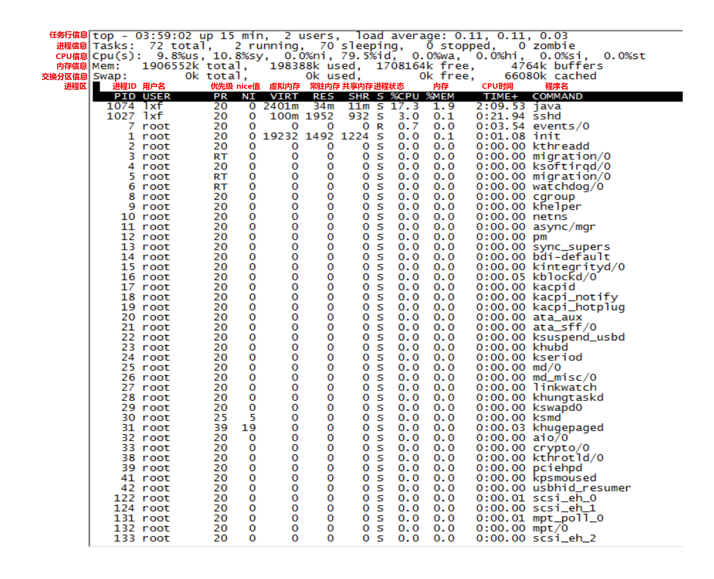

# top（整机）

### 命令效果



### 任务行信息

| top- | 03:59:02  up  15 min,                              | 2 users,          | load  average  :  0.11,  0.11,  0.01                         |
| ---- | -------------------------------------------------- | ----------------- | ------------------------------------------------------------ |
|      | 当前系统时间：03:59:02<br>系统持续运行时间：15 min | 当前系统有2个用户 | load average后面的三个数分别是1分钟、5分钟、15分钟的系统平均负载情况。<br>如果这3个数相加除以3大于0.6，说明系统负载很重 |

### 进程信息

| Tasks: | 72 total,    | 2 running,          | 70 sleeping      | 0 stopped,      | 0 zombie      |
| ------ | ------------ | ------------------- | ---------------- | --------------- | ------------- |
|        | 总进程数：72 | 正在运行的进程数：2 | 睡眠的进程数：70 | 停止的进程数：0 | 僵尸进程数：0 |

### CPU信息

| Cpu(s):  |                                                              |
| -------- | ------------------------------------------------------------ |
| 9.8%us,  | 用户进程占用CPU百分比，不包含nice值为负进程                  |
| 10.8%sy, | 内核进程占用CPU百分比                                        |
| 0.0%ni,  | 用户进程空间内改变过优先级的进程（nice值为负的进程）占用CPU百分比 |
| 79.5%id, | 空闲CPU百分比                                                |
| 0.0%wa,  | 系统等待IO的CPU时间百分比                                    |
| 0.0%hi,  | 硬中断（Hardware IRQ）占用CPU的百分比                        |
| 0.0%si,  | 软中断（Software Interrupts）占用CPU的百分比                 |
| 0.0%st   | 这个虚拟机被hypervisor偷去的CPU时间（译注：如果当前处于一个hypervisor下的vm，实际上hypervisor也是要消耗一部分CPU处理时间的） |

### 内存信息

| Mem: | 1906552k total,        | 198388k used,             | 1708164k free,         | 4764k buffers      |
| ---- | ---------------------- | ------------------------- | ---------------------- | ------------------ |
|      | 物理内存总量：1906552k | 使用中的内存总量：198388k | 空闲内存总量：1708164k | 缓存的内存量:4764k |

### 交换分区信息

| Swap: | 0k total,      | 0k used,               | 0k free,           | 66080k cached            |
| ----- | -------------- | ---------------------- | ------------------ | ------------------------ |
|       | 交换区总量：0k | 使用中的交换区总量：0k | 空闲交换区总量：0k | 缓冲的交换区总量：66080k |

### 进程区

| PID     | 进程ID，进程的唯一标识符                                     |
| ------- | ------------------------------------------------------------ |
| USER    | 进程所有者的实际用户名                                       |
| PR      | 进程的调度优先级。这个字段的一些值是'rt'。这意味这这些进程运行在实时态。 |
| NI      | 进程的nice值（优先级）。越小的值意味着越高的优先级。负值表示高优先级，正值表示低优先级。在这个字段中0意味着在确认任务的调度时不会调整优先级。 |
| VIRT    | 进程使用的虚拟内存。进程使用的虚拟内存总量，单位kb。VIRT=SWAP+RES |
| RES     | 驻留内存大小。驻留内存是任务使用的非交换物理内存大小。进程使用的、未被换出的物理内存大小，单位kb。RES=CODE+DATA |
| SHR     | SHR是进程使用的共享内存。共享内存大小，单位kb                |
| S       | 进程的状态。<br>它有以下不同的值:D - 不可中断的睡眠态。  R – 运行态  S – 睡眠态  T – 被跟踪或已停止  Z – 僵尸态 |
| %CPU    | 任务在上次屏幕刷新后经过的CPU时间占总CPU时间的百分比         |
| %MEM    | 进程使用的可用物理内存百分比                                 |
| TIME+   | 任务自启动以来使用的总CPU时间，精确到百分之一秒              |
| Command | 命令行或程序名。显示用于启动任务的命令行或相关程序名称       |

### top命令精简版

```
[lxf@hadoop101 ~]$ uptime
 05:11:50 up  1:28,  2 users,  load average: 0.23, 0.12, 0.09
```

