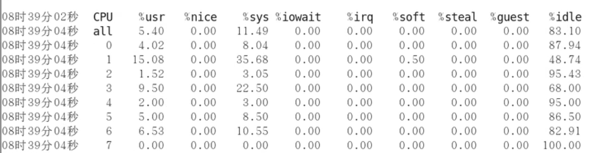

# mpstat

### mpstat -P ALL 2 5 

显示所有CPU的使用状态，每2秒采样1次，一共采样5次

### 使用效果

### 参数含义

| CPU     | CPU编号                                                      |
| ------- | ------------------------------------------------------------ |
| %usr    | 用户进程占用CPU百分比，不包含nice值为负进程                  |
| %nice   | 用户进程空间内改变过优先级的进程（nice值为负的进程）占用CPU百分比 |
| %sys    | 内核进程占用CPU百分比                                        |
| %iowait | 系统等待IO的CPU时间百分比                                    |
| %irq    | 硬中断（Hardware IRQ）占用CPU的百分比                        |
| %soft   | 软中断（Software Interrupts）占用CPU的百分比                 |
| %steal  | 这个虚拟机被hypervisor偷去的CPU时间百分比                    |
| %guest  | 运行虚拟处理器占用CPU百分比                                  |
| %idle   | 空闲CPU百分比                                                |

