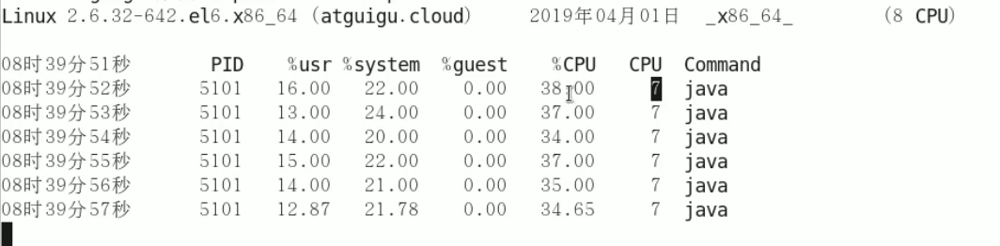
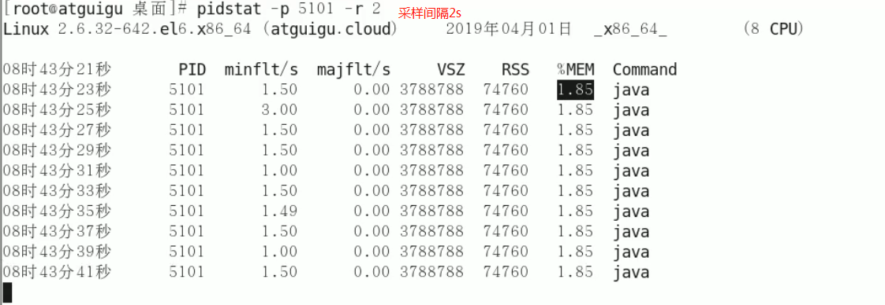

# pidstat 

> 一般会使用 `-p 进程编号`指定进程号，如果不指定会显示所有正在活动的进程的信息

### 每个进程使用cpu的用量分解信息  -u:代表查询CPU使用率 

```
[lxf@hadoop101 ~]$ ps -ef|grep java
lxf        5101   1028 14 07:18 pts/0    00:00:02 java Test
lxf        1186   1084  0 07:18 pts/1    00:00:00 grep java
[lxf@hadoop101 ~]$ pidstat -p 5101 -u 1
```



采样间隔设置为1s

### 每个进程使用内存的用量分解信息  -r：代表查询缺页错误和内存使用率



| minflt/s | 每秒次缺页错误次数(minor page faults)，次缺页错误次数意即虚拟内存地址映射成物理内存地址产生的page fault次数 |
| -------- | ------------------------------------------------------------ |
| majflt/s | 每秒主缺页错误次数(major page faults)，当虚拟内存地址映射成物理内存地址时，相应的page在swap中，这样的page fault为major page fault，一般在内存使用紧张时产生 |
| VSZ      | 该进程使用的虚拟内存(以kB为单位)                             |
| RSS      | 该进程使用的物理内存(以kB为单位)                             |
| %MEM     | 该进程使用内存的百分比                                       |

### 每个进程磁盘IO的用量分解信息 -d：代表磁盘IO统计数据

命令：pidstat -d -p 8472


| **kB_rd/s**                  | **kB_wr/s**                  | **kB_ccwr/s**                  |
| ---------------------------- | ---------------------------- | ------------------------------ |
| 进程从硬盘上的读取速度（kb） | 进程向硬盘中的写入速度（kb） | 进程写入磁盘被取消的速率（kb） |

