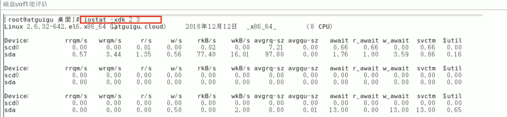

# iostat

### 命令：iostat -xdk 2 3

-x：显示更详细的io设备统计信息

-d：显示设备(磁盘)使用状态

-k：以kb为单位显示读写信息

-m：以mb为单位显示读写信息

2 3：以2秒为间隔显示3次

### 效果

以上各列的含义如下：

| 选项     | 说明                                                         |
| :------- | :----------------------------------------------------------- |
| rrqm/s   | 每秒对该设备的读请求被合并次数，文件系统会对读取同块(block)的请求进行合并 |
| wrqm/s   | 每秒对该设备的写请求被合并次数                               |
| r/s      | 每秒完成的读次数                                             |
| w/s      | 每秒完成的写次数                                             |
| rkB/s    | 每秒读数据量(kB为单位)                                       |
| wkB/s    | 每秒写数据量(kB为单位)                                       |
| avgrq-sz | 平均每次IO操作的数据量(扇区数为单位)                         |
| avgqu-sz | 平均等待处理的IO请求队列长度                                 |
| await    | 平均每次IO请求等待时间(包括等待时间和处理时间，毫秒为单位)   |
| r_await  | 平均每次IO读请求等待时间(包括等待时间和处理时间，毫秒为单位) |
| w_await  | 平均每次IO写请求等待时间(包括等待时间和处理时间，毫秒为单位) |
| svctm    | 平均每次IO请求的处理时间(毫秒为单位)                         |
| %util    | 采用周期内用于IO操作的时间比率，即IO队列非空的时间比率       |

util : 1秒中有百分之几的时间用于IO操作，接近100%时，表示磁盘带宽跑满，需要优化程序或者增加磁盘

svctm的值与await的值如果很接近，表示几乎没有IO等待，磁盘性能好；

如果await的值远高于svctm的值，则表示IO队列等待太长，需要优化程序或更换更快的磁盘 