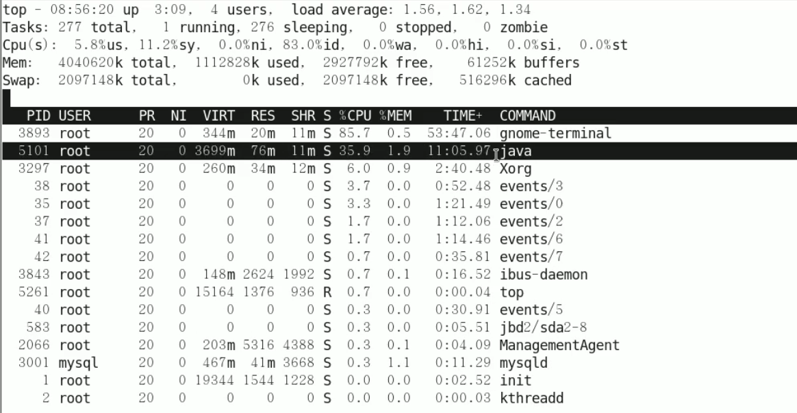
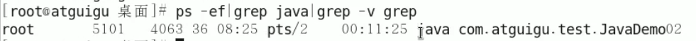
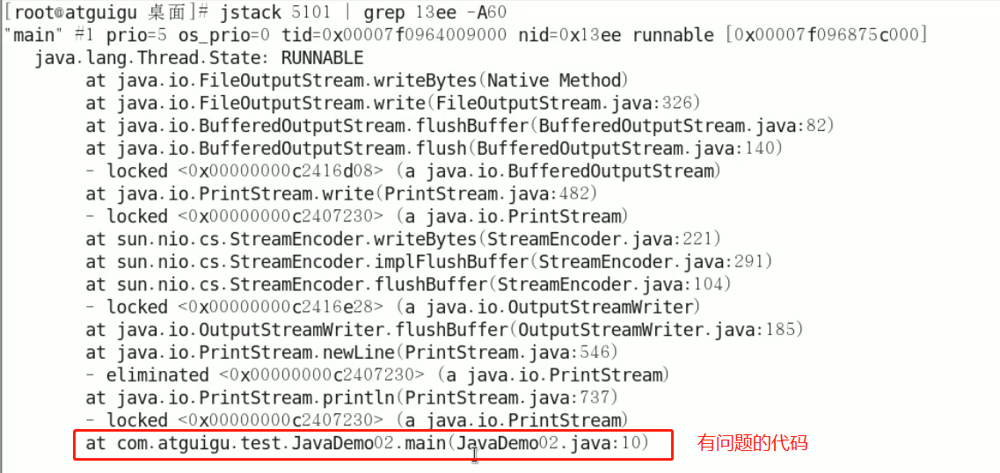

# CPU占用过高的定位分析思路

### 1 先用top命令找出CPU占比最高的进程，记下PID

### 2 用ps -ef 或者 jps进一步定位，得知是一个怎样进程惹麻烦

### 3 定位到具体的线程或者代码

- 命令：ps -mp 进程号 -o THREAD,tid,time
  - -m：显示所有线程
  - -p：pid进程使用CPU的时间
  - -o：该参数后是用户自定义格式

- 效果

  

线程5102是导致CPU占用过高的原因，%CPU和TIME都比较高

### 4 将需要的线程ID转换为16进制格式（英文小写格式），然后执行jstack命令

- 命令：jstack 进程ID | grep tid（16进制线程ID小写英文） -A60
  - -A60 : 打印前60行
- 效果

- 定位到问题代码

