# MySQL Linux版的安装（MySQL 5.5）

### 1 下载地址

官网下载地址：http://dev.mysql.com/downloads/mysql/

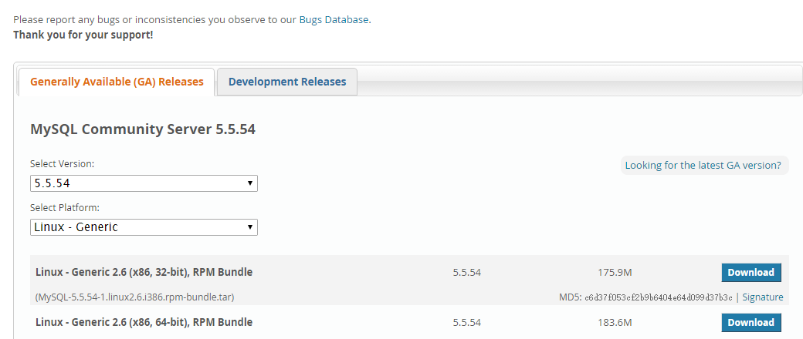 

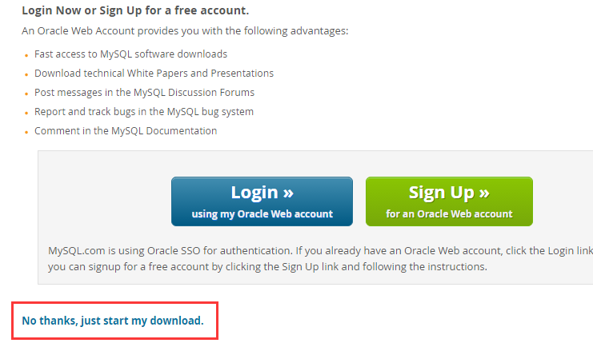 

### 2 拷贝&解压缩

### 3 检查工作 

- 检查当前系统是否安装过MySQL

  执行安装命令前，先执行查询命令

  rpm -qa|grep mysql

  如果存在mysql-libs的旧版本包如下：

  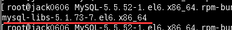 

  请先执行卸载命令：rpm -e --nodeps  mysql-libs

- 检查/tmp文件夹权限

  由于mysql安装过程中，会通过mysql用户在/tmp目录下新建tmp_db文件，所以请给/tmp较大的权限
  
  执行 ：`chmod -R 777 /tmp`

### 4 安装

```
在mysql的安装文件目录下执行：
rpm -ivh MySQL-server-5.5.54-1.linux2.6.x86_64.rpm
rpm -ivh MySQL-client-5.5.54-1.linux2.6.x86_64.rpm
```

### 5 查看MySQL安装版本

或者可以执行 mysqladmin --version命令，类似java -version如果打出消息，即为成功。

 

 通过vim 查看 mysql组 和mysql组

### 6 mysql服务的启+停

 启动：

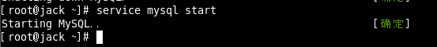 

关闭：

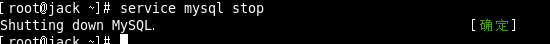 

### 7 首次登录

安装完成后会提示出如下的提示：

在mysql首次登录前要给 root 账号设置密码

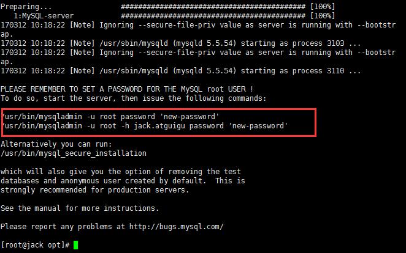 

启动服务后，执行命令 

/usr/bin/mysqladmin -u root  password '123123'

 

然后通过 mysql -uroot -p123123进行登录

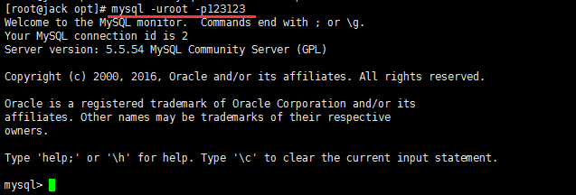 

### 8 MySQL的安装位置

在linux下查看安装目录  `ps -ef|grep mysql`

| 参数         | 路径                            | 解释                         | 备注                          |
| ------------ | ------------------------------- | ---------------------------- | ----------------------------- |
| --basedir    | /usr/bin                        | 相关命令目录                 | mysqladmin<br>mysqldump等命令 |
| --datadir    | /var/lib/mysql/                 | mysql数据库文件的存放路径    |                               |
| --plugin-dir | /usr/lib64/mysql/plugin         | mysql插件存放路径            |                               |
| --log-error  | /var/lib/mysql/jack.atguigu.err | mysql错误日志路径            |                               |
| --pid-file   | /var/lib/mysql/jack.atguigu.pid | 进程pid文件                  |                               |
| --socket     | /var/lib/mysql/mysql.sock       | 本地连接时用的unix套接字文件 |                               |
|              | /usr/share/mysql                | 配置文件目录                 | mysql脚本及配置文件           |
|              | /etc/init.d/mysql               | 服务启停相关脚本             |                               |

在linux下查看安装目录 ps -ef|grep mysql

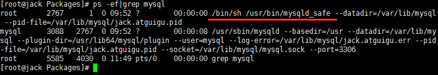 

### 9  自启动mysql服务

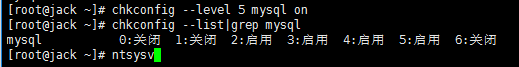 

 

### 10 修改字符集问题

尝试插入输入：

 

原因是字符集问题

1 查看字符集
```

show variables like 'character%'; 

show variables like '%char%';
```
看看出现的结果：

 

默认的是客户端和服务器都用了latin1，所以会乱码。

2 修改my.cnf

在/usr/share/mysql/ 中找到my.cnf的配置文件，

拷贝其中的my-huge.cnf 到 /etc/  并命名为my.cnf 

mysql 优先选中 /etc/ 下的配置文件

然后修改my.cnf:
```
[client]

default-character-set=utf8

[mysqld]

character_set_server=utf8

character_set_client=utf8

collation-server=utf8_general_ci

[mysql]

default-character-set=utf8
```
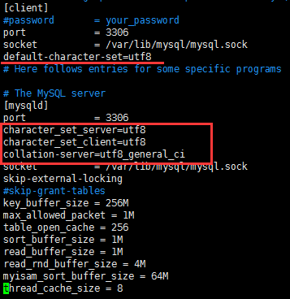 

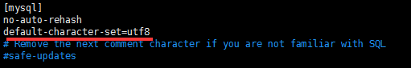 

 3、重新启动mysql

但是原库的设定不会发生变化，参数修改之对新建的数据库生效

4、已生成的库表字符集如何变更

修改数据库的字符集

`mysql> alter database mytest character set 'utf8';`

修改数据表的字符集

`mysql> alter table user convert to  character set 'utf8';`

但是原有的数据如果是用非'utf8'编码的话，数据本身不会发生改变。