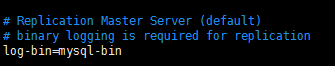
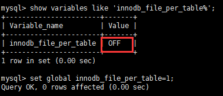
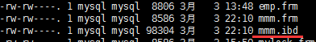

# MySQL配置文件

[TOC]

### 1 二进制日志log-bin

- 主从复制及备份恢复(了解)
  - log-bin 中存放了所有的操作记录(增删改)，可以用于恢复。相当于 Redis 中的 AOF    

  - my.cnf中的log-bin配置(默认关闭)
    

### 2 错误日志log-error

默认是关闭的,记录严重的警告和错误信息，每次启动和关闭的详细信息等。

### 3 慢查询日志log

- 默认关闭，记录查询的sql语句，如果开启会减低mysql的整体性能，因为记录日志也是需要消耗系统资源的
- 可自定义“慢”的概念:0-10秒之间的一个数。
- 慢查询日志会将超过这个查询时间的查询记录下来，方便找到需要优化的sql 。
- 用于优化sql语句时使用。 

### 4 数据文件

#### 4.1 两系统

  - windows	
    
    - ....\MySQLServer5.5\data目录下很多数据库文件
  - linux
    - 默认路径：/var/lib/mysql   （可在配置文件中更改 /usr/share/mysql/  下的 my-huge.cnf）
    - 每个目录代表一个同名的库

#### 4.2 Myisam存放方式

  > show create table mydb 查看创建 mydb 表的基本信息，其中包括了数据引擎。
  > 自带的库 mysql 库中所有的表都是以 MyIsam 引擎存的。通过 MyIsam 引擎存的表都是 一式三份，放在库同名的文件夹下 /var/lib/mysql

  - frm文件(framework) : 存放表结构

  - myd文件(data) : 存放表数据

  - myi文件(index) : 存放表索引

#### 4.3  innodb存放方式

  - ibdata1 : Innodb引擎将所有表的的数据都存在这里面 /usr/share/mysql/ibdata1,而frm文件存放在库同名的包下

  - frm文件 : 存放表结构

  - 表数据单独存放 

     

    ```
    set innodb_file_per_table=on 

    create table mmm (
    id int(20) auto_increment ,
    name varchar(20),
    primary key(id));
    ```
    设为 on 后 单独以 table名.ibd 的文件名存储表的数据
    
     

### 5 如何配置

- windows : my.ini文件(配置文件)
- Linux : /etc/my.cnf文件(配置文件)