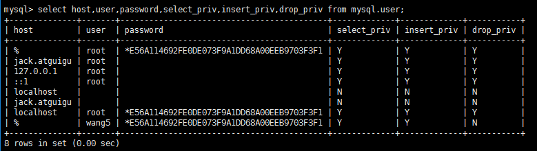
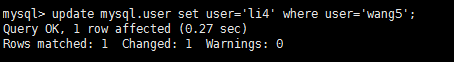
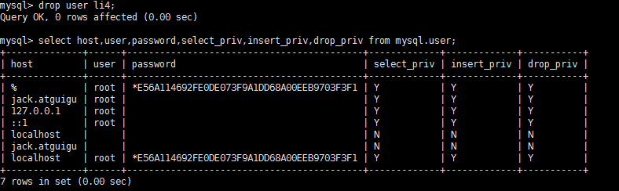
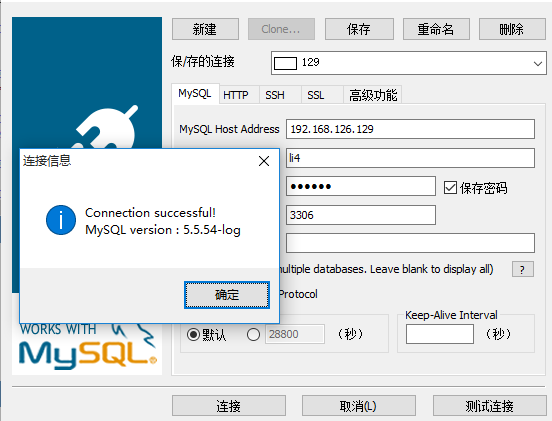

# MySQL 的用户与权限管理

[TOC]

### 1 MySQL的用户管理

#### 1.1 创建用户

```
  create user zhang3 identified by '123123';
```
  表示创建名称为zhang3的用户，密码设为123123；

#### 1.2 了解user表

  查看用户

```
select host,user,password,select_priv,insert_priv,drop_priv from mysql.user;
```
 

- host ：   表示连接类型
  - `%` 表示所有远程通过 TCP方式的连接
  - `IP 地址` 如 (192.168.1.2,127.0.0.1) 通过指定ip地址进行的TCP方式的连接
  - `机器名`   通过制定网络中的机器名进行的TCP方式的连接
  - `::1`   IPv6的本地ip地址  等同于IPv4的 127.0.0.1
  - `localhost` 本地方式通过命令行方式的连接 ，比如mysql -u xxx -p 123xxx 方式的连接。

- User:表示用户名

​       同一用户通过不同方式链接的权限是不一样的。

- password ： 密码

  所有密码串通过 password(明文字符串) 生成的密文字符串。加密算法为MYSQLSHA1 ，不可逆 。

  mysql 5.7 的密码保存到 authentication_string，字段中不再使用password 字段。

- select_priv , insert_priv等 

    为该用户所拥有的权限。

#### 1.3 设置密码

  修改当前用户的密码:
```
set password=password('123456');
```

  修改某个用户的密码:

  ```
update mysql.user set password=password('123456') where user='li4';
flush privileges;   #所有通过user表的修改，必须用该命令才能生效。
  ```
#### 1.4 修改用户

 修改用户名：
```
update mysql.user set user='li4' where user='wang5';

flush privileges;   #所有通过user表的修改，必须用该命令才能生效。
```
 

#### 1.5 删除用户
```
drop user li4 ;
```
 

不要通过`delete from  user where user='li4' `进行删除，系统会有残留信息保留。 

### 2 权限管理

#### 2.1 授予权限

授权命令： 

grant 权限1,权限2,…权限n on 数据库名称.表名称 to 用户名@用户地址 identified by ‘连接口令’;

该权限如果发现没有该用户，则会直接新建一个用户。

比如 :

```
grant select,insert,delete,drop on atguigudb.* to li4@localhost;

给li4用户用本地命令行方式下，授予atguigudb这个库下的所有表的插删改查的权限。


grant all privileges on *.* to joe@'%'  identified by '123'; 

授予通过网络方式登录的的joe用户 ，对所有库所有表的全部权限，密码设为123.
```
就算 all privileges 了所有权限，grant_priv 权限也只有 root 才能拥有。

```
给 root 赋连接口令 grant all privileges on *.* to root@'%';后新建的连接没有密码，需要设置密码才能远程连接。
update mysql.user set password=password('123456') where user='root' and host='%';
```
#### 2.2 收回权限

  收权命令： 

  revoke  权限1,权限2,…权限n on 数据库名称.表名称  from  用户名@用户地址 ;
```
  REVOKE ALL PRIVILEGES ON mysql.* FROM joe@localhost;

  #收回mysql库全表的所有权限
  

  REVOKE select,insert,update,delete ON mysql.* FROM joe@localhost;

  #收回mysql库下的所有表的插删改查权限
```
   对比赋予权限的方法。

   必须用户重新登录后才能生效

#### 2.3 查看权限

- 查看当前用户权限

  `show grants;`

- 查看某用户的全局权限

  `select  * from mysql.user ;`

- 查看某用户的某库的权限

  ` select * from  mysql.db;`

- 查看某用户的某个表的权限

  ` select * from mysql.tables_priv;`

### 3 通过工具远程访问

- 1、先 ping 一下数据库服务器的ip 地址确认网络畅通。

- 2、关闭数据库服务的防火墙

  ​    `service iptables stop`

- 3、 确认Mysql中已经有可以通过远程登录的账户

  ​    `select  * from mysql.user where user='li4' and host='%';`

  如果没有用户,先执行如下命令：

  ​    `grant all privileges on *.*  to li4@'%'  identified by '123123';`

- 4、测试连接：

   
