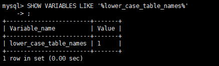
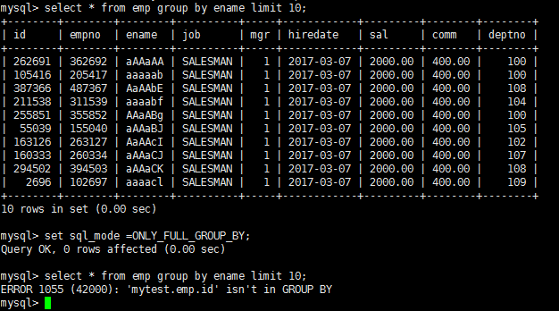

# MySQL的一些杂项配置

### 1 大小写问题

 `SHOW VARIABLES LIKE '%lower_case_table_names%' `

 

- windows系统默认大小写不敏感，但是linux系统是大小写敏感的
  - 默认为0，大小写敏感。
  - 设置1，大小写不敏感。创建的表，数据库都是以小写形式存放在磁盘上，对于sql语句都是转换为小写对表和DB进行查找。
  - 设置2，创建的表和DB依据语句上格式存放，凡是查找都是转换为小写进行。 

- 设置变量常采用 `setlower_case_table_names = 1；` 的方式，但此变量是只读权限，所以需要在配置文件中改。

- 当想设置为大小写不敏感时，要在my.cnf这个配置文件 [mysqld] 中加入 lower_case_table_names = 1 ，然后重启服务器。

- 但是要在重启数据库实例之前就需要将原来的数据库和表转换为小写，否则更改后将找不到数据库名。

- 在进行数据库参数设置之前，需要掌握这个参数带来的影响，切不可盲目设置。

### 2 (生产环境)sql_mode

- MySQL的sql_mode合理设置

  sql_mode是个很容易被忽视的变量，默认值是空值，在这种设置下是可以允许一些非法操作的，比如允许一些非法数据的插入。在生产环境必须将这个值设置为严格模式，所以开发、测试环境的数据库也必须要设置，这样在开发测试阶段就可以发现问题。

   

- 使用 set sql_mode=ONLY_FULL_GROUP_BY; 的方式设置会将之前的设置覆盖掉

- 同时设置多个限制：

  `set sql_mode='ONLY_FULL_GROUP_BY,NO_AUTO_VALUE_ON_ZERO';`

- sql_mode常用值如下： 
  - ONLY_FULL_GROUP_BY：

    对于GROUP BY聚合操作，如果在SELECT中的列，没有在GROUP BY中出现，那么这个SQL是不合法的，因为列不在GROUP BY从句中
    
  - NO_AUTO_VALUE_ON_ZERO：
  
    该值影响自增长列的插入。默认设置下，插入0或NULL代表生成下一个自增长值。如果用户 希望插入的值为0，而该列又是自增长的，那么这个选项就有用了。
    
  - STRICT_TRANS_TABLES：
  
  
    在该模式下，如果一个值不能插入到一个事务表中，则中断当前的操作，对非事务表不做限制
  
  - NO_ZERO_IN_DATE：
  
    在严格模式下，不允许日期和月份为零
  
  - NO_ZERO_DATE：
  
    设置该值，mysql数据库不允许插入零日期，插入零日期会抛出错误而不是警告。
  
  - ERROR_FOR_DIVISION_BY_ZERO：
  
    在INSERT或UPDATE过程中，如果数据被零除，则产生错误而非警告。如 果未给出该模式，那么数据被零除时MySQL返回NULL
  
  - NO_AUTO_CREATE_USER：
  
    禁止GRANT创建密码为空的用户
  
  - NO_ENGINE_SUBSTITUTION：
  
    如果需要的存储引擎被禁用或未编译，那么抛出错误。不设置此值时，用默认的存储引擎替代，并抛出一个异常
  
  - PIPES_AS_CONCAT：
  
    将"||"视为字符串的连接操作符而非或运算符，这和Oracle数据库是一样的，也和字符串的拼接函数Concat相类似
  
  - ANSI_QUOTES：
  
    启用ANSI_QUOTES后，不能用双引号来引用字符串，因为它被解释为识别符
  
  - ORACLE：
  
    设置等同：PIPES_AS_CONCAT, ANSI_QUOTES, IGNORE_SPACE, NO_KEY_OPTIONS, NO_TABLE_OPTIONS, NO_FIELD_OPTIONS, NO_AUTO_CREATE_USER.