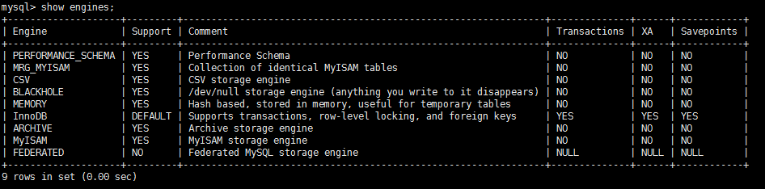
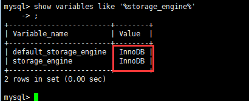

#  MySQL存储引擎

### 1 查看命令

- 看你的mysql现在已提供什么存储引擎:

  `mysql> show engines;`

   

- 看你的MySQL当前默认的存储引擎:

  `mysql> show variables like '%storage_engine%';`

   

### 2 各个引擎简介

- 1、InnoDB存储引擎

  InnoDB是MySQL的默认事务型引擎，它被设计用来处理大量的短期(short-lived)事务。除非有非常特别的原因需要使用其他的存储引擎，否则应该优先考虑InnoDB引擎。行级锁，适合高并发情况

- 2、MyISAM存储引擎

  MyISAM提供了大量的特性，包括全文索引、压缩、空间函数(GIS)等，但MyISAM不支持事务和行级锁(myisam改表时会将整个表全锁住)，有一个毫无疑问的缺陷就是崩溃后无法安全恢复。

- 3、Archive引擎

  Archive存储引擎只支持INSERT和SELECT操作，在MySQL5.1之前不支持索引。

  Archive表适合日志和数据采集类应用。适合低访问量大数据等情况。

  根据英文的测试结论来看，Archive表比MyISAM表要小大约75%，比支持事务处理的InnoDB表小大约83%。

- 4、Blackhole引擎

  Blackhole引擎没有实现任何存储机制，它会丢弃所有插入的数据，不做任何保存。但服务器会记录Blackhole表的日志，所以可以用于复制数据到备库，或者简单地记录到日志。但这种应用方式会碰到很多问题，因此并不推荐。

- 5、CSV引擎

  CSV引擎可以将普通的CSV文件作为MySQL的表来处理，但不支持索引。

  CSV引擎可以作为一种数据交换的机制，非常有用。

  CSV存储的数据直接可以在操作系统里，用文本编辑器，或者excel读取。

- 6、Memory引擎

  如果需要快速地访问数据，并且这些数据不会被修改，重启以后丢失也没有关系，那么使用Memory表是非常有用。Memory表至少比MyISAM表要快一个数量级。(使用专业的内存数据库更快，如redis)

- 7、Federated引擎

  Federated引擎是访问其他MySQL服务器的一个代理，尽管该引擎看起来提供了一种很好的跨服务器的灵活性，但也经常带来问题，因此默认是禁用的。

### 3 MyISAM和InnoDB

| 对比项         | MyISAM                                                   | InnoDB                                                       |
| -------------- | -------------------------------------------------------- | ------------------------------------------------------------ |
| 主外键         | 不支持                                                   | 支持                                                         |
| 事务           | 不支持                                                   | 支持                                                         |
| 行表锁         | 表锁，即使操作一条记录也会锁住整个表，不适合高并发的操作 | 行锁,操作时只锁某一行，不对其它行有影响，适合高并发的操作    |
| 缓存           | 只缓存索引，不缓存真实数据                               | 不仅缓存索引还要缓存真实数据，对内存要求较高，而且内存大小对性能有决定性的影响 |
| 表空间         | 小                                                       | 大                                                           |
| 关注点         | 性能                                                     | 事务                                                         |
| 默认安装       | Y                                                        | Y                                                            |
| 用户表默认使用 | N                                                        | Y                                                            |
| 自带系统表使用 | Y                                                        | N                                                            |

 innodb 索引 使用 B+TREE myisam 索引使用 b-tree
innodb 主键为聚簇索引，基于聚簇索引的增删改查效率非常高。

### 4 阿里巴巴、淘宝用哪个

 

  -  Percona 为 MySQL 数据库服务器进行了改进，在功能和性能上较 MySQL 有着很显著的提升。该版本提升了在高负载情况下的 InnoDB 的性能、为 DBA 提供一些非常有用的性能诊断工具；另外有更多的参数和命令来控制服务器行为。

  - 该公司新建了一款存储引擎叫xtradb完全可以替代innodb,并且在性能和并发上做得更好,

  - 阿里巴巴大部分mysql数据库其实使用的percona的原型加以修改。
  - AliSql+AliRedis