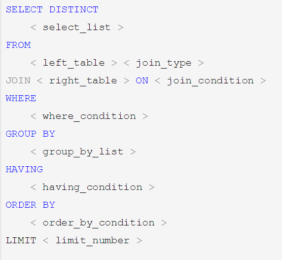
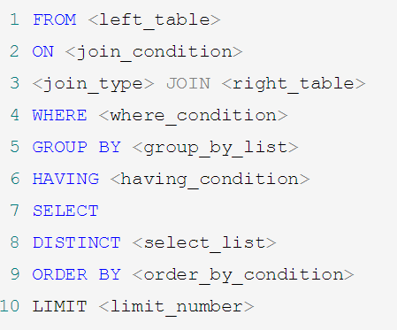
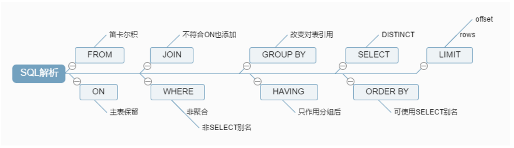
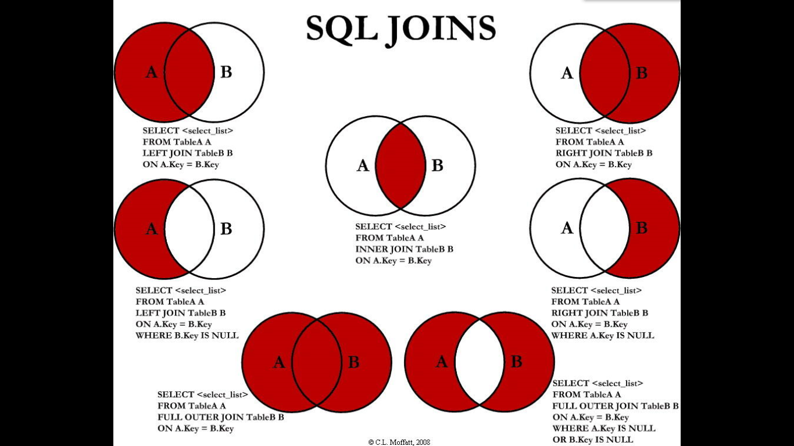

# 常见通用的Join查询

### 1 SQL执行顺序

- 手写

   

- 机读

  随着MySQL版本的更新换代，其优化器也在不断的升级，优化器会分析不同执行顺序产生的性能消耗不同而动态调整执行顺序。

  ​    下面是经常出现的查询顺序：

   

- 总结

   

### 2 Join图

 

共有与独有(理解)：

什么叫共有，什么叫独有？

共有：满足 a.deptid = b.id 的叫共有

A独有:  A 表中所有不满足  a.deptid = b.id  连接关系的数据

同时参考 join 图

### 3 建表SQL
```
CREATE TABLE `t_dept` (

 `id` INT(11) NOT NULL AUTO_INCREMENT,

 `deptName` VARCHAR(30) DEFAULT NULL,

 `address` VARCHAR(40) DEFAULT NULL,

 PRIMARY KEY (`id`)

) ENGINE=INNODB AUTO_INCREMENT=1 DEFAULT CHARSET=utf8;

CREATE TABLE `t_emp` (

 `id` INT(11) NOT NULL AUTO_INCREMENT,

 `name` VARCHAR(20) DEFAULT NULL,

  `age` INT(3) DEFAULT NULL,

 `deptId` INT(11) DEFAULT NULL,

 PRIMARY KEY (`id`),

 KEY `fk_dept_id` (`deptId`)

 CONSTRAINT `fk_dept_id` FOREIGN KEY (`deptId`) REFERENCES `t_dept` (`id`)

) ENGINE=INNODB AUTO_INCREMENT=1 DEFAULT CHARSET=utf8;

INSERT INTO t_dept(deptName,address) VALUES('华山','华山');

INSERT INTO t_dept(deptName,address) VALUES('丐帮','洛阳');

INSERT INTO t_dept(deptName,address) VALUES('峨眉','峨眉山');

INSERT INTO t_dept(deptName,address) VALUES('武当','武当山');

INSERT INTO t_dept(deptName,address) VALUES('明教','光明顶');

INSERT INTO t_dept(deptName,address) VALUES('少林','少林寺');

INSERT INTO t_emp(NAME,age,deptId) VALUES('风清扬',90,1);

INSERT INTO t_emp(NAME,age,deptId) VALUES('岳不群',50,1);

INSERT INTO t_emp(NAME,age,deptId) VALUES('令狐冲',24,1);

INSERT INTO t_emp(NAME,age,deptId) VALUES('洪七公',70,2);

INSERT INTO t_emp(NAME,age,deptId) VALUES('乔峰',35,2);

INSERT INTO t_emp(NAME,age,deptId) VALUES('灭绝师太',70,3);

INSERT INTO t_emp(NAME,age,deptId) VALUES('周芷若',20,3);

INSERT INTO t_emp(NAME,age,deptId) VALUES('张三丰',100,4);

INSERT INTO t_emp(NAME,age,deptId) VALUES('张无忌',25,5);

INSERT INTO t_emp(NAME,age,deptId) VALUES('韦小宝',18,null);
```

### 4 七种Join

```
1 A、B两表共有

 select * from t_emp a inner join t_dept b on a.deptId = b.id;

2 A、B两表共有+A的独有

 select * from t_emp a left join t_dept b on a.deptId = b.id;

3 A、B两表共有+B的独有

 select * from t_emp a right join t_dept b on a.deptId = b.id;

4 A的独有 

select * from t_emp a left join t_dept b on a.deptId = b.id where b.id is null; 

5 B的独有

select * from t_emp a right join t_dept b on a.deptId = b.id where a.deptId is null;  

6 AB全有

MySQL Full Join的实现 因为MySQL不支持FULL JOIN,下面是替代方法:

left join + union(可去除重复数据)+ right join

SELECT * FROM t_emp A LEFT JOIN t_dept B ON A.deptId = B.id

UNION

SELECT * FROM t_emp A RIGHT JOIN t_dept B ON A.deptId = B.id

 这里因为要联合的缘故，不能考虑到小表驱动大表的情况。只能用right join。要保证查询出来的数字要一致。

7 A的独有+B的独有

SELECT * FROM t_emp A LEFT JOIN t_dept B ON A.deptId = B.id WHERE B.`id` IS NULL

UNION

SELECT * FROM t_emp A RIGHT JOIN t_dept B ON A.deptId = B.id WHERE A.`deptId` IS NULL;
```
- 增加掌门字段
```
ALTER TABLE `t_dept` 
add CEO  INT(11)  ;
update t_dept set CEO=2 where id=1;
update t_dept set CEO=4 where id=2;
update t_dept set CEO=6 where id=3;
update t_dept set CEO=8 where id=4;
update t_dept set CEO=9 where id=5;
求各个门派对应的掌门人:
select   * from t_dept as  b left  join t_emp as a on  b.CEO=a.id;
求所有当上掌门人的平均年龄:
select  avg(a.age) from t_emp a inner join t_dept b on a.id=b.CEO  ;
```
- join 的理解例题
```
求所有人物对应的掌门:

t_dept 表
id  deptName  address       CEO 
 1       华山派          华山          2
...

t_emp 表
id  name     age  deptId 
1  风清扬     90         1
...

1.使用子查询(不推荐，影响后续用索引)
步骤：a.创建子查询  查询出每个门派对应的ceo  
     b.根据t_emp 对应的 deptId 关联子查询表查询出所有人物对应的 ceo
SELECT a.name,f.deptName,f.name FROM t_emp a
LEFT JOIN (SELECT d.`id`,e.`name` ,d.`deptName` FROM t_dept d
LEFT JOIN t_emp e 
ON d.`CEO`=e.`id`) f
ON a.deptId = f.id
2.使用join(推荐)使用join
步骤：a.关联出每个人物对应的门派
     b.通过门派的 ceo 关联对应的掌门
SELECT e.`name`, d.`deptName`,f.`name` ceo FROM t_dept d
RIGHT JOIN t_emp e
ON d.`id` = e.`deptId`   ##第一步 --->得到关联了部门的一张新的联合表
LEFT JOIN t_emp f   
ON d.`CEO`=f.`id`       ##第二步  --->通过新的联合表中的数据与另一张表关联

SELECT d.`deptName`, e.`name` CEO,d.`id`,f.name
 FROM t_dept d
LEFT JOIN  t_emp e    //上述两个 join 交换了顺序并不影响执行。前提是两个 join 间不是依赖关系。
ON d.`CEO`= e.`id` 
RIGHT JOIN t_emp f
ON f.deptId = d.`id`

```