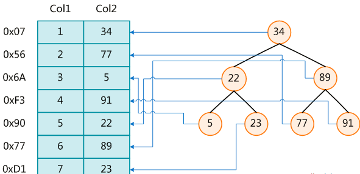
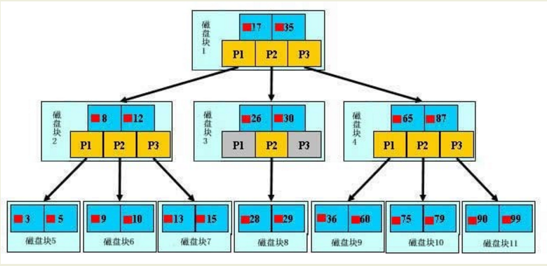
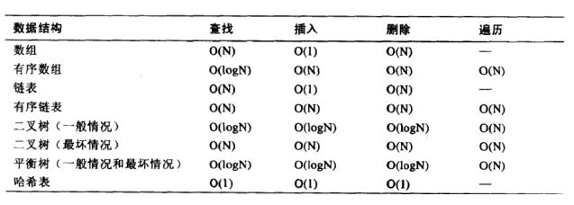
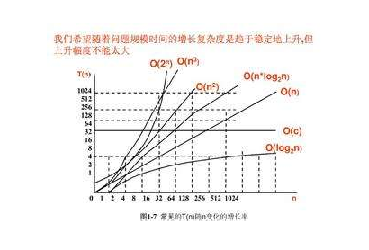
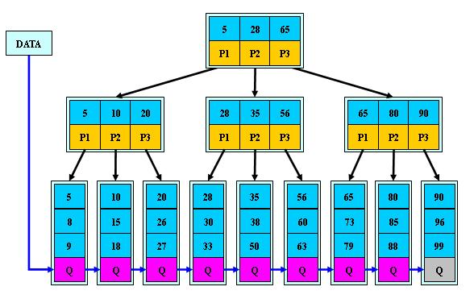

# 索引简介

### 1 是什么

#### 1.1 官方定义
​	MySQL官方对索引的定义为：索引（Index）是帮助MySQL高效获取数据的数据结构。

​	可以得到索引的本质：索引是数据结构。

#### 1.2 简单理解
​	你可以简单理解为“排好序的快速查找数据结构”。

#### 1.3 详解(重要)

​		在数据之外，数据库系统还维护着满足特定查找算法的数据结构，这些数据结构以某种方式引用（指向）数据，这样就可以在这些数据结构上实现高级查找算法。这种数据结构，就是索引。下图就是一种可能的索引方式示例：

 

​		左边是数据表，一共有两列七条记录，最左边的是数据记录的物理地址，为了加快Col2的查找，可以维护一个右边所示的二叉查找树，每个节点分别包含索引键值和一个指向对应数据记录物理地址的指针，这样就可以运用二叉查找在一定的复杂度内获取到相应数据，从而快速的检索出符合条件的记录。

- 二叉树弊端之一：二叉树很可能会发生两边不平衡的情况。
  - B-TREE: (B:balance)  会自动根据两边的情况自动调节，使两端无限趋近于平衡状态。可以使性能最稳定。(myisam使用的方式)
  - B-TREE弊端：(插入/修改操作多时，B-TREE会不断调整平衡，消耗性能)从侧面说明了索引不是越多越好。插入/修改操    B-TREE弊端：(插入/修改操作多时，B-TREE会不断调整平衡，消耗性能)从侧面说明了索引不是越多越好。
  - B+TREE:Innodb 所使用的索引
#### 1.4 结论

 		数据本身之外，数据库还维护着一个满足特定查找算法的数据结构，这些数据结构以某种方式指向数据，这样就可以在这些数据结构的基础上实现高级查找算法，这种数据结构就是索引。


​		一般来说索引本身也很大，不可能全部存储在内存中，因此索引往往以索引文件的形式存储的磁盘上。

​		我们平常所说的索引，如果没有特别指明，都是指B树(多路搜索树，并不一定是二叉的)结构组织的索引。其中聚集索引，次要索引，覆盖索引，复合索引，前缀索引，唯一索引默认都是使用B+树索引，统称索引。当然，除了B+树这种类型的索引之外，还有哈稀索引(hash index)等。

### 2 优势

- 类似大学图书馆建书目索引，提高数据检索的效率，降低数据库的IO成本
- 通过索引列对数据进行排序，降低数据排序的成本，降低了CPU的消耗

### 3 劣势

- 实际上索引也是一张表，该表保存了主键与索引字段，并指向实体表的记录，所以索引列也是要占用空间的
- 虽然索引大大提高了查询速度，同时却会降低更新表的速度，如对表进行INSERT、UPDATE和DELETE。因为更新表时，MySQL不仅要保存数据，还要保存一下索引文件每次更新添加了索引列的字段，都会调整因为更新所带来的键值变化后的索引信息
- 索引只是提高效率的一个因素，如果你的MySQL有大数据量的表，就需要花时间研究建立最优秀的索引，或优化查询语句

### 4 MySQL索引结构

#### 4.1 BTree索引

- 原理图——Myisam普通索引

   

  【初始化介绍】 

  一颗b树，浅蓝色的块我们称之为一个磁盘块，可以看到每个磁盘块包含几个数据项（深蓝色所示）和指针（黄色所示），

  如磁盘块1包含数据项17和35，包含指针P1、P2、P3，

  P1表示小于17的磁盘块，P2表示在17和35之间的磁盘块，P3表示大于35的磁盘块。

  *真实的数据存在于叶子节点*即3、5、9、10、13、15、28、29、36、60、75、79、90、99。

  非叶子节点不存储真实的数据，只存储指引搜索方向的数据项，如17、35并不真实存在于数据表中。

  【查找过程】

  如果要查找数据项29，那么首先会把磁盘块1由磁盘加载到内存，此时发生一次IO，在内存中用二分查找确定29在17和35之间，锁定磁盘块1的P2指针，内存时间因为非常短（相比磁盘的IO）可以忽略不计，通过磁盘块1的P2指针的磁盘地址把磁盘块3由磁盘加载到内存，发生第二次IO，29在26和30之间，锁定磁盘块3的P2指针，通过指针加载磁盘块8到内存，发生第三次IO，同时内存中做二分查找找到29，结束查询，总计三次IO。

  真实的情况是，3层的b+树可以表示上百万的数据，如果上百万的数据查找只需要三次IO，性能提高将是巨大的，如果没有索引，每个数据项都要发生一次IO，那么总共需要百万次的IO，显然成本非常非常高。

- 关于时间复杂度

  ​       同一问题可用不同算法解决，而一个算法的质量优劣将影响到算法乃至程序的效率。算法分析的目的在于选择合适算法和改进算法。

   

   

    1  N  logN 分别表示数据与查询次数之间的关系。

  常数  1*c 表示查询最快的方式。查询次数不随数据的增加而增加

  变量 N 表示查询次数随数据数量的增加而增加

  对数 logN 表示查询次数与数据数量成对数关系。 介于常数与 N 之间。

  n*logN 表示使用的复合方法。

#### 4.2 B+Tree索引

- 原理图——innodb的普通索引

  

  B+TREE 第二级的 数据并不能直接取出来，只作索引使用。在内存有限的情况下，查询效率高于 B-TREE

  B-TREE 第二级可以直接取出来，树形结构比较重，在内存无限大的时候有优势。

- B树和B+树的区别

  B+Tree与B-Tree 的区别：结论在内存有限的情况下，B+TREE 永远比 B-TREE好。无限内存则后者方便

  1）B-树的关键字和记录是放在一起的，叶子节点可以看作外部节点，不包含任何信息；B+树叶子节点中只有关键字和指向下一个节点的索引，记录只放在叶子节点中。(一次查询可能进行两次i/o操作)

  2）在B-树中，越靠近根节点的记录查找时间越快，只要找到关键字即可确定记录的存在；而B+树中每个记录的查找时间基本是一样的，都需要从根节点走到叶子节点，而且在叶子节点中还要再比较关键字。从这个角度看B-树的性能好像要比B+树好，而在实际应用中却是B+树的性能要好些。因为B+树的非叶子节点不存放实际的数据，这样每个节点可容纳的元素个数比B-树多，树高比B-树小，这样带来的好处是减少磁盘访问次数。尽管B+树找到一个记录所需的比较次数要比B-树多，但是一次磁盘访问的时间相当于成百上千次内存比较的时间，因此实际中B+树的性能可能还会好些，而且B+树的叶子节点使用指针连接在一起，方便顺序遍历（例如查看一个目录下的所有文件，一个表中的所有记录等），这也是很多数据库和文件系统使用B+树的缘故。 

  思考：为什么说B+树比B-树更适合实际应用中操作系统的文件索引和数据库索引？ 

  1) B+树的磁盘读写代价更低 

  B+树的内部结点并没有指向关键字具体信息的指针。因此其内部结点相对B 树更小。如果把所有同一内部结点的关键字存放在同一盘块中，那么盘块所能容纳的关键字数量也越多。一次性读入内存中的需要查找的关键字也就越多。相对来说IO读写次数也就降低了。 

  2) B+树的查询效率更加稳定 

  由于非终结点并不是最终指向文件内容的结点，而只是叶子结点中关键字的索引。所以任何关键字的查找必须走一条从根结点到叶子结点的路。所有关键字查询的路径长度相同，导致每一个数据的查询效率相当。

#### 4.3 聚簇索引与非聚簇索引

聚簇索引并不是一种单独的索引类型，而是一种数据存储方式。

术语‘聚簇’表示数据行和相邻的键值进错的存储在一起。

 如下图，左侧的索引就是聚簇索引，因为数据行在磁盘的排列和索引排序保持一致。数据行在磁盘的排列和索引排序保持一致。


聚簇索引的好处：

- 按照聚簇索引排列顺序，查询显示一定范围数据的时候，由于数据都是紧密相连，数据库不用从多个数据块中提取数据，所以节省了大量的io操作。

聚簇索引的限制：

- 对于mysql数据库目前只有innodb数据引擎支持聚簇索引，而Myisam并不支持聚簇索引。
- 由于数据物理存储排序方式只能有一种，所以每个Mysql的表只能有一个聚簇索引。一般情况下就是该表的主键。*数据物理存储排序方式只能有一种*由于数据物理存储排序方式只能有一种，所以每个Mysql的表只能有一个聚簇索引。一般情况下就是该表的主键。主键由于数据物理存储排序方式只能有一种，所以每个Mysql的表只能有一个聚簇索引。一般情况下就是该表的主键。
- 为了充分利用聚簇索引的聚簇的特性，所以innodb表的主键列尽量选用有序的顺序id，而不建议用无序的id，比如uuid这种。（参考聚簇索引的好处。）

 这里说明了主键索引为何采用自增的方式：1、业务需求，有序。2、能使用到聚簇索引

#### 4.4 full-text全文索引

全文索引（也称全文检索）是目前搜索引擎使用的一种关键技术。它能够利用【分词技术】等多种算法智能分析出文本文字中关键词的频率和重要性，然后按照一定的算法规则智能地筛选出我们想要的搜索结果。

CREATE TABLE `article` (

  `id` int(10) unsigned NOT NULL AUTO_INCREMENT,

  `title` varchar(200) DEFAULT NULL,

  `content` text,

  PRIMARY KEY (`id`),

  FULLTEXT KEY `title` (`title`,`content`)

) ENGINE=MyISAM DEFAULT CHARSET=utf8;

不同于like方式的的查询：

SELECT * FROM article WHERE content LIKE ‘%查询字符串%’;

全文索引用match+against方式查询：

SELECT * FROM article WHERE MATCH(title,content) AGAINST (‘查询字符串’);

明显的提高查询效率。

限制：

mysql5.6.4以前只有Myisam支持，5.6.4版本以后innodb才支持，但是官方版本不支持中文分词，需要第三方分词插件。

5.7以后官方支持中文分词。

随着大数据时代的到来，关系型数据库应对全文索引的需求已力不从心，逐渐被 solr,elasticSearch等专门的搜索引擎所替代。

#### 4.5 Hash索引

Hash索引只有Memory, NDB两种引擎支持，Memory引擎默认支持Hash索引，如果多个hash值相同，出现哈希碰撞，那么索引以链表方式存储。

NoSql采用此中索引结构。

#### 4.6 R-Tree索引

R-Tree在mysql很少使用，仅支持geometry数据类型，支持该类型的存储引擎只有myisam、bdb、innodb、ndb、archive几种。

相对于b-tree，r-tree的优势在于范围查找。

### 5 MySQL索引分类

#### 5.1 主键索引

- 设定为主键后数据库会自动建立索引，innodb为聚簇索引

- 语法：

```
随表一起建索引：

CREATE TABLE customer (id INT(10) UNSIGNED  AUTO_INCREMENT ,customer_no VARCHAR(200),customer_name VARCHAR(200),

  PRIMARY KEY(id) 

);

unsigned (无符号的)

使用  AUTO_INCREMENT 关键字的列必须有索引(只要有索引就行)。AUTO_INCREMENT 关键字的列必须有索引(只要有索引就行)。

CREATE TABLE customer2 (id INT(10) UNSIGNED   ,customer_no VARCHAR(200),customer_name VARCHAR(200),

  PRIMARY KEY(id) 

);

 单独建主键索引：

ALTER TABLE customer 

 add PRIMARY KEY customer(customer_no);  

删除建主键索引：

ALTER TABLE customer 

 drop PRIMARY KEY ;  

修改建主键索引：

必须先删除掉(drop)原索引，再新建(add)索引
```
#### 5.2 单值索引

- 即一个索引只包含单个列，一个表可以有多个单列索引

- 语法

  ```
  随表一起建索引：
  CREATE TABLE customer (id INT(10) UNSIGNED  AUTO_INCREMENT ,customer_no VARCHAR(200),customer_name VARCHAR(200),
    PRIMARY KEY(id),
    KEY (customer_name)  
  );
   随表一起建立的索引 索引名同 列名(customer_name)
  单独建单值索引：
  CREATE  INDEX idx_customer_name ON customer(customer_name); 
  删除索引：
  DROP INDEX idx_customer_name ;
  ```

  

#### 5.3 唯一索引

- 索引列的值必须唯一，但允许有空值

- 语法

  ```
  随表一起建索引：
  CREATE TABLE customer (id INT(10) UNSIGNED  AUTO_INCREMENT ,customer_no VARCHAR(200),customer_name VARCHAR(200),
    PRIMARY KEY(id),
    KEY (customer_name),
    UNIQUE (customer_no)
  );
  建立 唯一索引时必须保证所有的值是唯一的（除了null），若有重复数据，会报错。  
  单独建唯一索引：
  CREATE UNIQUE INDEX idx_customer_no ON customer(customer_no); 
  删除索引：
  DROP INDEX idx_customer_no on customer ;
  ```

#### 5.4 复合索引

- 即一个索引包含多个列

  在数据库操作期间，复合索引比单值索引所需要的开销更小(对于相同的多个列建索引)

  当表的行数远大于索引列的数目时可以使用复合索引

- 语法

  ```
  随表一起建索引：
  CREATE TABLE customer (id INT(10) UNSIGNED  AUTO_INCREMENT ,customer_no VARCHAR(200),customer_name VARCHAR(200),
    PRIMARY KEY(id),
    KEY (customer_name),
    UNIQUE (customer_name),
    KEY (customer_no,customer_name)
  );
  单独建索引：
  CREATE  INDEX idx_no_name ON customer(customer_no,customer_name); 
  删除索引：
  DROP INDEX idx_no_name  on customer ;
  ```

  

#### 5.5 基本语法

- 创建

  ```
  ALTER mytable ADD  [UNIQUE ]  INDEX [indexName] ON (columnname(length)) 
  ```

- 删除

  ```
  DROP INDEX [indexName] ON mytable; 
  ```

  | table    | Non_unique | Key_name | Seq_in_index | Column_name | Collation | Cardinality | Sub_part | Packed | Null | Index_type | Comment | Index_comment |
  | -------- | ---------- | -------- | ------------ | ----------- | --------- | ----------- | -------- | ------ | ---- | ---------- | ------- | ------------- |
  | customer | 0          | primary  | 0            | id          | A         | 0           | (NULL)   | (NULL) |      | BTREE      |         |               |
  | customer | 1          | custm_no | 1            | custm_no    | A         | 0           | (NULL)   | (NULL) | YES  | BTREE      |         |               |

  - non_unique: 是否是唯一索引  1：是   0：不是

  - seq_in_index:列 在索引中的 序列。针对符合索引(一个索引对应多个列)。针对同一个复合索引 按照创建复合索引时的顺序进行排序

  - collation:

  - cardinality:

  - sub_part:

  - packed:

  - Null:是否允许 null 值

  - comment:

  - index_comment:

- 查看

  ```
  SHOW INDEX FROM table_name\G
  ```

  

- 使用ALTER命令

  ```
  有四种方式来添加数据表的索引：
  ALTER TABLE tbl_name ADD PRIMARY KEY (column_list): 该语句添加一个主键，这意味着索引值必须是唯一的，且不能为NULL。
  ALTER TABLE tbl_name ADD UNIQUE index_name (column_list): 这条语句创建索引的值必须是唯一的（除了NULL外，NULL可能会出现多次）。
  ALTER TABLE tbl_name ADD INDEX index_name (column_list): 添加普通索引，索引值可出现多次。
  ALTER TABLE tbl_name ADD FULLTEXT index_name (column_list):该语句指定了索引为 FULLTEXT ，用于全文索引。
  
  ```

  

### 6 哪些情况需要创建索引

- 主键自动建立唯一索引

- 频繁作为查询条件的字段应该创建索引(where 后面的语句)

- 查询中与其它表关联的字段，外键关系建立索引

  ```
  A 表关联 B 表：A join B  。  on 后面的连接条件 既 A 表查询 B 表的条件。所以 B 表被关联的字段建立索引能大大提高查询效率所以 B 表被关联的字段建立索引能大大提高查询效率
  因为在 join 中，join 左边的表会用每一个字段去遍历 B 表的所有的关联数据，相当于一个查询操作
  ```

- 单键/组合索引的选择问题，who？(在高并发下倾向创建组合索引)

- 查询中排序的字段，排序字段若通过索引去访问将大大提高排序速度

  ```
  group by 和 order by 后面的字段有索引大大提高效率
  ```

- 查询中统计或者分组字段

### 7 哪些情况不要创建索引

- 表记录太少
- 经常增删改的表
- Where条件里用不到的字段不创建索引
- 数据重复且分布平均的表字段，因此应该只为最经常查询和最经常排序的数据列建立索引。
  - 注意，如果某个数据列包含许多重复的内容，为它建立索引就没有太大的实际效果。
  -  