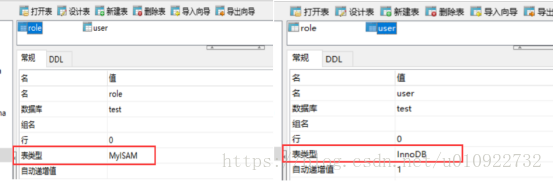
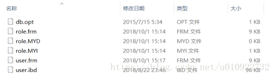
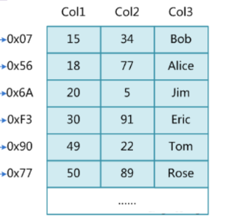
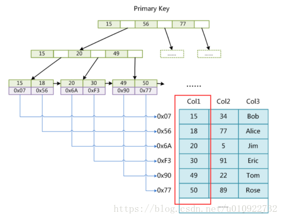
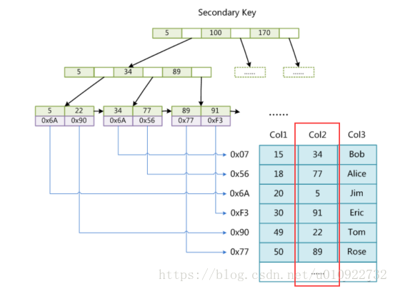
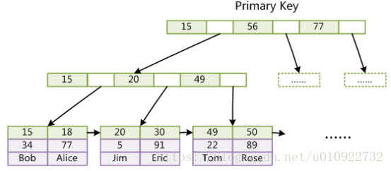
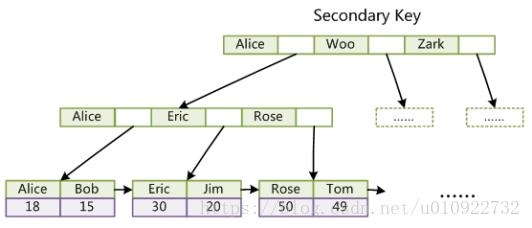

# 索引简介

[TOC]

### 1 是什么

#### 1.1 官方定义
​		MySQL官方对索引的定义为：索引（Index）是帮助MySQL高效获取数据的数据结构。

​		可以得到索引的本质：索引是数据结构。

#### 1.2 简单理解
​	你可以简单理解为“排好序的快速查找数据结构”。

#### 1.3 详解(重要)

​		在数据之外，数据库系统还维护着满足特定查找算法的数据结构，这些数据结构以某种方式引用（指向）数据，这样就可以在这些数据结构上实现高级查找算法。这种数据结构，就是索引。下图就是一种可能的索引方式示例：

 

​		左边是数据表，一共有两列七条记录，最左边的是数据记录的物理地址，为了加快Col2的查找，可以维护一个右边所示的二叉查找树，每个节点分别包含索引键值和一个指向对应数据记录物理地址的指针，这样就可以运用二叉查找在一定的复杂度内获取到相应数据，从而快速的检索出符合条件的记录。

- 二叉树弊端之一：二叉树很可能会发生两边不平衡的情况。
#### 1.4 结论

 数据本身之外，数据库还维护着一个满足特定查找算法的数据结构，这些数据结构以某种方式指向数据，这样就可以在这些数据结构的基础上实现高级查找算法，这种数据结构就是索引。

一般来说索引本身也很大，不可能全部存储在内存中，因此索引往往以索引文件的形式存储的磁盘上。

我们平常所说的索引，如果没有特别指明，都是指B树(多路搜索树，并不一定是二叉树)结构组织的索引。其中聚集索引，次要索引，覆盖索引，复合索引，前缀索引，唯一索引默认都是使用B+树索引，统称索引。当然，除了B+树这种类型的索引之外，还有哈稀索引(hash index)等。

### 2 优势

- 类似大学图书馆建书目索引，提高数据检索的效率，降低数据库的IO成本
- 通过索引列对数据进行排序，降低数据排序的成本，降低了CPU的消耗

### 3 劣势

- 实际上索引也是一张表，该表保存了主键与索引字段，并指向实体表的记录，所以索引列也是要占用空间的
- 虽然索引大大提高了查询速度，同时却会降低更新表的速度，如对表进行INSERT、UPDATE和DELETE。因为更新表时，MySQL不仅要更新数据文件，还要更新索引文件。
- 索引只是提高效率的一个因素，如果你的MySQL有大数据量的表，就需要花时间研究建立最优秀的索引，或优化查询语句

### 4 MySQL索引结构

#### 4.1 MyISAM和InnoDB对索引和数据的存储在磁盘上是如何体现的

先来看下面创建的两张表信息，role表使用的存储引擎是MyISAM，而user使用的是InnoDB：



再来看下两张表在磁盘中的索引文件和数据文件：



##### 4.1.1 role表有三个文件，对应如下：

- role.frm：表结构文件
- role.MYD：数据文件（MyISAM Data）
- role.MYI：索引文件（MyISAM Index）

##### 4.1.2 user表有两个文件，对应如下：

- user.frm：表结构文件
- user.ibd：索引和数据文件（InnoDB Data）

也由于两种引擎对索引和数据的存储方式的不同，我们也称MyISAM的索引为非聚集索引，InnoDB的索引为聚集索引。

#### 4.2 MyISAM主键索引与辅助索引的结构

我们先列举一部分数据出来分析，如下：



上面已经说明了MyISAM引擎的索引文件和数据文件是分离的，我们接着看一下下面两种索引结构异同。

##### 4.2.1 主键索引：

数据库索引是采用B+Tree存储，并且只在叶子节点存储数据，在MyISAM引擎中叶子结点存储的数据其实是索引和数据的文件指针两类。

如下图中我们以Col1列作为主键建立索引，对应的叶子结点储存形式可以看一下表格。



| 索引值   | 15   | 18   | →    | 20   | 30   | →    | 49   | 50   | →    |
| -------- | ---- | ---- | ---- | ---- | ---- | ---- | ---- | ---- | ---- |
| 文件指针 | 0x07 | 0x56 |      | 0x6A | 0xF3 |      | 0x90 | 0x77 |      |

通过索引查找数据的流程：先从索引文件中查找到索引节点，从中拿到数据的文件指针，再到数据文件中通过文件指针定位了具体的数据。

##### 4.2.2 辅助（非主键）索引：

以Col2列建立索引，得到的辅助索引结构跟上面的主键索引的结构是相同的。



#### 4.3 InnoDB主键索引与辅助索引的结构

##### 4.3.1 主键索引:

我们已经知道InnoDB索引是聚集索引，它的索引和数据是存入同一个.idb文件中的，因此它的索引结构是在同一个树节点中同时存放索引和数据，如下图中最底层的叶子节点有三行数据，对应于数据表中的Col1、Col2、Col3数据项。



##### 4.3.2 辅助（非主键）索引：

这次我们以数据表中的Col3列的字符串数据建立辅助索引，它的索引结构跟主键索引的结构有很大差别，我们来看下面的图：

在最底层的叶子结点有两行数据，第一行的字符串是辅助索引，按照ASCII码进行排序，第二行的整数是主键的值。



 

##### 4.3.3 InnoDB索引结构需要注意的点：

- 数据文件本身就是索引文件
- 表数据文件本身就是按B+Tree组织的一个索引结构文件
- 聚集索引中叶节点包含了完整的数据记录
- InnoDB表必须要有主键，并且推荐使用整型自增主键

正如我们上面介绍InnoDB存储结构，索引与数据是共同存储的，不管是主键索引还是辅助索引，在查找时都是通过先查找到索引节点才能拿到相对应的数据，如果我们在设计表结构时没有显式指定索引列的话，MySQL会从表中选择数据不重复的列建立索引，如果没有符合的列，则MySQL自动为InnoDB表生成一个隐含字段作为主键，并且这个字段长度为6个字节，类型为整型。

##### 4.3.4 那为什么推荐使用整型自增主键而不是选择UUID？

- UUID是字符串，比整型消耗更多的存储空间；
- 在B+树中进行查找时需要跟经过的节点值比较大小，整型数据的比较运算比字符串更快速；
- 自增的整型索引在磁盘中会连续存储，在读取一页数据时也是连续；UUID是随机产生的，读取的上下两行数据存储是分散的，不适合执行where id > 5 && id < 20的条件查询语句。
- 在插入或删除数据时，整型自增主键会在叶子结点的末尾建立新的叶子节点，不会破坏左侧子树的结构；UUID主键很容易出现这样的情况，B+树为了维持自身的特性，有可能会进行结构的重构，消耗更多的时间。

#### 4.4 full-text全文索引

​		全文索引（也称全文检索）是目前搜索引擎使用的一种关键技术。它能够利用【分词技术】等多种算法智能分析出文本文字中关键词的频率和重要性，然后按照一定的算法规则智能地筛选出我们想要的搜索结果。
```
 CREATE TABLE `article` (

  `id` int(10) unsigned NOT NULL AUTO_INCREMENT,

  `title` varchar(200) DEFAULT NULL,

  `content` text,

  PRIMARY KEY (`id`),

  FULLTEXT KEY `title` (`title`,`content`)

) ENGINE=MyISAM DEFAULT CHARSET=utf8;
```
不同于like方式的的查询：
```
SELECT * FROM article WHERE content LIKE ‘%查询字符串%’;
```
全文索引用match+against方式查询：
```
SELECT * FROM article WHERE MATCH(title,content) AGAINST (‘查询字符串’);
```
明显的提高查询效率。

限制：

mysql5.6.4以前只有Myisam支持，5.6.4版本以后innodb才支持，但是官方版本不支持中文分词，需要第三方分词插件。

5.7以后官方支持中文分词。

随着大数据时代的到来，关系型数据库应对全文索引的需求已力不从心，逐渐被 solr,elasticSearch等专门的搜索引擎所替代。

#### 4.5 Hash索引

Hash索引只有Memory, NDB两种引擎支持，Memory引擎默认支持Hash索引，如果多个hash值相同，出现哈希碰撞，那么索引以链表方式存储。

NoSql采用此种索引结构。

#### 4.6 R-Tree索引

R-Tree在mysql很少使用，仅支持geometry数据类型，支持该类型的存储引擎只有myisam、bdb、innodb、ndb、archive几种。

相对于b-tree，r-tree的优势在于范围查找。

### 5 MySQL索引分类

#### 5.1 主键索引

- 设定为主键后数据库会自动建立索引，innodb为聚簇索引

- 语法：

```
随表一起建索引：

CREATE TABLE customer (
id INT(10) UNSIGNED  AUTO_INCREMENT,
customer_no VARCHAR(200),
customer_name VARCHAR(200),
PRIMARY KEY(id) 
);

unsigned (无符号的)

使用  AUTO_INCREMENT 关键字的列必须有索引(只要有索引就行)。

CREATE TABLE customer2 (
id INT(10) UNSIGNED,
customer_no VARCHAR(200),
customer_name VARCHAR(200),
PRIMARY KEY(id) 
);

单独建主键索引：

ALTER TABLE customer 
add PRIMARY KEY customer(customer_no);  

删除建主键索引：

ALTER TABLE customer 
drop PRIMARY KEY ;  

修改建主键索引：

必须先删除掉(drop)原索引，再新建(add)索引
```
#### 5.2 单值索引

- 即一个索引只包含单个列，一个表可以有多个单列索引

- 语法

  ```
  随表一起建索引：
  CREATE TABLE customer (
  id INT(10) UNSIGNED  AUTO_INCREMENT,
  customer_no VARCHAR(200),
  customer_name VARCHAR(200),
  PRIMARY KEY(id),
  KEY (customer_name)  
  );
  随表一起建立的索引 索引名同列名(customer_name)
  单独建单值索引：
  CREATE  INDEX idx_customer_name ON customer(customer_name); 
删除索引：
  DROP INDEX idx_customer_name on customer;
  ```
  

#### 5.3 唯一索引

- 索引列的值必须唯一，但允许有空值

- 语法

  ```
  随表一起建索引：
  CREATE TABLE customer (
  id INT(10) UNSIGNED  AUTO_INCREMENT,
  customer_no VARCHAR(200),
  customer_name VARCHAR(200),
  PRIMARY KEY(id),
  KEY (customer_name),
  UNIQUE (customer_no)
  );
  建立 唯一索引时必须保证所有的值是唯一的（除了null），若有重复数据，会报错。  
  单独建唯一索引：
  CREATE UNIQUE INDEX idx_customer_no ON customer(customer_no); 
  删除索引：
  DROP INDEX idx_customer_no on customer ;
  ```

#### 5.4 复合索引

- 即一个索引包含多个列

  在数据库操作期间，复合索引比单值索引所需要的开销更小(对于相同的多个列建索引)

  当表的行数远大于索引列的数目时可以使用复合索引

- 语法

  ```
  随表一起建索引：
  CREATE TABLE customer (
  id INT(10) UNSIGNED  AUTO_INCREMENT,
  customer_no VARCHAR(200),
  customer_name VARCHAR(200),
  PRIMARY KEY(id),
  KEY (customer_name),
  UNIQUE (customer_name),
  KEY (customer_no,customer_name)
  );
  单独建索引：
  CREATE  INDEX idx_no_name ON customer(customer_no,customer_name); 
删除索引：
  DROP INDEX idx_no_name on customer;
  ```
  
  

#### 5.5 基本语法

- 创建

  ```
  ALTER mytable ADD  [UNIQUE ]  INDEX [indexName] ON (columnname(length)) 
  ```

- 删除

  ```
  DROP INDEX [indexName] ON mytable; 
  ```


- 查看

  ```
  SHOW INDEX FROM table_name\G
  ```

  
  | table    | Non_unique | Key_name | Seq_in_index | Column_name | Collation | Cardinality | Sub_part | Packed | Null | Index_type | Comment | Index_comment |
  | -------- | ---------- | -------- | ------------ | ----------- | --------- | ----------- | -------- | ------ | ---- | ---------- | ------- | ------------- |
  | customer | 0          | primary  | 0            | id          | A         | 0           | (NULL)   | (NULL) |      | BTREE      |         |               |
  | customer | 1          | custm_no | 1            | custm_no    | A         | 0           | (NULL)   | (NULL) | YES  | BTREE      |         |               |

  - non_unique: 是否是唯一索引  1：不是   0：是

  - seq_in_index:列 在索引中的序列。针对复合索引(一个索引对应多个列)。针对同一个复合索引 按照创建复合索引时的顺序进行排序

  - collation:

  - cardinality:

  - sub_part:

  - packed:

  - Null:是否允许 null 值

  - comment:

  - index_comment:

- 使用ALTER命令

  ```
  有四种方式来添加数据表的索引：
  ALTER TABLE tbl_name ADD PRIMARY KEY (column_list): 该语句添加一个主键，这意味着索引值必须是唯一的，且不能为NULL。
  ALTER TABLE tbl_name ADD UNIQUE index_name (column_list): 这条语句创建索引的值必须是唯一的（除了NULL外，NULL可能会出现多次）。
  ALTER TABLE tbl_name ADD INDEX index_name (column_list): 添加普通索引，索引值可出现多次。
  ALTER TABLE tbl_name ADD FULLTEXT index_name (column_list):该语句指定了索引为 FULLTEXT ，用于全文索引。
  
  ```


### 6 哪些情况需要创建索引

- 主键自动建立唯一索引

- 频繁作为查询条件的字段应该创建索引(where 后面的语句)

- 查询中与其它表关联的字段，外键关系建立索引

  ```
  A 表关联 B 表：A join B on 后面的连接条件，即 A 表查询 B 表的条件。所以 B 表被关联的字段建立索引能大大提高查询效率
  因为在 join 中，join 左边的表会用每一个字段去遍历 B 表的所有的关联数据，相当于一个查询操作
  ```

- 单值/组合索引的选择问题，who？(在高并发下倾向创建组合索引)

- 查询中排序的字段，排序字段若通过索引去访问将大大提高排序速度

  ```
  group by 和 order by 后面的字段有索引大大提高效率
  ```

- 查询中统计或者分组字段

### 7 哪些情况不要创建索引

- 表记录太少
- 经常增删改的表
- Where条件里用不到的字段不创建索引
- 数据重复且分布平均的表字段，因此应该只为最经常查询和最经常排序的数据列建立索引。
  - 注意，如果某个数据列包含许多重复的内容，为它建立索引就没有太大的实际效果。
    