# 性能分析

[TOC]

### 1 MySQL常见瓶颈

- CPU

  - SQL中对大量数据进行比较、关联、排序、分组（最大的压力在于 **比较**）

- IO

  - 实例内存满足不了缓存数据或排序等需要，导致产生大量**物理IO**。

  - 查询执行效率低，扫描过多数据行。

- 锁

  - 不适宜的锁的设置，导致线程阻塞，性能下降。

  - 死锁，线程之间交叉调用资源，导致死锁，程序卡住。

- 服务器硬件的性能瓶颈

  - top,free, iostat和vmstat来查看系统的性能状态

### 2 Explain

#### 2.1 是什么(查看执行计划)

- 使用EXPLAIN关键字可以模拟优化器执行SQL查询语句，从而知道MySQL是如何处理你的SQL语句的。分析你的查询语句或是表结构的性能瓶颈

- 官网介绍

  http://dev.mysql.com/doc/refman/5.5/en/explain-output.html

  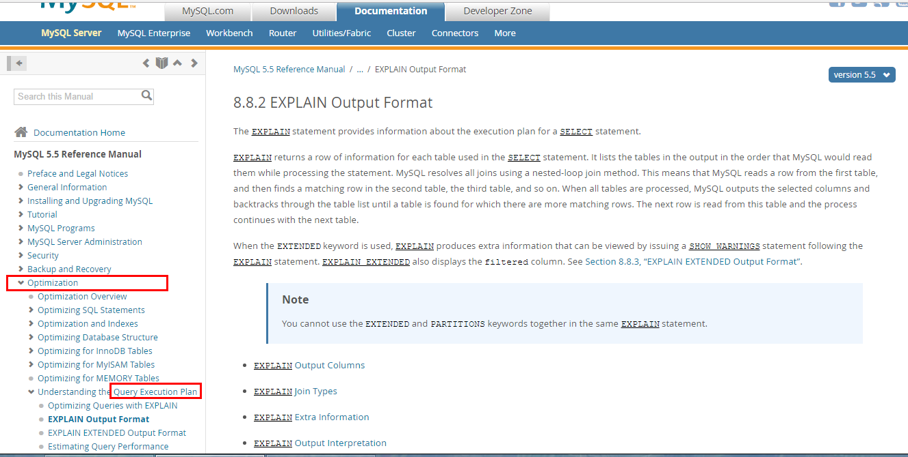 

#### 2.2 能干嘛

- 表的读取顺序
- 哪些索引可以使用
- 数据读取操作的操作类型
- 哪些索引被实际使用
- 表之间的引用
- 每张表有多少行被优化器查询

#### 2.3 怎么玩

- Explain + SQL语句

- 执行计划包含的信息

- 建表脚本

  ```
   CREATE TABLE t1(id INT(10) AUTO_INCREMENT,content  VARCHAR(100) NULL ,  PRIMARY KEY (id));
   CREATE TABLE t2(id INT(10) AUTO_INCREMENT,content  VARCHAR(100) NULL ,  PRIMARY KEY (id));
   CREATE TABLE t3(id INT(10) AUTO_INCREMENT,content  VARCHAR(100) NULL ,  PRIMARY KEY (id));
   CREATE TABLE t4(id INT(10) AUTO_INCREMENT,content  VARCHAR(100) NULL ,  PRIMARY KEY (id));
   INSERT INTO t1(content) VALUES(CONCAT('t1_',FLOOR(1+RAND()*1000)));
   INSERT INTO t2(content) VALUES(CONCAT('t2_',FLOOR(1+RAND()*1000)));
   INSERT INTO t3(content) VALUES(CONCAT('t3_',FLOOR(1+RAND()*1000)));
   INSERT INTO t4(content) VALUES(CONCAT('t4_',FLOOR(1+RAND()*1000)));
  ```

  

#### 2.4 各字段解释

##### 2.4.1 id

1. 含义：select查询的序列号,包含一组数字，表示查询中执行select子句或操作表的顺序

2. 三种情况：

  - id相同，执行顺序由上至下

    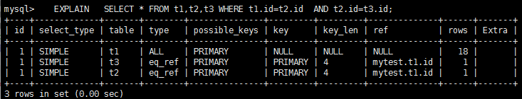 

    id相同，执行顺序由上至下  

    此例中 先执行where 后的第一条语句 t1.id = t2.id 通过 t1.id 关联 t2.id 。 而  t2.id 的结果建立在 t2.id=t3.id 的基础之上。

  - id不同，如果是子查询，id的序号会递增，id值越大优先级越高，越先被执行

    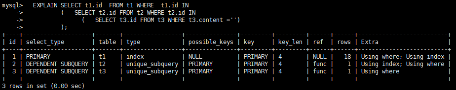 

    id不同，如果是子查询，id的序号会递增，id值越大优先级越高，越先被执行

  - id相同不同，同时存在

    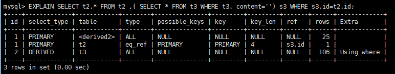 

    id如果相同，可以认为是一组，从上往下顺序执行；

    在所有组中，id值越大，优先级越高，越先执行

    衍生表 = derived2 --> derived + 2 （2 表示由 id =2 的查询衍生出来的表。type 肯定是 all ，因为衍生的表没有建立索引）

##### 2.4.2 select_type

1. 含义:查询的类型，主要是用于区别**普通查询、联合查询、子查询**等复杂查询

2. 有哪些

 

3. 具体介绍
- SIMPLE : 简单的 select 查询,查询中不包含子查询或者UNION

  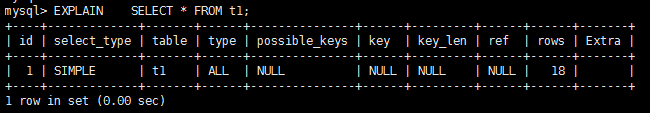 

- PRIMARY : 查询中若包含任何复杂的子部分，最外层查询则被标记为Primary

  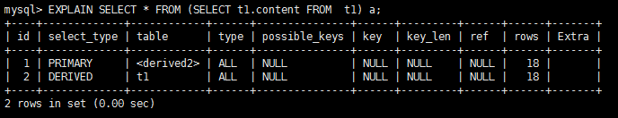 

- DERIVED : 在FROM列表中包含的子查询被标记为DERIVED(衍生),MySQL会递归执行这些子查询, 把结果放在临时表里。

  

  DERIVED 即查询通过子查询查出来的 临时表

- SUBQUERY : 在SELECT或WHERE列表中包含了子查询, 子查询结果为 单值

  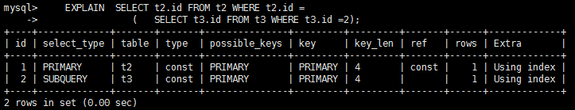 

- DEPENDENT SUBQUERY : 在SELECT或WHERE列表中包含了子查询, 子查询结果为 多值

  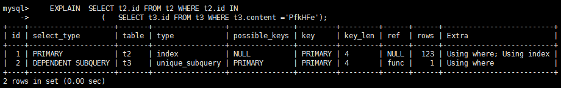 

  dependent subquery 与 subquery 的区别

  依赖子查询 ： 子查询结果为 多值

  子查询：子查询结果为 单值 

- UNCACHEABLE SUBQUREY : 无法被缓存的子查询

- UNION : 

  - 若第二个SELECT出现在UNION之后，则被标记为UNION；

  - 若UNION包含在FROM子句的子查询中,外层SELECT将被标记为：DERIVED

  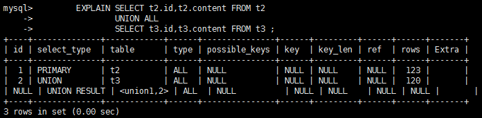 

  UNION RESULT 两个语句执行完后的结果

- UNION RESULT : 从UNION表获取结果的SELECT

   
##### 2.4.3 table

1. 含义 : 显示这一行的数据是关于哪张表的

##### 2.4.4 type

1. 含义 : 显示查询使用了何种访问类型

2. 访问类型排列

   type显示的是访问类型，是较为重要的一个指标，结果值从最好到最坏依次是：  

   system > const > eq_ref > ref > fulltext > ref_or_null > index_merge > unique_subquery > index_subquery > range(尽量保证) > index > ALL 

   **system>const>eq_ref>ref>range>index>ALL**

   一般来说，得保证查询至少达到range级别，最好能达到ref。

3. 具体介绍
- system : 表只有一行记录（等于系统表），这是const类型的特例，平时不会出现，这个也可以忽略不计

- const : 表示通过索引一次就找到了,const用于比较primary key或者unique索引。因为只匹配一行数据，所以很快。如将主键置于where列表中，MySQL就能将该查询转换为一个常量

  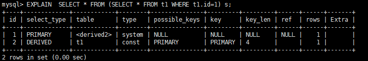 

- eq_ref ：唯一性索引扫描，对于每个索引键，表中只有一条记录与之匹配。常见于主键或唯一索引扫描

   

- ref ：非唯一性索引扫描，返回匹配某个单独值的所有行。本质上也是一种索引访问，它返回所有匹配某个单独值的行，然而，它可能会找到多个符合条件的行，所以他应该属于查找和扫描的混合体

- range：只检索给定范围的行,使用一个索引来选择行。key 列显示使用了哪个索引，一般就是在你的where语句中出现了between、<、>、in等的查询。这种范围扫描索引扫描比全表扫描要好，因为它只需要开始于索引的某一点，而结束语另一点，不用扫描全部索引。

  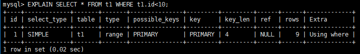 

  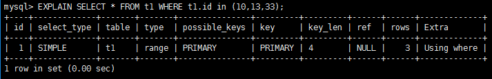 

- index：Full Index Scan，index与ALL区别为index类型只遍历索引树。这通常比ALL快，**因为索引文件通常比数据文件小**。（也就是说虽然all和Index都是读全表，但index是从索引中读取的，而all是从硬盘中读的）

  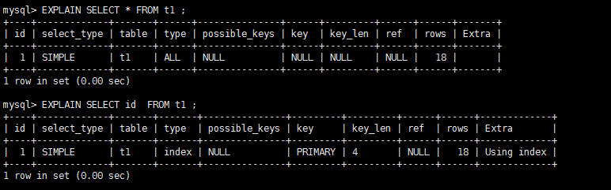 

- all：Full Table Scan，将遍历全表以找到匹配的行

  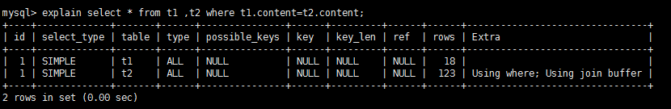 

  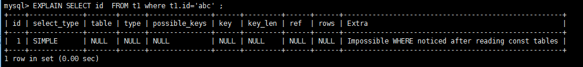 

- index_merge：在查询过程中需要多个索引组合使用，通常出现在有 or 的关键字的sql中

  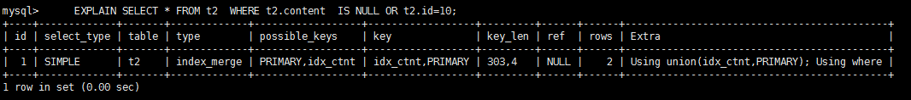 

- ref_or_null：对于某个字段既需要关联条件，也需要null值的情况下。查询优化器会选择用ref_or_null连接查询。

  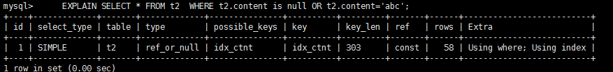 

- index_subquery：利用索引来关联子查询，不再全表扫描。

  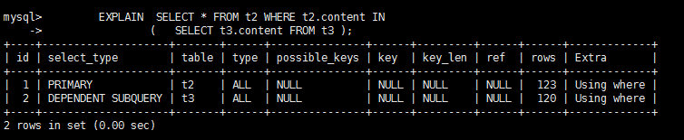 

  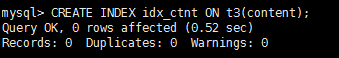 

   

- unique_subquery：该联接类型类似于index_subquery。 子查询中的唯一索引

  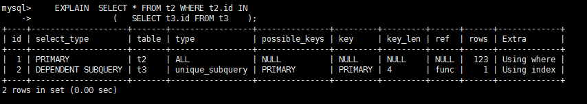 

##### 2.4.5 possible_keys

1. 含义：显示可能应用在这张表中的索引，一个或多个。查询涉及到的字段上若存在索引，则该索引将被列出，但不一定被查询实际使用

##### 2.4.6 key

1. 含义：实际使用的索引。如果为NULL，则没有使用索引
2. 覆盖索引：查询的select字段和索引重叠

##### 2.4.7 key_len

1. 含义：表示索引中使用的字节数，可通过该列计算查询中使用的索引的长度。

```
EXPLAIN SELECT * FROM emp WHERE emp.deptno=109 AND emp.ename='AvDEjl'
```
    

   如何计算

    

   总结一下：char(30) utf8 --> key_len = 30*3 +1  表示 utf8 格式需要  *3 (跟数据类型有关)   

   ​                 允许为 NULL  +1  ，不允许 +0

   ​                 动态类型 +2  (动态类型包括 : varchar , detail text() 截取字符窜)

    

   第一组：`key_len=deptno(int)+null + ename(varchar(20)*3+动态)=4+1+20*3+2= 67`

   第二组：`key_len=deptno(int)+null=4+1=5 `

2. 作用：key_len字段能够帮你检查是否充分的利用上了索引

   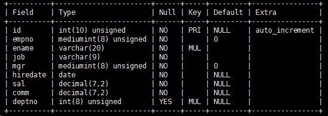 

   ```
    RESET QUERY CACHE ;             

    EXPLAIN     SELECT emp.deptno,COUNT(*) c FROM emp    

    WHERE emp.ename LIKE 'a%'   AND emp.deptno=109

    GROUP BY emp.deptno

    HAVING c >2

    ORDER BY c DESC
   ```
   同样的使用了索引但是索引的涉及的字段却不同。

   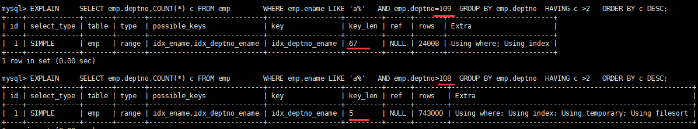 

   下图可知，充分的利用了索引的查询效率会更高。

   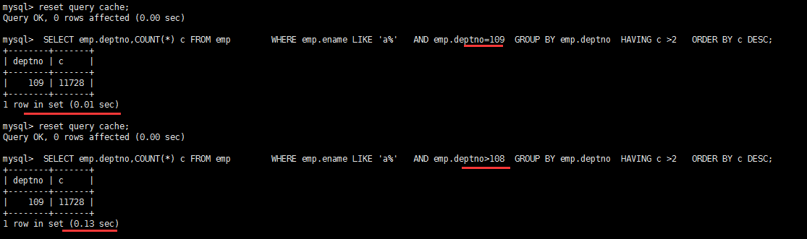 

##### 2.4.8 ref

1. 含义：显示索引的哪一列被使用了，如果可能的话，是一个常数。哪些列或常量被用于查找索引列上的值

   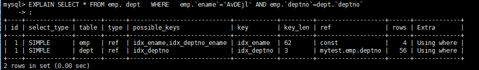 

##### 2.4.9 rows

1. 含义：rows列显示MySQL认为它执行查询时必须检查的行数。（越少越好）

   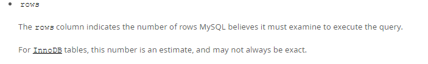

##### 2.4.10 Extra

1. 含义：包含不适合在其他列中显示但十分重要的额外信息

2. 具体介绍

- Using filesort 
  - 含义：说明mysql会对数据使用一个外部的索引进行排序，而不是按照表内的索引顺序进行读取。MySQL中无法利用索引完成的排序操作称为“文件排序”
  
  - 例子
  
     出现filesort的情况：
  
    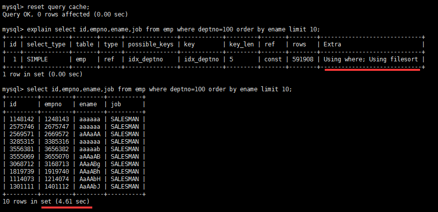 
  
    优化后，不再出现filesort的情况：(给 ename 加上了索引)
  
    [缺图]
  
    查询中排序的字段，排序字段若通过索引去访问将大大提高排序速度
  
    分情况：当通过前面的查询语句 筛选大部分条件后，只剩下很少的数据。using filesort 性能影响不大。需要综合考虑
  
- Using temporary 

  - 含义：使了用临时表保存中间结果,MySQL在对查询结果排序时使用临时表。常见于排序 order by 和分组查询 group by。

  - 例子

    优化前存在 using  temporary 和 using  filesort  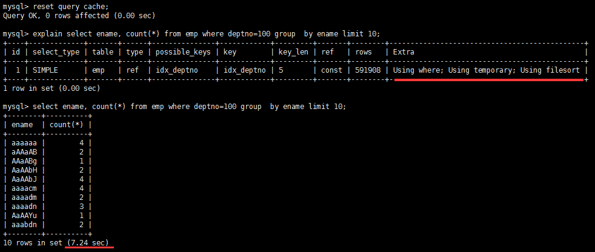 

    你怎么优化的? 建立索引？  在 group by 的情况下发生的。

    `create index idx_deptno_ename on emp(deptno,ename) `后解决

    优化前存在的 using  temporary 和 using  filesort 不在，性能发生明显变化：

    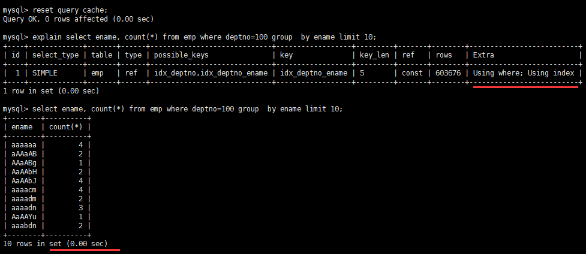 

- USING index

  - 含义：表示相应的select操作中使用了覆盖索引(Covering Index)，避免访问了表的数据行，效率不错！

    - 如果同时出现using where，表明索引被用来执行索引键值的查找;

    - 如果没有同时出现using where，表明索引只是用来读取数据而非利用索引执行查找。
    
  - 覆盖索引(Covering Index)：
  
    索引是高效找到行的一个方法，但是一般数据库也能使用索引找到一个列的数据，因此它不必读取整个行。毕竟索引叶子节点存储了它们索引的数据;当能通过读取索引就可以得到想要的数据，那就不需要读取行了。①一个索引 ②包含了(或覆盖了)[select子句]与查询条件[Where子句]中 ③所有需要的字段就叫做覆盖索引。
  
    覆盖索引理解：
  
    ​        ` select id , name from t_xxx where age=18;`
  
    ​         有一个组合索引  idx_id_name_age_xxx 包含了(覆盖了)，id,name,age三个字段。查询时直接将建立了索引的列读取出来了，而不需要去查找所在行的其他数据。所以很高效。
  
    ​         (个人认为：在数据量较大，固定字段查询情况多时可以使用这种方法。)
  
    注意：
  
    如果要使用覆盖索引，一定要注意select列表中只取出需要的列，不可select *，
  
    因为如果将所有字段一起做索引会导致索引文件过大，查询性能下降。
  
- Using where

  1. 含义：表明使用了where过滤

- using join buffer

  1. 含义：使用了连接缓存

  2. 例子

     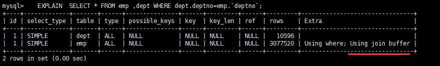 

     出现在当两个连接时

     驱动表(被连接的表,left join 左边的表。inner join 中数据少的表) 没有索引的情况下。

     给驱动表建立索引可解决此问题。且 type 将改变成 ref

- impossible where

  1. 含义：where子句的值总是false，不能用来获取任何元组

  2. 例子

     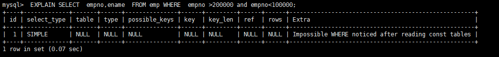 

- select tables optimized away

  1. 含义：在没有GROUP BY子句的情况下，基于索引优化MIN/MAX操作或者对于MyISAM存储引擎优化COUNT(*)操作，不必等到执行阶段再进行计算，查询执行计划生成的阶段即完成优化。

  2. 例子

     在innodb中：

     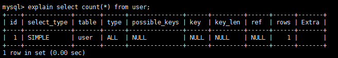 

     在Myisam中：

     [缺图] 

     myisam 中会维护 总行数 (还有其他参数)这个参数，所以在执行查询时不会进行全表扫描。而是直接读取这个数。

     但会对增删产生一定的影响。根据业务情况决定谁好谁坏

     innodb 中没有这个机制。
