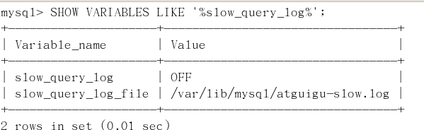
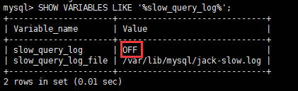
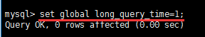
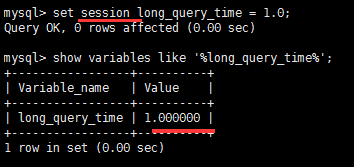
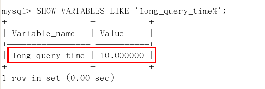
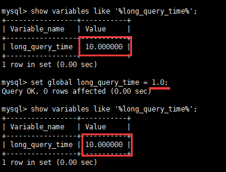
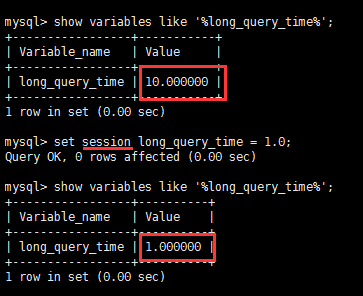
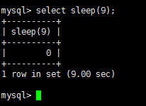
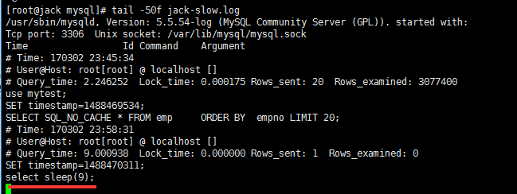
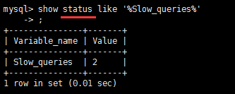

# 慢查询日志

### 0 目录

[TOC]

### 1 是什么

- MySQL的慢查询日志是MySQL提供的一种日志记录，它用来记录在MySQL中响应时间超过阀值的语句，具体指运行时间超过long_query_time值的SQL，则会被记录到慢查询日志中。

- 具体指运行时间超过long_query_time值的SQL，则会被记录到慢查询日志中。long_query_time的默认值为10，意思是运行10秒以上的语句。

- 由他来查看哪些SQL超出了我们的最大忍耐时间值，比如一条sql执行超过5秒钟，我们就算慢SQL，希望能收集超过5秒的sql，结合之前explain进行全面分析。

### 2 怎么玩

#### 2.1 说明

默认情况下，MySQL数据库没有开启慢查询日志，需要我们手动来设置这个参数。

当然，如果不是调优需要的话，一般不建议启动该参数，因为开启慢查询日志会或多或少带来一定的性能影响。慢查询日志支持将日志记录写入文件

#### 2.2 查看是否开启及如何开启

- 默认 

  默认情况下slow_query_log的值为OFF，表示慢查询日志是禁用的，

  可以通过设置slow_query_log的值来开启

  SHOW VARIABLES LIKE '%slow_query_log%';

   

- 开启

  使用set global slow_query_log=1开启了慢查询日志只对当前数据库生效，

  如果MySQL重启后则会失效。

   

   

  全局变量设置，对当前连接不影响

   

  对当前连接立刻生效

   

  如果要永久生效，就必须修改配置文件my.cnf（其它系统变量也是如此）

  修改my.cnf文件，[mysqld]下增加或修改参数

  slow_query_log 和slow_query_log_file后，然后重启MySQL服务器。也即将如下两行配置进my.cnf文件

  slow_query_log =1

  slow_query_log_file=/var/lib/mysql/atguigu-slow.log

  关于慢查询的参数slow_query_log_file ，它指定慢查询日志文件的存放路径，系统默认会给一个缺省的文件host_name-slow.log（如果没有指定参数slow_query_log_file的话）

#### 2.3 那么开启了慢查询日志后，什么样的SQL才会记录到慢查询日志里面呢？

这个是由参数long_query_time控制，默认情况下long_query_time的值为10秒，

命令：SHOW VARIABLES LIKE 'long_query_time%';

 

可以使用命令修改，也可以在my.cnf参数里面修改。

假如运行时间正好等于long_query_time的情况，并不会被记录下来。也就是说，

在mysql源码里是判断大于long_query_time，而非大于等于。

#### 2.4 Case

- 查看当前多少秒算慢

  SHOW VARIABLES LIKE 'long_query_time%';

- 设置慢的阙值时间

  使用命令 

  set global long_query_time=1

  修改为阙值到1秒钟的就是慢sql

   

  修改后发现long_query_time并没有改变。

- 为什么设置后看不出变化？

  - 需要重新连接或新开一个会话才能看到修改值。 SHOW VARIABLES LIKE 'long_query_time%';

  - 或者通过set session long_query_time=1来改变当前session变量;

     

- 记录慢SQL并后续分析

   实验一条慢sql

   

  跟踪日志信息

   

- 查询当前系统中有多少条慢查询记录

  show global status like '%Slow_queries%';

   

#### 2.5 配置版

【mysqld】下配置：

slow_query_log=1;

slow_query_log_file=/var/lib/mysql/atguigu-slow.log

long_query_time=3;

log_output=FILE

### 3 日志分析工具mysqldumpslow

#### 3.1 查看mysqldumpslow的帮助信息
- s: 是表示按照何种方式排序；
- c: 访问次数
- l: 锁定时间
- r: 返回记录
- t: 查询行数
- al:平均锁定时间
- ar:平均返回记录数
- at:平均查询时间
- t:即为返回前面多少条的数据；
- g:后边搭配一个正则匹配模式，大小写不敏感的；

#### 3.2 工作常用参考

得到返回记录集最多的10个SQL

mysqldumpslow -s r -t 10 /var/lib/mysql/atguigu-slow.log

得到访问次数最多的10个SQL

mysqldumpslow -s c -t 10 /var/lib/mysql/atguigu-slow.log

得到按照时间排序的前10条里面含有左连接的查询语句

mysqldumpslow -s t -t 10 -g "left join" /var/lib/mysql/atguigu-slow.log

另外建议在使用这些命令时结合 | 和more 使用 ，否则有可能出现爆屏情况

mysqldumpslow -s r -t 10 /var/lib/mysql/atguigu-slow.log | more

