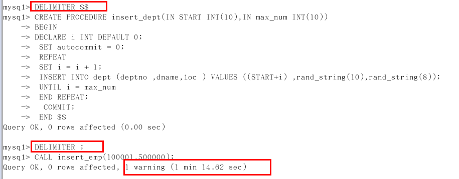
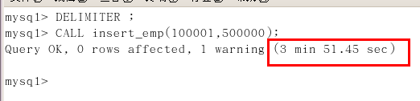
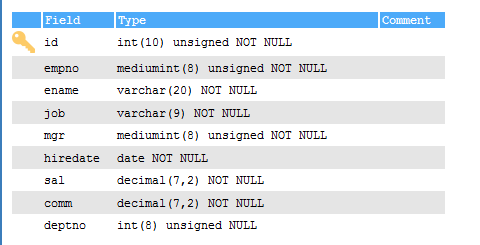
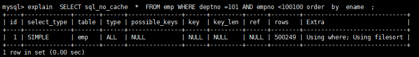
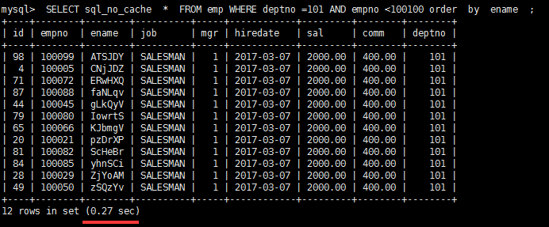
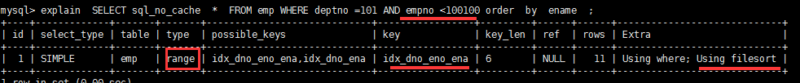
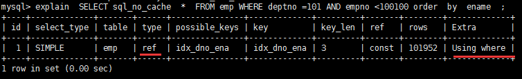
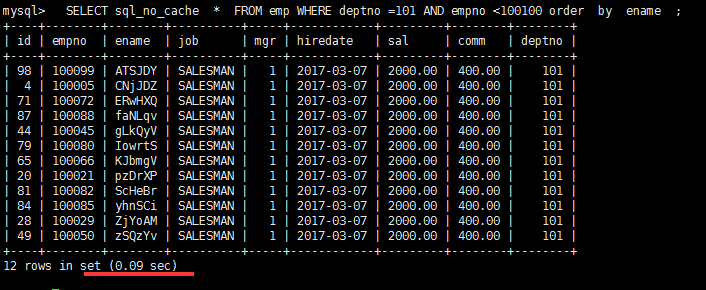
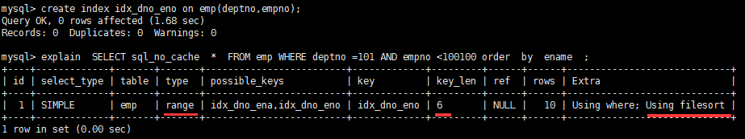
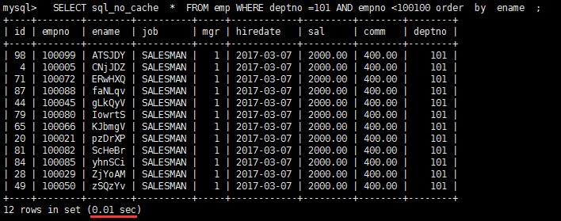

# 批量数据脚本

>往表里插入1000W数据

### 1 建表

\#0 新建库

```
create database bigData;

use bigData;
```
\#1 建表dept
```
CREATE TABLE dept(  

id INT UNSIGNED PRIMARY KEY AUTO_INCREMENT,  

deptno MEDIUMINT UNSIGNED NOT NULL DEFAULT 0,   

dname VARCHAR(20) NOT NULL DEFAULT "",  

loc VARCHAR(13) NOT NULL DEFAULT ""  

) ENGINE=INNODB DEFAULT CHARSET=UTF8 ;  
```
\#2 建表emp
```
CREATE TABLE emp(  

id INT UNSIGNED PRIMARY KEY AUTO_INCREMENT,  

empno MEDIUMINT UNSIGNED NOT NULL DEFAULT 0, /*编号*/  

ename VARCHAR(20) NOT NULL DEFAULT "", /*名字*/  

job VARCHAR(9) NOT NULL DEFAULT "",/*工作*/  

mgr MEDIUMINT UNSIGNED NOT NULL DEFAULT 0,/*上级编号*/  

hiredate DATE NOT NULL,/*入职时间*/  

sal DECIMAL(7,2) NOT NULL,/*薪水*/  

comm DECIMAL(7,2) NOT NULL,/*红利*/  

deptno MEDIUMINT UNSIGNED NOT NULL DEFAULT 0 /*部门编号*/  

)ENGINE=INNODB DEFAULT CHARSET=UTF8 ; 
```
### 2 设置参数log_bin_trust_function_creators

创建函数，假如报错：This function has none of DETERMINISTIC......

当二进制日志(log_bin )启用后，这个变量就会启用。它控制是否可以信任存储函数创建者，不会创建写入二进制日志引起不安全事件的存储函数。如果设置为0（默认值），用户不得创建或修改存储函数，除非它们具有除CREATE ROUTINE或ALTER ROUTINE特权之外的SUPER权限。 设置为0还强制使用DETERMINISTIC特性或READS SQL DATA或NO SQL特性声明函数的限制。 如果变量设置为1，MySQL不会对创建存储函数实施这些限制。 此变量也适用于触发器的创建。

\# 因为我们开启了 bin-log, 我们就必须设置log_bin_trust_function_creators=1
```
show variables like 'log_bin_trust_function_creators';

set global log_bin_trust_function_creators=1;
```
\# set global log_bin_trust_function_creators=1，重启mysqld后会失效，永久方法：
```
windows下my.ini[mysqld]加上log_bin_trust_function_creators=1 

linux下/etc/my.cnf下my.cnf[mysqld]加上log_bin_trust_function_creators=1
```
### 3 创建函数,保证每条数据都不同

#### 3.1 随机产生字符串
```
DELIMITER $$

CREATE FUNCTION rand_string(n INT) RETURNS VARCHAR(255)

BEGIN    #方法开始

 DECLARE chars_str VARCHAR(100) DEFAULT 'abcdefghijklmnopqrstuvwxyzABCDEFJHIJKLMNOPQRSTUVWXYZ';
 
 #声明一个字符串长度为 100 的变量 chars_str ,默认值 
 DECLARE return_str VARCHAR(255) DEFAULT '';

 DECLARE i INT DEFAULT 0;

#循环开始

 WHILE i < n DO

 	SET return_str =CONCAT(return_str,SUBSTRING(chars_str,FLOOR(1+RAND()*52),1));

 	SET i = i + 1;

 END WHILE;

 RETURN return_str;

END $$

#假如要删除
DELIMITER ;
drop function rand_string;
```
```
SUBSTRING函数：
mysql> SELECT SUBSTRING('MySQL SUBSTRING',1,5);
+----------------------------------+
| SUBSTRING('MySQL SUBSTRING',1,5) |
+----------------------------------+
| MySQL                            |
+----------------------------------+
1 row in set

RAND函数：返回[0,1)之间的小数
mysql> SELECT RAND( ), RAND( ), RAND( );
+------------------+-----------------+------------------+
| RAND( )   | RAND( )   | RAND( )   |
+------------------+-----------------+------------------+
| 0.45464584925645 | 0.1824410643265 | 0.54826780459682 |
+------------------+-----------------+------------------+
1 row in set (0.00 sec)
```

#### 3.2 随机产生部门编号
```
#用于随机产生部门编号

DELIMITER $$

CREATE FUNCTION rand_num( ) RETURNS INT(5)  

BEGIN   

 DECLARE i INT DEFAULT 0;  

 SET i = FLOOR(100+RAND()*10);  

RETURN i;  

END $$

#假如要删除
DELIMITER ;
drop function rand_num;
```
### 4 创建存储过程

#### 4.1 创建往emp表中插入数据的存储过程
```
DELIMITER $$

CREATE PROCEDURE insert_emp(IN START INT(10),IN max_num INT(10))  

BEGIN  

DECLARE i INT DEFAULT 0;   

#set autocommit =0 把autocommit设置成0,提高执行效率

 SET autocommit = 0;    

 REPEAT  ##重复

 SET i = i + 1;  

 INSERT INTO emp (empno, ename ,job ,mgr ,hiredate ,sal ,comm ,deptno ) VALUES ((START+i),rand_string(6),'SALESMAN',0001,CURDATE(),FLOOR(1+RAND()*20000),FLOOR(1+RAND()*1000),rand_num());  

 UNTIL i = max_num   ##直到  上面也是一个循环

 END REPEAT;  ##满足条件后结束循环

 COMMIT;   ##执行完成后一起提交

 END $$

#删除

DELIMITER ;

drop PROCEDURE insert_emp;
```
#### 4.2 创建往dept表中插入数据的存储过程

\#执行存储过程，往dept表添加随机数据
```
DELIMITER $$

CREATE PROCEDURE insert_dept(IN START INT(10),IN max_num INT(10))  

BEGIN  

DECLARE i INT DEFAULT 0;   

 SET autocommit = 0;    

 REPEAT  

 SET i = i + 1;  

 INSERT INTO dept (deptno ,dname,loc ) VALUES (START +i ,rand_string(10),rand_string(8));  

 UNTIL i = max_num  

 END REPEAT;  

 COMMIT;  

 END $$ 

#删除

DELIMITER ;

drop PROCEDURE insert_dept;
```
### 5 调用存储过程

#### 5.1 dept
```
DELIMITER ;

CALL insert_dept(100,10); 
```
#### 5.2 emp

执行存储过程，往emp表添加50万条数据
```
DELIMITER ;    #将 结束标志换回 ;

CALL insert_emp(100001,500000); 

CALL insert_emp10000(100001,10000); 
```
 

 

### 6 大量数据案例

**查询 部门编号为101的，且员工编号小于100100的用户，按用户名称排序**

 
```
EXPLAIN SELECT sql_no_cache * FROM emp WHERE deptno=101 AND empno<100100 order by ename;
```
 

**结论：**很显然,type 是 ALL,即最坏的情况。Extra 里还出现了 Using filesort,也是最坏的情况。优化是必须的。

**开始优化：**

- 思路：  尽量让where的过滤条件和排序使用上索引

  但是一共两个字段(deptno,empno)上有过滤条件，一个字段(ename)有索引 

- 我们建一个三个字段的组合索引可否？

```
create index idx_dno_eno_ena on emp(deptno,empno,ename);
```

 

 

我们发现using filesort 依然存在，所以ename 并没有用到索引。

原因是因为empno是一个范围过滤，所以索引后面的字段不会再使用索引了。

 

所以
```
drop index idx_dno_eno_ena on emp;
```
但是我们可以把索引建成
```
create index idx_dno_ena on emp(deptno,ename);
```
 

也就是说empno 和ename这个两个字段我只能二选其一。

 这样我们优化掉了 using filesort。

 执行一下sql

 

速度果然提高了3倍。

 .......

但是 

如果我们建立 
```
create index idx_dno_eno on emp(deptno,empno); 
```
而放弃ename使用索引呢？

 

 果然出现了filesort，意味着排序没有用到索引。

我们来执行以下sql

 

结果竟然有 filesort的 sql 运行速度，超过了已经优化掉 filesort的 sql ，而且快了近10倍。何故？

原因是所有的排序都是在条件过滤之后才执行的，所以如果条件过滤了大部分数据的话，几百几千条数据进行排序其实并不是很消耗性能，即使索引优化了排序但实际提升性能很有限。 

结论： 当范围条件和group by 或者 order by  的字段出现二选一时 ，优先观察条件字段的过滤数量，如果过滤的数据足够多，而需要排序的数据并不多时，优先把索引放在范围字段上。反之，亦然。