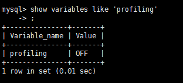
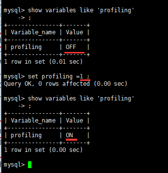
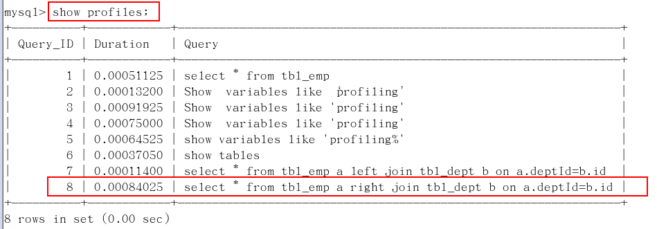
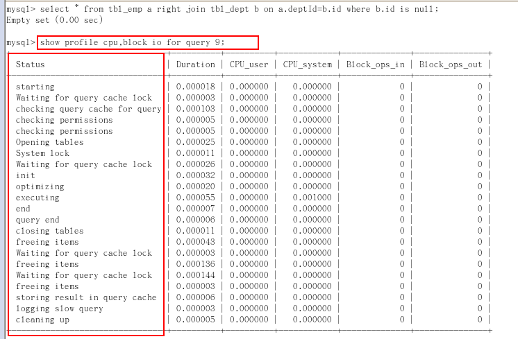

# Show Profile

### 1 是什么

是mysql提供可以用来分析当前会话中语句执行的资源消耗情况。可以用于SQL的调优的测量

### 2 官网

http://dev.mysql.com/doc/refman/5.5/en/show-profile.html

### 3 默认情况

默认情况下，参数处于关闭状态，并保存最近15次的运行结果

### 4 分析步骤

#### 4.1 是否支持，看看当前的mysql版本是否支持

Show  variables like 'profiling';

默认是关闭，使用前需要开启

 

#### 4.2 开启功能，默认是关闭，使用前需要开启

show variables like 'profiling';

set profiling=1;

 

#### 4.3 运行SQL 

```
select * from emp group by id%10 limit 150000;  # id对10取余后再进行分组

select * from emp group by id%20  order by 5   #5代表select后面的第5个字段
```

#### 4.4 查看结果，show profiles;

 

#### 4.5 诊断SQL，show profile cpu,block io for query  n  (n为上一步前面的问题SQL数字号码);

 

**参数备注:**

| 参数             | 含义                                                         |
| ---------------- | ------------------------------------------------------------ |
| ALL              | 显示所有的开销信息                                           |
| BLOCK IO         | 显示块IO相关开销                                             |
| CONTEXT SWITCHES | 上下文切换相关开销                                           |
| CPU              | 显示CPU相关开销信息                                          |
| IPC              | 显示发送和接收相关开销信息                                   |
| MEMORY           | 显示内存相关开销信息                                         |
| PAGE FAULTS      | 显示页面错误相关开销信息                                     |
| SOURCE           | 显示和Source_function，Source_file，Source_line相关的开销信息 |
| SWAPS            | 显示交换次数相关开销的信息                                   |

#### 4.6 日常开发需要注意的结论

| Status                       | 原因                                                         |
| ---------------------------- | ------------------------------------------------------------ |
| converting HEAP to MyISAM    | 查询结果太大，内存都不够用了往磁盘上搬了                     |
| Creating tmp table           | 过程：（1）创建临时表（2）拷贝数据到临时表（3）用完再删除临时表 |
| Copying to tmp table on disk | 把内存中临时表复制到磁盘，危险！！！                         |
| locked                       | 该查询被其它查询锁定。                                       |