# 表锁(偏读)

[TOC]

### 1 特点

偏向MyISAM存储引擎，开销小，加锁快；无死锁；锁定粒度大，发生锁冲突的概率最高,并发度最低。

### 2 案例分析

#### 2.1 建表SQL

【表级锁分析--建表SQL】

create table mylock(

 id int not null primary key auto_increment,

 name varchar(20)

)engine myisam;

insert into mylock(name) values('a');

insert into mylock(name) values('b');

insert into mylock(name) values('c');

insert into mylock(name) values('d');

insert into mylock(name) values('e');

select * from mylock;

【手动增加表锁】

 lock table 表名字1 read(write)，表名字2 read(write)，其它;

【查看表上加过的锁】

  show open tables;

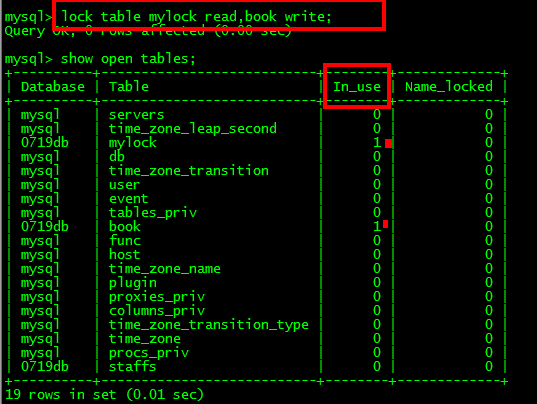 

【释放表锁】

unlock tables;

#### 2.2 加读锁

 我们为mylock表加read锁(读阻塞写例子) 

| session_1                                                    | session_2                                                    |
| ------------------------------------------------------------ | ------------------------------------------------------------ |
| 获得表mylock的READ锁定 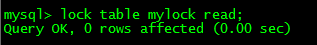 | 连接终端                                                     |
| 当前session可以查询该表记录 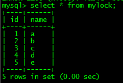 | 其他session也可以查询该表的记录 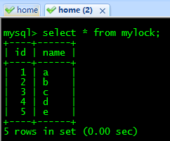 |
| 当前session不能查询其它没有锁定的表  | 其他session可以查询或者更新未锁定的表 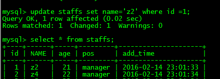 |
| 当前session中插入或者更新锁定的表都会提示错误：锁定的表当前session中插入或者更新锁定的表都会提示错误： 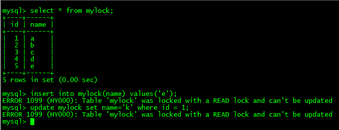 | 其他session插入或者更新锁定表会一直等待获得锁：会一直等待其他session插入或者更新锁定表会一直等待获得锁： 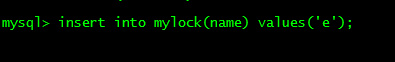 |
| 释放锁  | Session2获得锁，插入操作完成： 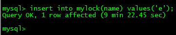 |
|                                                              |                                                              |
|                                                              |                                                              |

#### 2.3 加写锁

 mylockwrite(MyISAM) 

| session_1                                                    | session_2                                                    |
| ------------------------------------------------------------ | ------------------------------------------------------------ |
| 获得表mylock的WRITE锁定 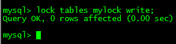 | 待Session1开启写锁后待Session1开启写锁后，session2再连接终端 |
| 当前session对锁定表的查询+更新+插入操作都可以执行： 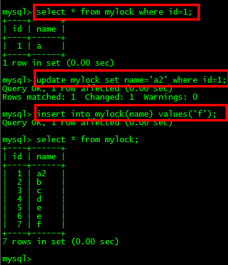 | 其他session对锁定表的查询被阻塞，需要等待锁被释放：在锁表前，如果session2有数据缓存，锁表以后，在锁住的表不发生改变的情况下session2可以读出缓存数据，一旦数据发生改变，缓存将失效，操作将被阻塞住。 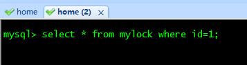  在锁表前，如果session2有数据缓存，锁表以后，在锁住的表不发生改变的情况下session2可以读出缓存数据，一旦数据发生改变，缓存将失效，操作将被阻塞住。 |
| 释放锁 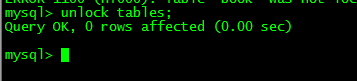 | Session2获得锁，查询返回： 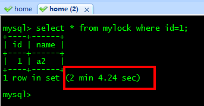 |

### 3 结论

MyISAM在执行查询语句（SELECT）前，会自动给涉及的所有表加读锁，在执行增删改操作前，会自动给涉及的表加写锁。 

MySQL的表级锁有两种模式：

 表共享读锁（Table Read Lock）

 表独占写锁（Table Write Lock）

| 锁类型 | 他人可读 | 他人可写 |
| ------ | -------- | -------- |
| 读锁   | 是       | 否       |
| 写锁   | 否       | 否       |

结论：

 结合上表，所以对MyISAM表进行操作，会有以下情况： 

  1、对MyISAM表的读操作（加读锁），不会阻塞其他进程对同一表的读请求，但会阻塞对同一表的写请求。只有当读锁释放后，才会执行其它进程的写操作。 

  2、对MyISAM表的写操作（加写锁），会阻塞其他进程对同一表的读和写操作，只有当写锁释放后，才会执行其它进程的读写操作。

 简而言之，就是读锁会阻塞写，但是不会堵塞读。而写锁则会把读和写都堵塞

