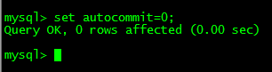
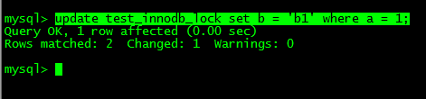
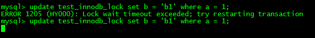
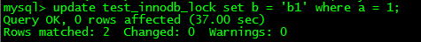
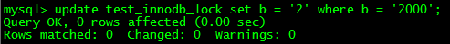
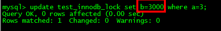
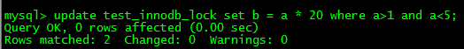
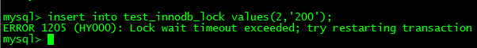
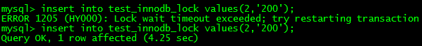
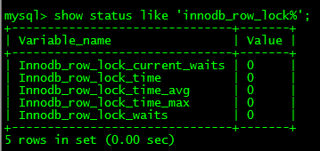

# 行锁(偏写)

[TOC]

### 1 特点

- 偏向InnoDB存储引擎，开销大，加锁慢；会出现死锁；锁定粒度最小，发生锁冲突的概率最低,并发度也最高。
- InnoDB与MyISAM的最大不同有两点：一是支持事务（TRANSACTION）；二是采用了行级锁

### 2 行锁支持事务

#### 2.1 事务（Transaction）及其ACID属性

事务是由一组SQL语句组成的逻辑处理单元，事务具有以下4个属性，通常简称为事务的ACID属性。 

l 原子性（Atomicity）：事务是一个原子操作单元，其对数据的修改，要么全都执行，要么全都不执行。 

l 一致性（Consistent）：在事务开始和完成时，数据都必须保持一致状态。这意味着所有相关的数据规则都必须应用于事务的修改，以保持数据的完整性；事务结束时，所有的内部数据结构（如B树索引或双向链表）也都必须是正确的。 

l 隔离性（Isolation）：数据库系统提供一定的隔离机制，保证事务在不受外部并发操作影响的“独立”环境执行。这意味着事务处理过程中的中间状态对外部是不可见的，反之亦然。 

l 持久性（Durable）：事务完成之后，它对于数据的修改是永久性的，即使出现系统故障也能够保持。 

#### 2.2 并发事务处理带来的问题

##### 2.2.1 更新丢失(Lost Update)

当两个或多个事务选择同一行，然后基于最初选定的值更新该行时，由于每个事务都不知道其他事务的存在，就会发生丢失更新问题－－最后的更新覆盖了由其他事务所做的更新。

例如，两个程序员修改同一java文件。每程序员独立地更改其副本，然后保存更改后的副本，这样就覆盖了原始文档。最后保存其更改副本的编辑人员覆盖前一个程序员所做的更改。

如果在一个程序员完成并提交事务之前，另一个程序员不能访问同一文件，则可避免此问题。 

##### 2.2.2 脏读(Dirty Reads)

 一个事务正在对一条记录做修改，在这个事务完成并提交前，这条记录的数据就处于不一致状态；这时，另一个事务也来读取同一条记录，如果不加控制，第二个事务读取了这些“脏”数据，并据此做进一步的处理，就会产生未提交的数据依赖关系。这种现象被形象地叫做”脏读”。 

一句话：事务A读取到了事务B已修改但尚未提交的的数据，还在这个数据基础上做了操作。此时，如果B事务回滚，A读取

的数据无效，不符合一致性要求。

##### 2.2.3 不可重复读(Non-Repeatable Reads)

​       在一个事务内，多次读同一个数据。在这个事务还没有结束时，另一个事务也访问该同一数据。那么，在第一个事务的两次读数据之间。由于第二个事务的修改，那么第一个事务读到的数据可能不一样，这样就发生了在一个事务内两次读到的数据是不一样的，因此称为不可重复读，即原始读取不可重复。

​      一句话：一个事务范围内两个相同的查询却返回了不同数据。

##### 2.2.4 幻读(Phantom Reads)

 一个事务按相同的查询条件重新读取以前检索过的数据，却发现其他事务插入了满足其查询条件的新数据，这种现象就称为“幻读”。

一句话：事务A读取到了事务B提交的新增数据，不符合隔离性。

### 3 案例分析

#### 3.1 建表SQL

create table test_innodb_lock (a int(11),b varchar(16))engine=innodb;

insert into test_innodb_lock values(1,'b2');

insert into test_innodb_lock values(3,'3');

insert into test_innodb_lock values(4,'4000');

insert into test_innodb_lock values(5,'5000');

insert into test_innodb_lock values(6,'6000');

insert into test_innodb_lock values(7,'7000');

insert into test_innodb_lock values(8,'8000');

insert into test_innodb_lock values(9,'9000');

insert into test_innodb_lock values(1,'b1');

create index test_innodb_a_ind on test_innodb_lock(a);

create index test_innodb_lock_b_ind on test_innodb_lock(b);

select * from test_innodb_lock;

#### 3.2 行锁定基本演示

行锁定基本演示

| Session_1                                                    | Session_2                                                    |
| ------------------------------------------------------------ | ------------------------------------------------------------ |
|       |       |
| 更新但是不提交，没有手写commit;  | Session_2被阻塞，只能等待  |
| 提交更新  | 解除阻塞，更新正常进行  |
|                                                              | commit命令执行                                               |
| 下面试试1号会话更新a =1                                      | 下面试试2号会话更新a =9                                      |

#### 3.3 无索引行锁升级为表锁

 

| Session_1                                                    | Session_2                                               |
| ------------------------------------------------------------ | ------------------------------------------------------- |
| 正常情况，各自锁定各自的行，互相不影响，一个2000另一个3000   |                                                         |
|       |  |
| 由于在column字段b上面建了索引，如果没有正常使用，会导致行锁变表锁 |                                                         |
| 比如没加单引号导致索引失效，行锁变表锁                       | 被阻塞，等待。只到Session_1提交后才阻塞解除，完成更新   |

#### 3.4 Select也可以加锁

##### 3.4.1 读锁 select ... lock in share mode

共享锁(Share Lock)

共享锁又称读锁，是读取操作创建的锁。其他用户可以并发读取数据，但任何事务都不能对数据进行修改（获取数据上的排他锁），直到已释放所有共享锁。

如果事务T对数据A加上共享锁后，则其他事务只能对A再加共享锁，不能加排他锁。获准共享锁的事务只能读数据，不能修改数据。

用法

SELECT ... LOCK IN SHARE MODE;

在查询语句后面增加 LOCK IN SHARE MODE ，Mysql会对*查询结果中的每行都加共享锁，*当没有其他线程对查询结果集中的任何一行使用排他锁时，可以成功申请共享锁，否则会被阻塞。其他线程也可以读取使用了共享锁的表（行？），而且这些线程读取的是同一个版本的数据。

##### 3.4.2 写锁 select... for update 

排他锁（eXclusive Lock）

共享锁又称写锁，如果事务T对数据A加上排他锁后，则其他事务不能再对A加任任何类型的封锁。获准排他锁的事务既能读数据，又能修改数据。

用法

SELECT ... FOR UPDATE;

​       在查询语句后面增加 FOR UPDATE ，Mysql会对查询结果中的每行都加排他锁，当没有其他线程对查询结果集中的任何一行使用排他锁时，可以成功申请排他锁，否则会被阻塞。

#### 3.5 间隙锁危害

间隙锁带来的插入问题 

| Session_1                                               | Session_2                                                    |
| ------------------------------------------------------- | ------------------------------------------------------------ |
|  | 阻塞产生，暂时不能插入  |
| commit;                                                 | 阻塞解除，完成插入  |
|                                                         |                                                              |

【什么是间隙锁】

当我们用范围条件而不是相等条件检索数据，并请求共享或排他锁时，InnoDB会给符合条件的已有数据记录的索引项加锁；对于键值在条件范围内但并不存在的记录，叫做“间隙（GAP)”，

InnoDB也会对这个“间隙”加锁，这种锁机制就是所谓的间隙锁（GAP Lock）。

【危害】

因为Query执行过程中通过过范围查找的话，他会锁定整个范围内所有的索引键值，即使这个键值并不存在。

间隙锁有一个比较致命的弱点，就是当锁定一个范围键值之后，即使某些不存在的键值也会被无辜的锁定，而造成在锁定的时候无法插入锁定键值范围内的任何数据。在某些场景下这可能会对性能造成很大的危害

### 4 案例结论

  Innodb存储引擎由于实现了行级锁定，虽然在锁定机制的实现方面所带来的性能损耗可能比表级锁定会要更高一些，但是在整体并发处理能力方面要远远优于MyISAM的表级锁定的。当系统并发量较高的时候，Innodb的整体性能和MyISAM相比就会有比较明显的优势了。

  但是，Innodb的行级锁定同样也有其脆弱的一面，当我们使用不当的时候，可能会让Innodb的整体性能表现不仅不能比MyISAM高，甚至可能会更差。

### 5 行锁分析

【如何分析行锁定】

通过检查InnoDB_row_lock状态变量来分析系统上的行锁的争夺情况

mysql>show status like 'innodb_row_lock%';

 

对各个状态量的说明如下：

Innodb_row_lock_current_waits：当前正在等待锁定的数量；

Innodb_row_lock_time：从系统启动到现在锁定总时间长度；

Innodb_row_lock_time_avg：每次等待所花平均时间；

Innodb_row_lock_time_max：从系统启动到现在等待最常的一次所花的时间；

Innodb_row_lock_waits：系统启动后到现在总共等待的次数；

对于这5个状态变量，比较重要的主要是

  Innodb_row_lock_time_avg（等待平均时长），

  Innodb_row_lock_waits（等待总次数）

  Innodb_row_lock_time（等待总时长）这三项。

尤其是当等待次数很高，而且每次等待时长也不小的时候，我们就需要分析系统中为什么会有如此多的等待，然后根据分析结果着手指定优化计划。

最后可以通过

SELECT * FROM information_schema.INNODB_TRX\G;

来查询正在被锁阻塞的sql语句。

### 6 优化建议

- 尽可能让所有数据检索都通过索引来完成，避免无索引行锁升级为表锁。
- 尽可能较少检索条件，避免间隙锁
- 尽量控制事务大小，减少锁定资源量和时间长度
- 锁住某行后，尽量不要去调别的行或表，赶紧处理被锁住的行然后释放掉锁。
- 涉及相同表的事务，对于调用表的顺序尽量保持一致。
- 在业务环境允许的情况下,尽可能低级别事务隔离