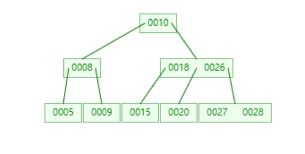
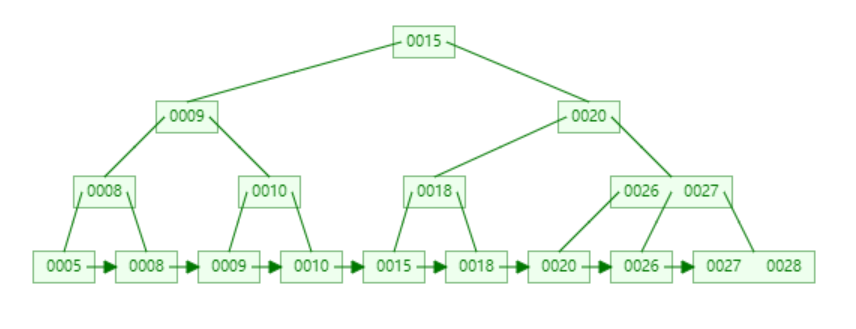

# B树和B+树

**一、为什么要有B树？**

  学习任何一个东西我们都要知道为什么要有它，B树也一样，既然存储数据，我们为什么不用红黑树呢？ 
  这个要从几个方面来说了：

1. 计算机有一个**局部性原理**，就是说，当一个数据被用到时，其附近的数据也通常会马上被使用。

2. 所以当你用**红黑树的时候，你一次只能得到一个键值的信息，而用B树，可以得到最多M-1个键值的信息**。这样来说B树当然更好了。

3. 另外一方面，同样的数据，**红黑树的阶数更大，B树更短**，这样查找的时候当然B树更具有优势了，效率也就越高。

**二、B树**

  对于B树，我们首先要知道它的应用，B树大量应用在数据库和文件系统当中。

  B树是对二叉查找树的改进。它的设计思想是，将相关数据尽量集中在一起，以便一次读取多个数据，减少硬盘操作次数。B树为系统最优化大块数据的读和写操作。B树算法减少定位记录时所经历的中间过程，从而加快存取速度。普遍运用在数据库和文件系统。

  假定一个节点可以容纳100个值，那么3层的B树可以容纳100万个数据，如果换成二叉查找树，则需要20层！假定操作系统一次读取一个节点，并且根节点保留在内存中，那么B树在100万个数据中查找目标值，只需要读取两次硬盘。B 树可以看作是对2-3查找树的一种扩展，即他允许每个节点有M-1个子节点。

**m阶B树的结构：**

1. 根节点包含k个子树，k-1个关键字，2 <= k <= m ;
2. 每个中间节点包含k个子树，k-1个关键字，⌈ m/2 ⌉  <= k <= m ；
3. 叶子节点没有子树，包含k-1个关键字，⌈ m/2 ⌉  <= k <= m ；
4. 非叶子节点的子树指针P[i]，指向关键字值属于[K[i], K[i+1])的子树（B-树是开区间）；
5. 每个节点的关键字以升序排列；
6. 所有叶子节点都在同一层 。

**3阶的B树：**

**三、B+树**

  B+树是B-树的变体，也是一种多路搜索树，其定义基本与B树相同，除了：

1. 非叶子结点的子树指针P[i]，指向关键字值属于[K[i], K[i+1])的子树（B+树是左闭右开区间）；
2. B+树包含2种类型的结点：内部结点（也称索引结点）和叶子结点。根结点本身既可以是内部结点，也可以是叶子结点。
3. B+树与B树最大的不同是内部结点不保存数据，只用于索引，所有数据（或者说记录）都保存在叶子结点中。
4. 为所有叶子结点增加一个链指针；
5. 所有关键字都在叶子结点出现。
   **3阶的B+树：**
   

**四、B树与B+树的对比**

  B和B+树的区别在于，B+树的非叶子结点只包含导航信息，不包含实际的值，所有的叶子结点和相邻的节点使用链表相连，便于区间查找和遍历。

**1、B树的优点**

1. B树的每一个节点都包含key和value，因此经常访问的元素可能离根节点更近，因此访问也更迅速。

**2、B+树的优点**

1. 由于B+树在内部节点上不包含数据信息，因此在内存页中能够存放更多的key。 数据存放的更加紧密，具有更好的空间局部性。因此访问叶子节点上关联的数据也具有更好的缓存命中率；

2. B+树的叶子节点都是相连的，因此对整棵树的遍历只需要一次线性遍历叶子节点即可。而且由于数据顺序排列并且相连，所以便于区间查找和搜索。而B树则需要进行每一层的递归遍历。相邻的元素可能在内存中不相邻，所以缓存命中性没有B+树好。

### 转自
https://blog.csdn.net/qq_26768741/article/details/53164202 
https://blog.csdn.net/feynman1999/article/details/72667919