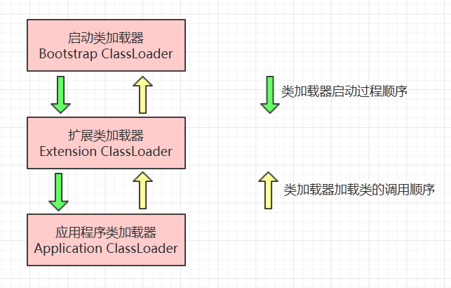

# 类加载器

### 类加载器的分类

-  `启动类加载器(Bootstrap ClassLoader)`：主要负责加载`<JAVA_HOME>\lib`目录中的,或是`-Xbootclasspath`参数指定的路径中的，并且可以被虚拟机识别（仅仅按照文件名识别的）的类库到虚拟机内存中。它加载的是`System.getProperty("sun.boot.class.path")`所指定的`路径`或`jar`。

-  `扩展类加载器(Extension ClassLoader)`：主要负责加载`<JAVA_HOME>\lib\ext`目录中的，或者被`java.ext.dirs`系统变量所指定的路径中的所有类库。它加载的是`System.getProperty("java.ext.dirs")`所指定的`路径`或`jar`。

-  `应用程序类加载器(Application ClassLoader)`：也叫系统类加载器，主要负责加载`ClassPath路径`上的类库，如果应用程序没有自定义类加载器，则这个就是默认的类加载器。它加载的是`System.getProperty("java.class.path")`所指定的`路径`或`jar`。

### 类加载器的特点

- 运行一个程序时，总是由`Application Loader`（系统类加载器）开始加载指定的类。

- 在加载类时，每个类加载器会将加载任务上交给其父，如果其父找不到，再由自己去加载。

- `Bootstrap Loader`（启动类加载器）是最顶级的类加载器了，其父加载器为`null`。

### 类加载器的双亲委派模型

> 类加载器双亲委派模型的工作过程是：如果一个类加载器收到一个类加载的请求，它首先将这个请求**委派给父类加载器去完成**，每一个层次类加载器都是如此，则所有的类加载请求都会传送到顶层的启动类加载器，只有父加载器无法完成这个加载请求(即它的搜索范围中没有找到所要的类)，子类才尝试加载。

使用双亲委派模型主要是两个原因：

- 可以避免重复加载，当父类已经加载了，子类不需再次加载；

- 安全因素，如果不用这种，则用户可以随意的自定义加载器来替代`Java核心API`，则就会带来安全隐患。

下面是一个类加载器双亲委派模型，这里各个类加载器并不是继承关系，它们利用组合实现的父类与子类关系。



​				双亲委派模型

### 类加载的几种方式

- 命令行启动应用时候由`JVM`初始化加载含有`main`的主类。

- 通过`Class.forName("Hello")`方法动态加载类，默认会执行初始化块，这是因为`Class.forName("Hello")`其实就是`Class.forName("Hello"，true,CALLCLASS.getClassLoader())`，第二个参数就是类加载过程中的连接操作。如果指定了`ClassLoader`，则不会执行初始化块。

- 通过`ClassLoader.loadClass("Hello")`方法动态加载类，不会执行初始化块，因为`loadClass`方法有两个参数，用户只是用第一个参数，第二个参数默认为`false`，即不对该类进行解析则就不会初始化。

```
    public Class<?> loadClass(String name) throws ClassNotFoundException {
        return loadClass(name, false);
    }
```
### 类加载实例

当在命令行下执行：`java HelloWorld(HelloWorld是含有main方法的类的Class文件)`，JVM会将`HelloWorld.class`加载到内存中，并在堆中形成一个Class的对象`HelloWorld.class`。

基本的加载流程如下：

- 寻找`jre目录`，寻找`jvm.dll`，并初始化`JVM`；

- 产生一个`Bootstrap Loader`（启动类加载器）；

-  `Bootstrap Loader`，该加载器会加载它指定路径下的`Java核心API`，并且再自动加载`Extension Loader`（标准扩展类加载器），`Extension Loader`会加载指定路径下的扩展`Java API`，并将其`父Loader`设为`Bootstrap Loader`;

-  `Bootstrap Loader`也会同时自动加载`AppClass Loader`（系统类加载器），并将其`父Loader`设为`Extension Loader`。

- 最后由`AppClass Loader`加载`CLASSPATH`目录下定义的类，`HelloWorld类`。

### 类加载器与类的唯一性

类加载器虽然只用于实现类的加载动作，但是对于任意一个类，都需要由加载它的类加载器和这个类本身共同确立其在Java虚拟机中的唯一性。通俗的说，JVM中两个类是否“相等”，首先就必须是同一个类加载器加载的，否则，即使这两个类来源于同一个Class文件，被同一个虚拟机加载，只要类加载器不同，那么这两个类必定是不相等的。

这里的“相等”，包括代表类的Class对象的equals()方法、isAssignableFrom()方法、isInstance()方法的返回结果，也包括使用instanceof关键字做对象所属关系判定等情况。

以下代码说明了不同的类加载器对instanceof关键字运算的结果的影响。

```
package com.lannister.java.demo.jvm;

import java.io.IOException;
import java.io.InputStream;


/**
 * 类加载器在类相等判断中的影响
 * 
 * instanceof关键字
 * 
 */

public class ClassLoaderDemo {
    public static void main(String[] args) throws Exception {

        // 使用ClassLoaderTest的类加载器加载本类
        Object obj1 = ClassLoaderDemo.class.getClassLoader().loadClass("com.lannister.java.demo.jvm.ClassLoaderDemo").newInstance();
        System.out.println(obj1.getClass());
        System.out.println(obj1 instanceof com.lannister.java.demo.jvm.ClassLoaderDemo);

        // 使用自定义类加载器加载本类
        Object obj2 = new MyClassLoader().loadClass("com.lannister.java.demo.jvm.ClassLoaderDemo").newInstance();
        System.out.println(obj2.getClass());
        System.out.println(obj2 instanceof com.lannister.java.demo.jvm.ClassLoaderDemo);
    }
}


class MyClassLoader extends ClassLoader{
    
    @Override
    public Class<?> loadClass(String name) throws ClassNotFoundException {
        try {
            String fileName = name.substring(name.lastIndexOf(".") + 1) + ".class";
            InputStream is = getClass().getResourceAsStream(fileName);
            if (is == null) {
                return super.loadClass(name);
            }
            byte[] b = new byte[is.available()];
            is.read(b);
            return defineClass(name, b, 0, b.length);   
        } catch (IOException e) {
            throw new ClassNotFoundException();
        }
    }
}
/*
Class.getResourceAsStream(String path) 
path 不以’/'开头时默认是从此类所在的包下取资源，以’/'开头则是从ClassPath根下获取。
其只是通过path构造一个绝对路径，最终还是由ClassLoader获取资源。
*/
```
输出结果：

```
class com.lannister.java.demo.jvm.ClassLoaderDemo
true
class com.lannister.java.demo.jvm.ClassLoaderDemo
false
```

- new MyClassLoader()是自定义的类加载器，可以用来加载与当前类在同一路径下的Class文件。
- main函数的第一部分使用系统加载主类ClassLoaderDemo的类加载器加载ClassLoaderDemo，输出显示，obj1的所属类型检查正确，这时虚拟机中有2个ClassLoaderDemo类，一个是主类，另一个是main()方法中加载的类，由于这两个类使用同一个类加载器加载并且来源于同一个Class文件，因此这两个类是完全相同的。
- 第二部分使用自定义的类加载器加载ClassLoaderDemo，输出显示，obj2确实是类com.lannister.java.demo.jvm.ClassLoaderDemo实例化出来的对象，但是第二句输出false。此时虚拟机中有3个ClassLoaderTest类，由于第3个类的类加载器与前面2个类加载器不同，虽然来源于同一个Class文件，但它是一个独立的类，所属类型检查是返回结果自然是false。

### 创建自己的类加载器

在`Java`应用开发过程中，可能会需要创建应用自己的类加载器。典型的场景包括实现特定的`Java字节代码`查找方式、对字节代码进行加密/解密以及**实现同名Java类的隔离**等。创建自己的类加载器并不是一件复杂的事情，只需要继承自`java.lang.ClassLoader`类并覆写对应的方法即可。 `java.lang.ClassLoader`中提供的方法有不少，下面介绍几个创建类加载器时需要考虑的：

-  `defineClass()`：这个方法用来完成从`Java字节码`的字节数组到`java.lang.Class`的转换。这个方法是不能被覆写的，一般是用原生代码来实现的。

-  `findLoadedClass()`：这个方法用来根据名称查找已经加载过的Java类。一个类加载器不会重复加载同一名称的类。

-  `findClass()`：这个方法用来根据名称查找并加载`Java类`。当自定义类加载器，加载ClassPath路径以外的类时，可以改写这个方法，不会破坏双亲委派模型

-  `loadClass()`：这个方法用来根据名称加载`Java类`。通过改写这个方法，可以破坏双亲委派模型。

-  `resolveClass()`：这个方法用来连接一个`Java类`。

```
//双亲委派模型的实现
protected synchronized Class<?> loadClass(String name,boolean resolve)throws ClassNotFoundException{
    //check the class has been loaded or not
    Class c = findLoadedClass(name);
    if(c == null){
        try{
            if(parent != null){
            	//默认情况下，这里的parent指的是应用程序类加载器
                c = parent.loadClass(name,false);
            }else{
                c = findBootstrapClassOrNull(name);
            }
        }catch(ClassNotFoundException e){
            //if throws the exception ,the father can not complete the load
        }
        if(c == null){
            c = findClass(name);
        }
    }
    if(resolve){
        resolveClass(c);
    }
    return c;
}

//父加载器没能成功加载，调用自己的findClass()方法进行加载
protected Class<?> findClass(String name) throws ClassNotFoundException {
    throw new ClassNotFoundException(name);
}
```
