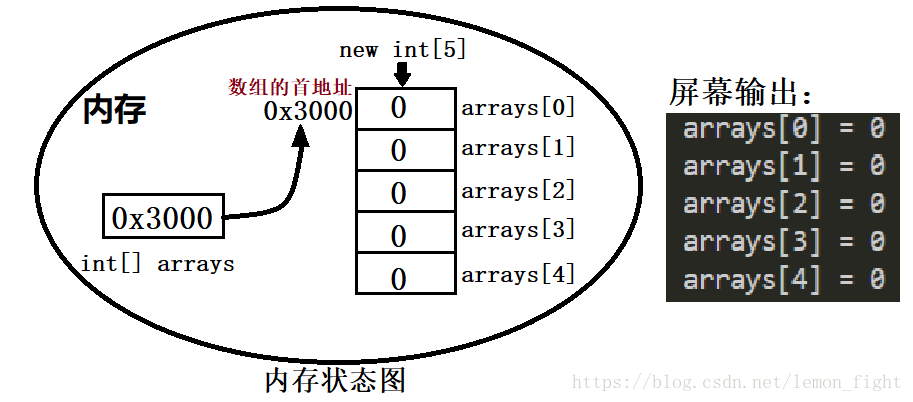

# Java中数组的定义及初始化

### 1 动态初始化（声明并开辟数组）
`数组类型[] 数组名 = new 数据类型[数组长度];`

- 其中，数据类型可以是8种基本的数据类型，也可以是引用数据类型。

- 注意：

  - 在给数组命名的时候，一般在数组名后加一个 s 表示这是一个包含多个元素的数组（与单个变量区分）

  - 当数组采用动态初始化开辟空间之后，数组之中的每个元素都是该数据类型的默认值。

    | 数据类型               | 默认初始化                   |
    | ---------------------- | ---------------------------- |
    | byte、short、int、long | 0                            |
    | float、double          | 0.0                          |
    | char                   | 一个空字符，即 ‘\u0000’      |
    | boolean                | false                        |
    | 引用数据类型           | null，表示变量不引用任何对象 |
  
  - 数组名称.length：取得数组长度（数组长度可以由属性length获得）。
    
  - 数组遍历推荐使用for-each循环（仅限于数组内容读取），要修改数组内容，还是使用常规for循环
    
    ```
    public class Study02{
        public static void main(String[] args){
            int[] arrays = new int[5];	//定义并开辟了一个长度为3的数组
    	    // 可以将上面代码分成两句来写
    	   int[] array = null;	// 声明一个长度int[]类型的变量，变量会占用一块内存空间，它没有分配初始值。
    	   array = new int[5];	//创建一个长度为5的数组，将数组的地址赋给变量arrays。
    		
    	   for(int i = 0; i < arrays.length; i++)
            {
                System.out.println("arrays[" + i + "] = " + arrays[i] + " ");
            }
            arrays[0] = 10;	//数组的第一个元素
            arrays[1] = 20;	//数组的第二个元素
            // 数组遍历
            for(int x : array)
            {
                System.out.println(array[x]);
            }
        }
    }
    ```
    
    

### 2 静态初始化
```
简化格式：
	数据类型[] 数组名称 = {值, 值, …};
完整格式（推荐）:
	数据类型[] 数组名称 = new 数据类型[]{值, 值, …};
```
- 注意：
  - 在数组定义时直接设置内容，根据值的个数确定长度，且长度不可修改
  - 通过数组下标来取得元素，下标默认从0开始。数组下标超出数组长度，数组越界异常（运行时异常）。
  - 数组属于引用数据类型，在使用之前一定要开辟空间（实例化），否则就会产生"NullPoninterException"。
```
int[] arrays = {1, 2, 3, 4, 5};
int[] arrays = new int[]{1, 2, 3, 4, 5};
```
### 3 参考

作者：lemon_fight 
来源：CSDN 
原文：https://blog.csdn.net/lemon_fight/article/details/83033513 
版权声明：本文为博主原创文章，转载请附上博文链接！