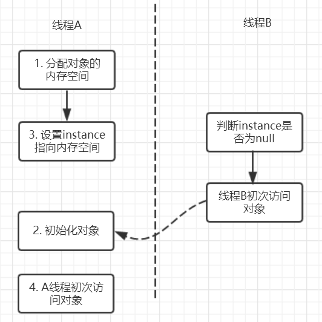

# volatile关键字

### JMM（Java 内存模型）

> [参考]：http://blog.cuzz.site/2019/04/16/Java%E5%B9%B6%E5%8F%91%E7%BC%96%E7%A8%8B/

#### 基本概念

- JMM 本身是一种抽象的概念并不是真实存在，它描述的是一组规定或则规范，通过这组规范定义了程序中的访问方式。

- JMM 同步规定

  - 线程解锁前，必须把共享变量的值刷新回主内存
  - 线程加锁前，必须读取主内存的最新值到自己的工作内存
  - 加锁解锁是同一把锁

- 由于 JVM 运行程序的实体是线程，而每个线程创建时 JVM 都会为其创建一个工作内存，工作内存是每个线程的私有数据区域，而  Java  内存模型中规定所有变量都储存在主内存，主内存是共享内存区域，所有的线程都可以访问，但线程对变量的操作（读取赋值等）必须都在工作内存中进行。

- 首先要将变量从主内存拷贝到自己的工作内存空间，然后对变量进行操作，操作完成后再将变量写回主内存，不能直接操作主内存中的变量，工作内存中存储着主内存中的变量副本拷贝，前面说过，工作内存是每个线程的私有数据区域，因此不同的线程间无法访问对方的工作内存，线程间的通信(传值)必须通过主内存来完成。

- 内存模型图


### volatile 是 Java 虚拟机提供的轻量级的同步机制

#### 可见性：

- 在读取一个volatile变量之前，必须从主内存中拷贝最新值到工作内存
- 在修改一个volatile变量之后，必须立刻把更新值刷新回主内存

#### 不保证原子性：

- 模拟3个线程对一个共享变量v（volatile修饰）进行自增1


#### 禁指令重排序

>[参考]：http://swiftlet.net/archives/3321

- 指令重排的介绍

  - 计算机在执行程序时，为了提高性能，编译器和处理器常常会对指令做重排，一般分为以下 3 种
    - 编译器优化的重排
    - 指令并行的重排
    - 内存系统的重排

  - 单线程环境里面确保程序最终执行的结果和代码执行的结果一致

  - 处理器在进行重排序时必须考虑指令之间的数据依赖性

  - 多线程环境中线程交替执行，由于编译器优化重排的存在，两个线程中使用的变量能否保证一致性是无法确定的，结果无法预测

  - Java程序天然的有序性可以总结为：如果在本线程内观察，所有的操作都是有序的；如果在一个线程观察另一个线程，所有的操作都是无序的

- 指令重排示例1

```
public class ReSortSeqDemo {
    int a = 0;
    boolean flag = false;
    
    public void method01() {
        a = 1;           // flag = true;
                         // ----线程切换----
        flag = true;     // a = 1;
    }

    public void method02() {
        if (flag) {
            a = a + 3;
            System.out.println("a = " + a);
        }
    }

}
```
​	 如果两个线程分别执行method01 和 method02,如果线程 1 执行 method01 重排序了，然后切换的线程 2 执行 method02 ,就会出现不一样的结果。

- 指令重排示例2

	在单例模式的实现上有一种双重检验锁定的方式（Double-checked Locking）。代码如下：

```
public class Singleton {
    private Singleton() { }
    private volatile static Singleton instance;
    public Singleton getInstance(){
        if(instance==null){
            synchronized (Singleton.class){
                if(instance==null){
                    instance = new Singleton();
                }
            }
        }
        return instance;
    }
}
```

​	这里为什么要加volatile了？我们先来分析一下不加volatile的情况，有问题的语句是这条：instance = new Singleton();
​	这条语句实际上包含了三个操作：

​	1.分配对象的内存空间；
​	2.初始化对象；
​	3.设置instance指向刚分配的内存地址。

​	但由于存在重排序的问题，可能有以下的执行顺序：



​	如果2和3进行了重排序的话，线程B进行判断if(instance==null)时就会为true，而实际上这个instance并没有初始化成功，显而易见对线程B来说之后的操作就会是错的。而用volatile修饰的话就可以禁止2和3操作重排序，从而避免这种情况。volatile包含禁止指令重排序的语义，其具有有序性。

- volatile禁止指令重排序的深度分析

	volatile除了保证内存可见性，还有个作用是防止指令重排。个人觉得：指令重排是不是最终的思想来源还是内存可见性呢？如果两个互不相关的思想，用到一个事物上，感觉怪怪的。我后来想了想：寄存器和主存的隔离造成了数据的不一致，volatile的初衷是保证数据的强一致性，当赋值基本简单类型的时候，这种一致性很容易实现。但是赋值对象类型的时候，这种一致性分为强一致性和弱一致性，重排是弱一致性，而有序则是强一致性，volatile的目的是强一致性，所以最终它要求指令不得重排。现在我感觉可以把可见性和有序性都统一到一致性上面了。