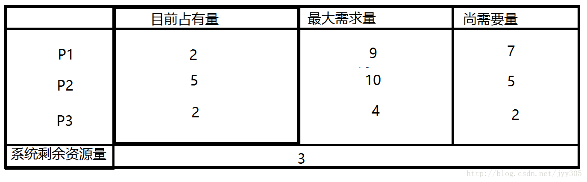
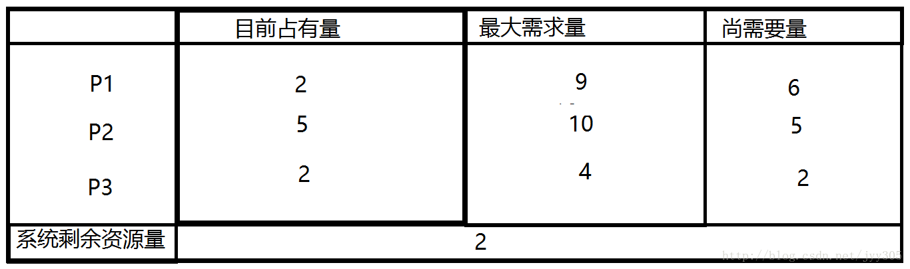

# 死锁的四个必要条件？如何避免与预防死锁？

[TOC]

## 一、什么是死锁

死锁是指多个进程因竞争资源而造成的一种僵局（互相等待），若无外力作用，这些进程都将无法向前推进。例如，在某一个计算机系统中只有一台打印机和一台输入设备，进程P1正占用输入设备，同时又提出使用打印机的请求，但此时打印机正被进程P2 所占用，而P2在未释放打印机之前，又提出请求使用正被P1占用着的输入设备。这样两个进程相互无休止地等待下去，均无法继续执行，此时两个进程陷入死锁状态。

## 二、死锁产生的原因

1. 系统资源的竞争

   系统资源的竞争导致系统资源不足，以及资源分配不当，导致死锁。

2. 进程运行推进顺序不合适

   进程在运行过程中，请求和释放资源的顺序不当，会导致死锁。

## 三、死锁的四个必要条件

**互斥条件**：资源是独占的且排他使用，进程互斥使用资源，即任意时刻一个资源只能给一个进程使用，其他进程若申请一个资源，而该资源被另一进程占有时，则申请者等待直到资源被占有者释放。

**不可剥夺条件**：进程所获得的资源在未使用完毕之前，不被其他进程强行剥夺，而只能由获得该资源的进程资源释放。

**请求和保持条件**：进程每次申请它所需要的一部分资源，在申请新的资源的同时，继续占用已分配到的资源。

**循环等待条件**：在发生死锁时必然存在一个进程等待队列{P1,P2,…,Pn},其中P1等待P2占有的资源，P2等待P3占有的资源，…，Pn等待P1占有的资源，形成一个进程等待环路，环路中每一个进程所占有的资源同时被另一个申请，也就是前一个进程占有后一个进程所申请的资源。

以上给出了导致死锁的四个必要条件，只要系统发生死锁则以上四个条件至少有一个成立。事实上循环等待的成立蕴含了前三个条件的成立，似乎没有必要列出然而考虑这些条件对死锁的预防是有利的，因为可以通过破坏四个条件中的任何一个来预防死锁的发生。

 

### 四、 死锁的避免与预防

#### 1. 死锁避免

死锁避免的基本思想：系统对进程发出的每一个资源申请进行动态检查，并根据检查结果决定是否分配资源，如果分配后系统可能发生死锁，则不予分配，否则予以分配，这是一种保证系统不进入死锁状态的动态策略。 
如果操作系统能保证所有进程在有限时间内得到需要的全部资源，则系统处于安全状态否则系统是不安全的。

**安全状态与不安全状态**：所谓安全状态，是指系统能按某种进程推进顺序( P1, P2, …, Pn)，为每个进程Pi分配其所需资源，直至满足每个进程对资源的最大需求，使每个进程都可顺序地完成。此时称 P1, P2, …, Pn 为安全序列。如果系统无法找到一个安全序列，则称系统处于不安全状态。他们之间的对对应关系如下图所示：

 

下面我们来通过一个例子对安全状态和不安全状态进行更深的了解 

如上图所示系统处于安全状态，系统剩余3个资源，可以把其中的2个分配给P3，此时P3已经获得了所有的资源，执行完毕后还能还给系统4个资源，此时系统剩余5个资源所以满足（P2所需的资源不超过系统当前剩余量与P3当前占有资源量之和），同理P1也可以在P2执行完毕后获得自己需要的资源。 
如果P1提出再申请一个资源的要求，系统从剩余的资源中分配一个给进程P1，此时系统剩余2个资源，新的状态图如下：那么是否仍是安全序列呢那我们来分析一下 

系统当前剩余2个资源，分配给P3后P3执行完毕还给系统4个资源，但是P2需要5个资源，P1需要6个资源，他们都无法获得资源执行完成，因此找不到一个安全序列。此时系统转到了不安全状态。

#### 2. 死锁预防

我们可以通过破坏死锁产生的4个必要条件来 预防死锁，由于资源互斥是资源使用的固有特性是无法改变的。

**破坏“不可剥夺”条件**
当某个进程请求新的资源得不到满足时，便立即释放保持的所有资源，待以后需要时再重新申请。
注意：
缺点是实现复杂，抢占资源可能导致部分工作失效，反复申请和释放导致系统开销很大，也可能导致饥饿。

**破坏“请求和保持”条件**
为了破坏“请求和保持条件”，在这里，我们必须保证：当一个进程在请求资源时，它不能持有不可抢占的系统资源。在此，有两种协议可供选择：

第一种协议：
该协议规定，所有进程在开始运行之前，必须一次性地申请其在整个运行过程中所需的全部资源。此时若系统有足够的资源分配给某进程，便可把其需要的所有资源分配给它,这样，该进程在整个运行期间，便不会再提出资源要求，从而破坏了“请求”条件。系统在分配资源时，只要有一种资源不能满足进程的要求，即使其它所需的各资源都空闲也不分配给该进程。
第二种协议：
该协议是对第一种协议的改进，它允许一个进程只获得运行初期所需的资源后，便开始运行。进程运行过程中再逐步释放已分配给自己的、且已用毕的全部资源，然后再请求新的所需资源。
注意：
第一种协议虽然简单易行且安全，但是它导致资源被严重浪费，严重的降低了资源的利用率；进程会经常发生饥饿现象。因此比较推荐第二种协议。
**破坏“循环等待”条件**
可采用顺序资源分配法来使循环等待条件不成立。

具体做法：首先给系统中的资源编号，规定每个进程必须按编号递增的顺序请求资源，同类资源(即编号相同的资源) 一次性申请完。
原理：一个进程只有已占有小编号的资源时，才有资格申请更大编号的资源。按此规则，已持有大编号资源的进程不可能逆向地回来申请小编号的资源，从而就不会产生循环等待的现象，进而预防死锁的发生。
注意：
该方法与前两种方法相比，资源利用率和系统吞吐量都有了较为明显的提高，但是依旧存在以下缺点：

不方便增加新的设备，因为可能需要重新分配所有的编号；
进程实际使用资源的顺序可能和编号递增顺序不一致，会导致资源浪费;
必须按规定次序申请资源，用户编程麻烦。