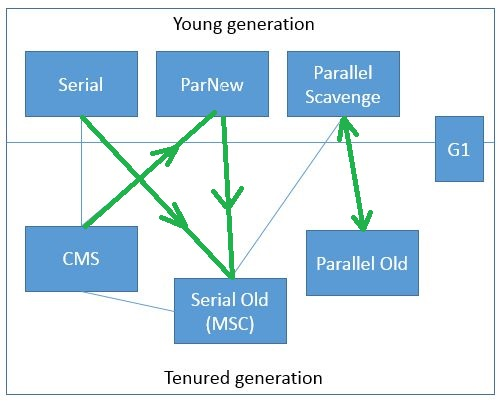
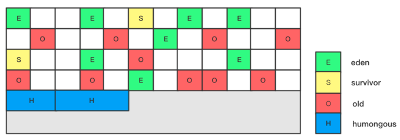
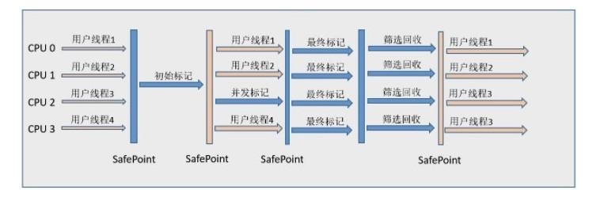

## GC 垃圾回收算法和垃圾收集器的关系？谈谈你的理解？

- 四种 GC 垃圾回收算法

  - 引用计数
  - 复制回收
  - 标记清除
  - 标记整理
  
- GC 算法是内存回收的方法论，垃圾收集器就是算法的落地实现。

- 目前为止还没有完美的收集器的出现，更加没有万能的收集器，只是针对具体应用选择最适合的收集器，进行分代收集。

- 串行垃圾回收器（Serial）

  - 它为单线程环境设计且只使用一个线程进行垃圾回收，会暂停所有的用户线程，所以不适合服务环境。

- 并行垃圾回收器（Parallel）

  - 多个垃圾收集线程并行工作，此时用户线程是暂停的，用于科学计算、大数据处理等弱交互场景。

- 并发垃圾回收器（CMS）

  - 用户线程和垃圾收集线程同时执行（不一定是并行，可能是交替执行），不需要停顿用户线程，互联网公司多用它，适用对响应时间有要求的场景。

- G1 垃圾回收器

  - G1 垃圾回收器将堆内存分割成不同的区域然后并发地对其进行垃圾回收。

## 怎么查看服务器默认垃圾收集器是哪个？生产是如何配置垃圾收集器？谈谈你对垃圾收集器的理解？

- 怎么查看服务器默认垃圾收集器是哪个？

  - Java -XX:+PrintCommandLineFlags

- Java 的 GC 回收的类型主要有：

  - UseSerialGC，UseParallelGC，UseConcMarkSweepGC，UseParNewGC，UseParallelOldGC，UseG1GC

  - Java 8 以后基本不使用 Serial Old

- 垃圾收集器

A------>B : 使用A垃圾收集器后，会默认激活B

- 参数说明

  - DefNew : Default New Generation（在新生代使用Serial GC后，新生代的名称）
  - Tenured : Old（在老年代使用Serial Old GC后，老年代的名称）
  - ParNew : Parallel New Generation（在新生代使用ParNew GC后，新生代的名称）
  - PSYoungGen : Parallel Scavenge Young Generation（在新生代使用Parallel Scanvenge GC后，新生代的名称）
  - ParOldGen : Parallel Old Generation（在老年代使用Parallel Old GC后，老年代的名称）

- Server/Client 模式分别是什么意思

  - 最主要的差别在于：Server模式启动时，速度较慢，但是一旦运行起来后，性能将会有很大的提升。

  - 当虚拟机运行在Client模式的时候，使用的是一个代号为C1的轻量级编译器, 而Server模式启动的虚拟机采用相对重量级，代号为C2的编译器，C2比C1编译器编译的相对彻底，服务起来之后,性能更高。

  - 适用范围：只需掌握Server模式即可，Client模式基本不会用
  
  - 操作系统

    - 32位Windows操作系统，不论硬件如何都默认使用Client模式

    - 32位其他操作系统，2G内存同时有2个及以上CPU用Server模式，低于该配置还是Client模式

    - 64位操作系统只有Server模式

- 新生代

  - 串行 GC (Serial/ Serial Copying)

    - 一句话：一个单线程的收集器，在进行垃圾收集的时候，必须暂停其他所有的工作线程直到它收集结束

    - 串行收集器是最古老，最稳定以及效率高的收集器，只使用一个线程去回收，但其在进行垃圾回收过程中可能会产生较长的停顿（“Stop-The-World”状态）。虽然在收集过程中需要暂停所有其他的工作线程，但是他简单高效，对于限定单个CPU环境来说，没有线程交互的开销可以获得最高的单线程垃圾收集效率，因此Serial垃圾收集器依然是java虚拟机运行在Client模式下默认的新生代垃圾收集器

  - 并行 GC (ParNew)

    - 一句话：使用多线程进行垃圾回收，在垃圾收集时，会Stop-The-World暂停其他所有的工作线程直到它收集结束

    - ParNew收集器其实就是Serial收集器新生代的并行多线程版本，最常见的应用场景是配合老年代的CMS GC工作，其余的行为和Serial收集器完全一样，ParNew垃圾收集器在垃圾收集过程中同样也要暂停其他所有的工作线程。

  - 并行回收 GC (Parallel/ Parallel Scavenge)

    - 一句话：使用多线程进行垃圾回收，在垃圾收集时，会Stop-The-World暂停其他所有的工作线程直到它收集结束

    - Parallel Scavenge收集器类似ParNew，也是一个新生代垃圾收集器，使用复制算法，也是一个并行的多线程的垃圾收集器，俗称吞吐量优先收集器

    - 可控制的吞吐量：

      Thoughput = 运行用户代码时间 / （运行用户代码的时间 + 垃圾收集时间）

      即，比如程序运行100分钟 ，垃圾收集时间1分钟，吞吐量就是99%，高吞吐量意味着高效利用CPU的时间，Parallel Scavenge多用于在后台运算而不需要太多交互的任务

    - 自适应调节策略

      自适应调节策略也是Parallel Scavenge收集器与ParNew收集器的一个重要区别。

      自适应调节策略：虚拟机会根据当前系统的运行情况收集性能监控信息，动态调整这些参数以提供最合适的停顿时间（-XX:MaxGCPauseMillis）或最大的吞吐量

- 老年代

  - 串行 GC (Serial Old/ Serial MSC)

    - 一句话：Serial Old 是Serial垃圾收集器的老年代版本，他同样是个单线程的收集器，使用标记整理算法，这个收集器也主要是运行在Client模式的java虚拟机默认的老年代垃圾收集器

    - 在Server模式下，主要有两个用途：

      （1） 在JDK1.5之前的版本中与新生代的Parallel Scavenge收集器搭配使用（Parallel Scavenge + Serial Old）

      （2） 作为老年代中使用CMS收集器的后备垃圾收集方案

  - 并行 GC (Parallel Old/ Parallel MSC)

    - 一句话：Parallel Old收集器是Parallel Scavenge的老年代版本，使用多线程的标记-整理算法
    - Parallel Old收集器在JDK1.6才开始提供，在JDK1.6之前，新生代使用Parallel Scavenge收集器只能搭配老年代的Serial Old收集器，只能保证新生代的吞吐量优先，无法保证整体的吞吐量。
    
    - Parallel Old正是为了在老年代同样提供吞吐量优先的垃圾收集器，如果系统对吞吐量要求比较高，JDK1.8后可以考虑新生代Parallel Scavenge和老年代Parallel Old收集器的搭配策略。

  - 并发标记清除 GC (CMS)

    - 是一种以获取最短回收停顿时间为目标的收集器，适合应用在互联网站或者 B/S 系统的服务器上，这类应用尤其重视服务器的响应速度，希望系统停顿时间最短。

    - CMS 非常适合堆内存大、CPU 核数多的服务器端应用，也是 G1 出现之前大型应用首选收集器。

    - 并发停顿比较少，并发指的是与用户线程一起执行。

    - 过程

      - 初始标记（initail mark）：只是标记一下 GC Roots 能直接关联的对象，速度很快，需要暂停所有的工作线程

      - 并发标记（concurrent mark 和用户线程一起）：进行 GC Roots 的跟踪过程，和用户线程一起工作，不需要暂停工作线程。

      - 重新标记（remark）：为了修正在并发标记期间，因用户程序继续运行而导致标记产生变动的那一部分对象的标记记录，仍然需要暂停所有的工作线程。

      - 并发清除（concurrent sweep 和用户线程一起）：清除 GC  不可达对象，和用户线程一起工作，不需要暂停工作线程，基于标记结果，直接清除。由于耗时最长的并发标记和并发清除过程中，垃圾收集线程和用户线程可以一起并发工作，所以总体来看  CMS 收集器的内存回收和用户线程是一起并发地执行。

    - 优缺点

      - 优点：并发收集停顿低

      - 缺点：并发执行对 CPU 资源压力大，采用的标记清除算法会导致大量碎片

    - 由于并发进行， CMS 收集线程与应用线程会同时增加对堆内存的占用，也就是说，CMS 必须要在老年代堆用尽之前完成垃圾回收，否则 CMS 回收失败，将触发担保机制，串行老年代收集器将会以 STW 的方式进行一次 GC，从而造成较大的停顿时间。

    - 标记清除算法无法整理空间碎片，老年代空间会随着应用时长被逐渐耗尽，最后将不得不通过担保机制对堆内存进行压缩。CMS 也提供了参数  -XX:CMSFullGCsBeForeCompaction (默认0，即每次都进行内存整理) 来指定多少次 CMS 收集之后，进行一次压缩的Full GC。

- 垃圾收集器配置代码总结

  - 配置新生代收集器，老年代收集器会自动配置上。

    
    
    

- 如何选择垃圾收集器

  - 单 CPU 或者小内存，单机程序：-XX:UseSerialGC

  - 多 CPU 需要最大吞吐量，如后台计算型应用：-XX:UseParallelGC 或者 -XX:UseParallelOldGC

  - 多 CPU 追求低停顿时间，需要快速响应，如互联网应用：-XX:+UseConcMarkSweepGC

## G1 垃圾收集器你了解吗？

- 以前收集器的特点

  - 年轻代和老年代是各自独立且连续的内存块
  - 年轻代收集器使用 Eden + S0 + S1 进行复制算法
  - 老年代收集必须扫描整个老年代区域
  - 都是以尽可能的少而快速地执行 GC 为设计原则

- G1 是什么

  - G1 是一种面向服务端的垃圾收集器，应用在多核处理器和大容量内存环境中，在实现高吞吐量的同时，尽可能的满足垃圾收集器的暂停时间要求。

  - 像 CMS 收集器一样，能与应用程序线程并发执行，整理空闲空间更快，需要更多的时间来预测 GC 停顿时间，不希望牺牲大量的吞吐性能，不需要更大的 JAVA Heap。

  - G1 收集器的设计目的是取代 CMS 收集器，同时与 CMS 相比，G1 垃圾收集器是一个有整理内存过程的垃圾收集器，不会产生很多内存碎片。G1 的 Stop The World 更可控，G1 在停顿上添加了预测机制，用户可以指定期望的停顿时间。

  - G1 是在 2012 年才在 jdk.1.7u4 中可用，在 jdk9 中将 G1 变成默认垃圾收集器来代替 CMS。它是一款面向服务应用的收集器。

  - 主要改变是 Eden、Survivor 和 Tenured 等内存区域不再是连续的，而是变成了一个个大小一样的 Region，每个  Region 从 1M 到 32M 不等，一个 region 有可能属于 Eden、Survivor 或者 Tenured 内存区域。

- 特点

  - G1 能充分利用多 CPU、多核环境硬件优势，尽量缩短 STW。

  - G1 整体采用标记-整理算法，局部是通过是通过复制算法，**不会产生内存碎片**。

  - 宏观上看 G1 之中不在区分年轻代和老年代，被内存划分为多个独立的子区域。

  - G1 收集器里面讲整个的内存区域混合在一起，**但其本身依然在小范围内要进行年轻代和老年代的区分**。保留了新生代和老年代，但她们不在是物理隔离，而是一部分 Region 的集合且不需要 Region 是连续的，也就是说依然会采用不同的 GC 方式来处理不同的区域。

  - G1 虽然也是分代收集器，但整个内存分区不存在物理上的年轻代和老年代的区别，也不需要完全独立的 survivor（to space） 堆做复制准备。G1 只有逻辑上的分代概念，或者说每个分区都可能随 G1 的运行在不同代之间前后切换。

- 底层原理

  - Region 区域化垃圾收集器：最大好处是化整为零，避免全内存扫描，只需要按照区域来进行扫描即可。

  - Region

    

  - G1的内存结构和传统的内存空间划分不同。G1将整个堆内存区域划分成了多个大小相等的Region（默认是1M）。启动时可以通过参数-XX:G1HeapRegionSize=n可制定Region的大小（1MB~32MB，且必须是2的幂）。最多只能设置2048个区域，也即能够支持的最大内存为：32MB*2048=65536MB=64G内存。 

  - Region逻辑上连续，物理内存地址不连续。同时每个Region被标记成E、S、O、H，分别表示Eden、Survivor、Old、Humongous。其中E、S属于年轻代，O与H属于老年代。每个Region也不会固定地为某个代服务，可以按需在年轻代和老年代之间切换。

  - H表示Humongous。从字面上就可以理解表示大的对象（下面简称H对象）。**当分配的对象大于等于Region大小的一半**的时候就会被认为是巨型对象。H对象默认分配在老年代，可以防止GC的时候大对象的内存拷贝。通过如果发现堆内存容不下H对象的时候，会触发一次GC操作。 

  - G1算法将堆划分为若干个Region，它仍然属于分代收集器

    （1）这些Region的一部分包含新生代，新生代的垃圾收集依然采用暂停所有用户线程的方式，将存活的对象拷贝到老年代或者survivor空间。

    （2）这些Region的一部分包含老年代，G1收集器通过将对象从一个Region复制到另外一个Region，完成了清理工作。这就意味着，在正常的处理过程中，G1完成了堆的压缩（至少是部分堆的压缩），这样也就不会有CMS内存碎片问题的存在了。

- 回收步骤

  - G1收集器下的Young GC

    针对Eden区进行收集，Eden区耗尽后就会被触发，主要是小区域收集+形成连续的内存块，避免内存碎片

    （1）Eden区的数据移动到Survivor区，假如出现Survivor区空间不够，Eden区数据会部分晋升到Old区

    （2）Survivor区的数据移动到新的Survivor区，部分数据会晋升到Old区

    （3）最后Eden区收拾干净了，GC结束，用户的应用程序继续执行。

  

- 四步过程

  - 初始标记：只标记GC Roots能直接关联到的对象
  - 并发标记：进行GC Roots Tracing的过程
  - 最终标记：修正并发标记期间，因程序运行导致标记发生变化的那一部分对象
  - 筛选回收：根据时间来进行价值最大化的回收

  

- 开发人员仅仅需要声明以下参数即可

  - 三步归纳 ： 开始G1 + 设置最大内存 + 设置最大停顿时间

  - -XX:+UseG1GC -Xmx32g -XX:MaxGCPauseMillis=100

  - -XX:MaxGCPauseMillis=n：最大GC停顿时间（单位：毫秒），这是个软目标，JVM将尽可能（但不保证）停顿小于这个时间。

​	 	