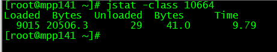
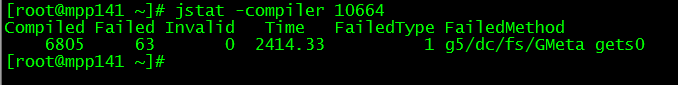
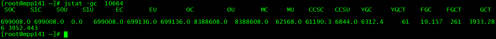
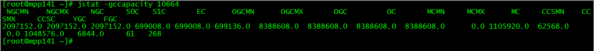
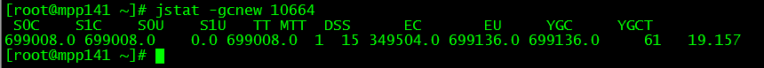
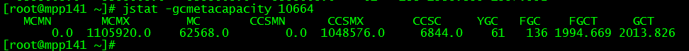
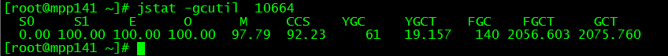

#  jstat命令查看jvm的GC情况 （以Linux为例）

 

 jstat命令可以查看堆内存各部分的使用量，以及加载类的数量。命令的格式如下：

 jstat [-命令选项] [vmid] [间隔时间/毫秒] [查询次数]

 **注意！！！：使用的jdk版本是jdk8.**

 

##   类加载统计：

　

- **Loaded:**加载class的数量
- **Bytes：**所占用空间大小
- **Unloaded：**未加载数量
- **Bytes:**未加载占用空间
- **Time：**时间

 

##   编译统计

　

- **Compiled：**编译数量。
- **Failed：**失败数量
- **Invalid：**不可用数量
- **Time：**时间
- **FailedType：**失败类型
- **FailedMethod：**失败的方法

 

##   垃圾回收统计

　

- **S0C：**第一个幸存区的大小
- **S1C：**第二个幸存区的大小
- **S0U：**第一个幸存区的使用大小
- **S1U：**第二个幸存区的使用大小
- **EC：**伊甸园区的大小
- **EU：**伊甸园区的使用大小
- **OC：**老年代大小
- **OU：**老年代使用大小
- **MC：**方法区大小
- **MU：**方法区使用大小
- **CCSC:**压缩类空间大小
- **CCSU:**压缩类空间使用大小
- **YGC：**年轻代垃圾回收次数
- **YGCT：**年轻代垃圾回收消耗时间
- **FGC：**老年代垃圾回收次数
- **FGCT：**老年代垃圾回收消耗时间
- **GCT：**垃圾回收消耗总时间

 

##   堆内存统计

　 

- **NGCMN：**新生代最小容量
- **NGCMX：**新生代最大容量
- **NGC：**当前新生代容量
- **S0C：**第一个幸存区大小
- **S1C：**第二个幸存区的大小
- **EC：**伊甸园区的大小
- **OGCMN：**老年代最小容量
- **OGCMX：**老年代最大容量
- **OGC：**当前老年代大小
- **OC:**当前老年代大小
- **MCMN:**最小元数据容量
- **MCMX：**最大元数据容量
- **MC：**当前元数据空间大小
- **CCSMN：**最小压缩类空间大小
- **CCSMX：**最大压缩类空间大小
- **CCSC：**当前压缩类空间大小
- **YGC：**年轻代gc次数
- **FGC：**老年代GC次数

 

##   新生代垃圾回收统计

　

- **S0C：**第一个幸存区大小
- **S1C：**第二个幸存区的大小
- **S0U：**第一个幸存区的使用大小
- **S1U：**第二个幸存区的使用大小
- **TT:**对象在新生代存活的次数
- **MTT:**对象在新生代存活的最大次数
- **DSS:**期望的幸存区大小
- **EC：**伊甸园区的大小
- **EU：**伊甸园区的使用大小
- **YGC：**年轻代垃圾回收次数
- **YGCT：**年轻代垃圾回收消耗时间

 

##   新生代内存统计

　

- **NGCMN：**新生代最小容量
- **NGCMX：**新生代最大容量
- **NGC：**当前新生代容量
- **S0CMX：**最大幸存1区大小
- **S0C：**当前幸存1区大小
- **S1CMX：**最大幸存2区大小
- **S1C：**当前幸存2区大小
- **ECMX：**最大伊甸园区大小
- **EC：**当前伊甸园区大小
- **YGC：**年轻代垃圾回收次数
- **FGC：**老年代回收次数

 

##   老年代垃圾回收统计

　

- **MC：**方法区大小
- **MU：**方法区使用大小
- **CCSC:**压缩类空间大小
- **CCSU:**压缩类空间使用大小
- **OC：**老年代大小
- **OU：**老年代使用大小
- **YGC：**年轻代垃圾回收次数
- **FGC：**老年代垃圾回收次数
- **FGCT：**老年代垃圾回收消耗时间
- **GCT：**垃圾回收消耗总时间

 

##  老年代内存统计

　

- **OGCMN：**老年代最小容量
- **OGCMX：**老年代最大容量
- **OGC：**当前老年代大小
- **OC：**老年代大小
- **YGC：**年轻代垃圾回收次数
- **FGC：**老年代垃圾回收次数
- **FGCT：**老年代垃圾回收消耗时间
- **GCT：**垃圾回收消耗总时间

 

##  元数据空间统计

　

- **MCMN:** 最小元数据容量
- **MCMX：**最大元数据容量
- **MC：**当前元数据空间大小
- **CCSMN：**最小压缩类空间大小
- **CCSMX：**最大压缩类空间大小
- **CCSC：**当前压缩类空间大小
- **YGC：**年轻代垃圾回收次数
- **FGC：**老年代垃圾回收次数
- **FGCT：**老年代垃圾回收消耗时间
- **GCT：**垃圾回收消耗总时间

 

##  总结垃圾回收统计

　

- **S0：**幸存1区当前使用比例
- **S1：**幸存2区当前使用比例
- **E：**伊甸园区使用比例
- **O：**老年代使用比例
- **M：**元数据区使用比例
- **CCS：**压缩使用比例
- **YGC：**年轻代垃圾回收次数
- **FGC：**老年代垃圾回收次数
- **FGCT：**老年代垃圾回收消耗时间
- **GCT：**垃圾回收消耗总时间

 

##  JVM编译方法统计

　

- **Compiled：**最近编译方法的数量
- **Size：**最近编译方法的字节码数量
- **Type：**最近编译方法的编译类型。
- **Method：**方法名标识。