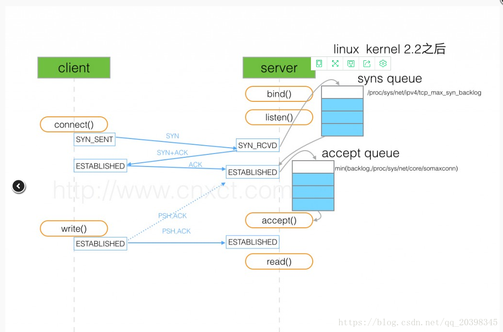
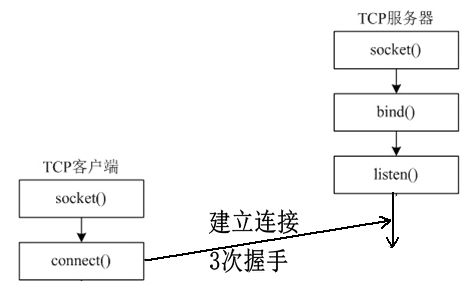
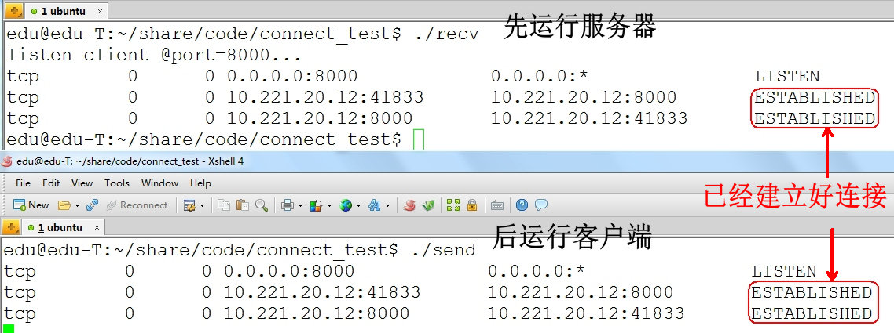
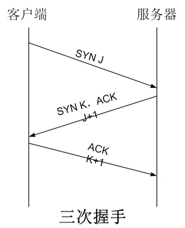
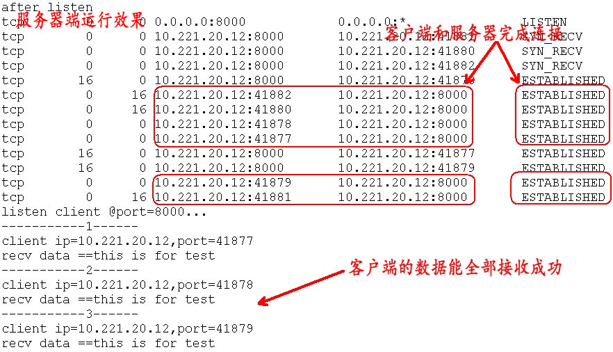
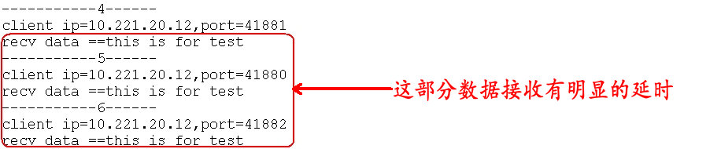
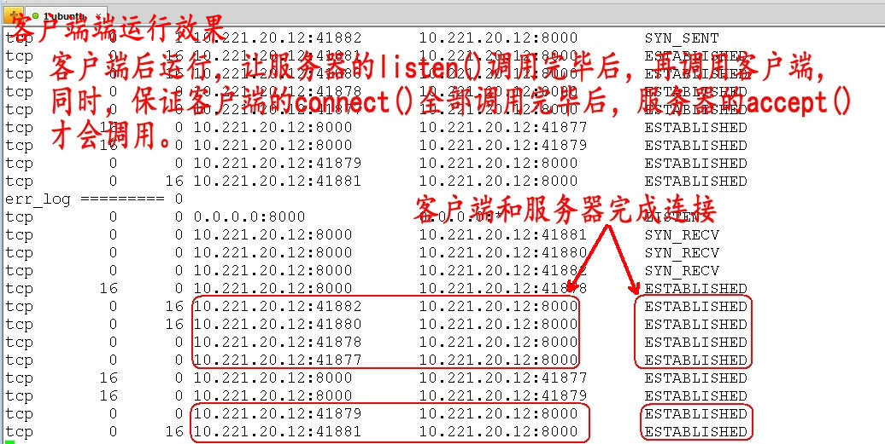
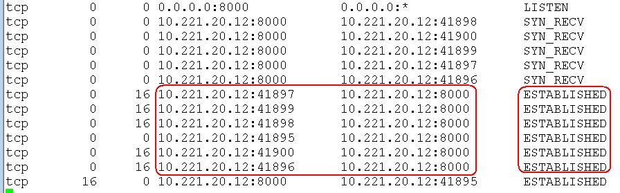

基于 TCP 的网络编程开发分为服务器端和客户端两部分，常见的核心步骤和流程如下：


# 连接详情：

# 

#  

# **connect()函数**

对于客户端的 **connect() 函数**，该函数的功能为客户端主动连接服务器，建立连接是通过[三次握手](http://blog.csdn.net/tennysonsky/article/details/45622395)，而**这个连接的过程是由内核完成**，不是这个函数完成的，这个函数的作用仅仅是通知 Linux 内核，让 **Linux 内核自动完成** **TCP 三次握手连接**（[三次握手详情，请看《浅谈 TCP 三次握手》](http://blog.csdn.net/tennysonsky/article/details/45622395)），最后把连接的结果返回给这个函数的返回值（成功连接为0， 失败为-1）。

 

通常的情况，客户端的 **connect() 函数默认会一直阻塞**，直到[三次握手](http://blog.csdn.net/tennysonsky/article/details/45622395)成功或超时失败才返回（正常的情况，这个过程很快完成）。

 

# listen()函数

对于服务器，它是被动连接的。举一个生活中的例子，通常的情况下，移动的客服（相当于服务器）是等待着客户（相当于客户端）电话的到来。而这个过程，需要调用listen()函数。

```cpp
#include<sys/socket.h>
int listen(int sockfd, int backlog);
```

listen() 函数的主要作用就是将套接字( sockfd )变成被动的连接监听套接字（被动等待客户端的连接），至于参数 backlog 的作用是设置内核中连接队列的长度（这个长度有什么用，后面做详细的解释），**TCP 三次握手也不是由这个函数完成，listen()的作用仅仅告诉内核一些信息。**

 

**这里需要注意的是**，**listen()函数不会阻塞**，它主要做的事情为，**将该套接字和套接字对应的连接队列长度告诉 Linux 内核**，然后，listen()函数就结束。

 

这样的话，当有一个客户端主动连接（connect()），Linux 内核就自动完成[TCP 三次握手](http://blog.csdn.net/tennysonsky/article/details/45622395)，将建立好的链接自动存储到队列中，如此重复。

 

所以，只要 TCP 服务器调用了 listen()，客户端就可以通过 connect() 和服务器建立连接，而**这个连接的过程是由内核完成**。



 

下面为测试的服务器和客户端代码，运行程序时，要先运行服务器，再运行客户端：

服务器：

```cpp
#include <stdio.h>
#include <stdlib.h>
#include <string.h>						
#include <unistd.h>
#include <sys/socket.h>
#include <netinet/in.h>
#include <arpa/inet.h>				
int main(int argc, char *argv[])
{
	unsigned short port = 8000;	
 
	int sockfd;
	sockfd = socket(AF_INET, SOCK_STREAM, 0);// 创建通信端点：套接字
	if(sockfd < 0)
	{
		perror("socket");
		exit(-1);
	}
	
	struct sockaddr_in my_addr;
	bzero(&my_addr, sizeof(my_addr));	     
	my_addr.sin_family = AF_INET;
	my_addr.sin_port   = htons(port);
	my_addr.sin_addr.s_addr = htonl(INADDR_ANY);
	
	int err_log = bind(sockfd, (struct sockaddr*)&my_addr, sizeof(my_addr));
	if( err_log != 0)
	{
		perror("binding");
		close(sockfd);		
		exit(-1);
	}
	
	err_log = listen(sockfd, 10);
	if(err_log != 0)
	{
		perror("listen");
		close(sockfd);		
		exit(-1);
	}	
	
	printf("listen client @port=%d...\n",port);
	
	sleep(10);	// 延时10s
 
	system("netstat -an | grep 8000");	// 查看连接状态
	
	return 0;
}
```

 

客户端：

```cpp
#include <stdio.h>
#include <unistd.h>
#include <string.h>
#include <stdlib.h>
#include <arpa/inet.h>
#include <sys/socket.h>
#include <netinet/in.h>
int main(int argc, char *argv[])
{
	unsigned short port = 8000;        		// 服务器的端口号
	char *server_ip = "10.221.20.12";    	// 服务器ip地址
 
	int sockfd;
	sockfd = socket(AF_INET, SOCK_STREAM, 0);// 创建通信端点：套接字
	if(sockfd < 0)
	{
		perror("socket");
		exit(-1);
	}
	
	struct sockaddr_in server_addr;
	bzero(&server_addr,sizeof(server_addr)); // 初始化服务器地址
	server_addr.sin_family = AF_INET;
	server_addr.sin_port = htons(port);
	inet_pton(AF_INET, server_ip, &server_addr.sin_addr);
    //server_addr.sin_addr.s_addr=inet_addr(server_ip);
	int err_log = connect(sockfd, (struct sockaddr*)&server_addr, sizeof(server_addr));      
    // 主动连接服务器
	if(err_log != 0)
	{
		perror("connect");
		close(sockfd);
		exit(-1);
	}
	
	system("netstat -an | grep 8000");	// 查看连接状态
	
	while(1);
 
	return 0;
}
```

**运行程序时，要先运行服务器，再运行客户端**，运行结果如下：


 

 

# 三次握手的连接队列

这里详细的介绍一下 listen() 函数的第二个参数（ **backlog**）的作用：**告诉内核连接队列的长度**。

 

为了更好的理解 backlog 参数，我们必须认识到内核为任何一个给定的监听套接口维护两个队列：

1、**未完成连接队列**（incomplete connection queue），每个这样的 SYN 分节对应其中一项：已由某个客户发出并到达服务器，而服务器正在等待完成相应的 TCP [三次握手](http://blog.csdn.net/tennysonsky/article/details/45622395)过程。这些套接口处于 **SYN_RCVD** 状态。


2、**已完成连接队列**（completed connection queue），每个已完成 TCP [三次握手](http://blog.csdn.net/tennysonsky/article/details/45622395)过程的客户对应其中一项。这些套接口处于 **ESTABLISHED** 状态。

 



 

 

当来自客户的 SYN 到达时，TCP 在未完成连接队列中创建一个新项，然后响应以三次握手的第二个分节：服务器的 SYN 响应，其中稍带对客户 SYN 的 ACK（即SYN+ACK），这一项一直保留在未完成连接队列中，直到三次握手的第三个分节（客户对服务器 SYN 的 ACK ）到达或者该项超时为止（曾经源自Berkeley的实现为这些未完成连接的项设置的超时值为75秒）。

 

**如果三次握手正常完成，该项就从未完成连接队列移到已完成连接队列的队尾**。

 

**backlog 参数**历史上被定义为上面两个队列的大小之和，大多数实现默认值为 5，当服务器把这个完成连接队列的某个连接取走后，这个队列的位置又空出一个，这样来回实现动态平衡，但在高并发 web 服务器中此值显然不够。

 

# accept()函数

**accept()函数**功能是，**从处于 established 状态的连接队列头部取出一个已经完成的连接**，如果这个队列没有已经完成的连接，accept()函数就**会阻塞，直到取出队列中已完成的用户连接为止**。

 

如果，服务器不能及时调用 accept() 取走队列中已完成的连接，队列满掉后会怎样呢？UNP（《unix网络编程》）告诉我们，服务器的连接队列满掉后，服务器不会对再对建立新连接的syn进行应答，所以客户端的 connect 就会返回 ETIMEDOUT。**但实际上Linux的并不是这样的！**

 

下面为测试代码，服务器 listen() 函数只指定队列长度为 2，客户端有 6 个不同的套接字主动连接服务器，同时，保证客户端的 6 个 connect()函数都先调用完毕，服务器的 accpet() 才开始调用。

 

服务器：

```cpp
#include <stdio.h>
#include <stdlib.h>
#include <string.h>						
#include <unistd.h>
#include <sys/socket.h>
#include <netinet/in.h>
#include <arpa/inet.h>	
			
int main(int argc, char *argv[])
{
	unsigned short port = 8000;			
	
	int sockfd = socket(AF_INET, SOCK_STREAM, 0);   
	if(sockfd < 0)
	{
		perror("socket");
		exit(-1);
	}
	
	struct sockaddr_in my_addr;
	bzero(&my_addr, sizeof(my_addr));	     
	my_addr.sin_family = AF_INET;
	my_addr.sin_port   = htons(port);
	my_addr.sin_addr.s_addr = htonl(INADDR_ANY);
	
	int err_log = bind(sockfd, (struct sockaddr*)&my_addr, sizeof(my_addr));
	if( err_log != 0)
	{
		perror("binding");
		close(sockfd);		
		exit(-1);
	}
	
	err_log = listen(sockfd, 2);	// 等待队列为2
	if(err_log != 0)
	{
		perror("listen");
		close(sockfd);		
		exit(-1);
	}	
	printf("after listen\n");
	
	sleep(20);	//延时 20秒
	
	printf("listen client @port=%d...\n",port);
 
	int i = 0;
	
	while(1)
	{	
	
		struct sockaddr_in client_addr;		   
		char cli_ip[INET_ADDRSTRLEN] = "";	   
		socklen_t cliaddr_len = sizeof(client_addr);    
		
		int connfd;
		connfd = accept(sockfd, (struct sockaddr*)&client_addr, &cliaddr_len);       
		if(connfd < 0)
		{
			perror("accept");
			continue;
		}
 
		inet_ntop(AF_INET, &client_addr.sin_addr, cli_ip, INET_ADDRSTRLEN);
		printf("-----------%d------\n", ++i);
		printf("client ip=%s,port=%d\n", cli_ip,ntohs(client_addr.sin_port));
		
		char recv_buf[512] = {0};
		while( recv(connfd, recv_buf, sizeof(recv_buf), 0) > 0 )
		{
			printf("recv data ==%s\n",recv_buf);
			break;
		}
		
		close(connfd);     //关闭已连接套接字
		//printf("client closed!\n");
	}
	close(sockfd);         //关闭监听套接字
	return 0;
}
```

 

客户端：

```cpp
#include <stdio.h>
#include <unistd.h>
#include <string.h>
#include <stdlib.h>
#include <arpa/inet.h>
#include <sys/socket.h>
#include <netinet/in.h>
 
void test_connect()
{
	unsigned short port = 8000;        		// 服务器的端口号
	char *server_ip = "10.221.20.12";    	// 服务器ip地址
	
	int sockfd;
	sockfd = socket(AF_INET, SOCK_STREAM, 0);// 创建通信端点：套接字
	if(sockfd < 0)
	{
		perror("socket");
		exit(-1);
	}
	
	struct sockaddr_in server_addr;
	bzero(&server_addr,sizeof(server_addr)); // 初始化服务器地址
	server_addr.sin_family = AF_INET;
	server_addr.sin_port = htons(port);
	inet_pton(AF_INET, server_ip, &server_addr.sin_addr);
	
	int err_log = connect(sockfd, (struct sockaddr*)&server_addr, sizeof(server_addr));      // 主动连接服务器
	if(err_log != 0)
	{
		perror("connect");
		close(sockfd);
		exit(-1);
	}
	
	printf("err_log ========= %d\n", err_log);
	
	char send_buf[100]="this is for test";
	send(sockfd, send_buf, strlen(send_buf), 0);   // 向服务器发送信息
	
	system("netstat -an | grep 8000");  // 查看连接状态
	
	//close(sockfd);
}
 
int main(int argc, char *argv[])
{
	pid_t pid;
	pid = fork();
	
	if(0 == pid){
 
		test_connect();		// 1
		
		pid_t pid = fork();
		if(0 == pid){
			test_connect();	// 2
		
		}else if(pid > 0){
			test_connect();	// 3
		}
		
	}else if(pid > 0){
		
		test_connect();	// 4
		
		pid_t pid = fork();
		if(0 == pid){
			test_connect();	// 5
		
		}else if(pid > 0){
			test_connect();	// 6
		}
	
	}
 
	while(1);
	
	return 0;
}
```

 

同样是先运行服务器，在运行客户端，服务器 accept()函数前延时了 20 秒， 保证了客户端的 connect() 全部调用完毕后再调用 accept(),运行结果如下：

服务器运行效果图：





 

客户端运行效果图：



 

按照 UNP 的说法，连接队列满后（这里设置长度为 2，发了 6 个连接），以后再调用 connect() 应该统统超时失败，但实际上测试结果是：有的 connect()立刻成功返回了，有的经过明显延迟后成功返回了。对于服务器 accpet() 函数也是这样的结果：有的立马成功返回，有的延迟后成功返回。

 

对于上面服务器的代码，我们把lisen()的第二个参数改为 0 的数，重新运行程序，发现：

客户端 connect() 全部返回连接成功（有些会延时）：



 

服务器 accpet() 函数却不能把连接队列的所有连接都取出来：


 

对于上面服务器的代码，我们把lisen()的第二个参数改为大于 6 的数(如 10)，重新运行程序，发现，客户端 connect() 立马返回连接成功， 服务器 accpet() 函数也立马返回成功。

 

**TCP 的连接队列满后，Linux 不会如书中所说的拒绝连接**，只是有些会延时连接，**而且**accept()未必能把已经建立好的连接全部取出来（如：当队列的长度指定为 0 ），写程序时服务器的 listen() 的第二个参数最好还是根据需要填写，写太大不好（具体可以看cat /proc/sys/net/core/somaxconn，默认最大值限制是 128），浪费资源，写太小也不好，延时建立连接。