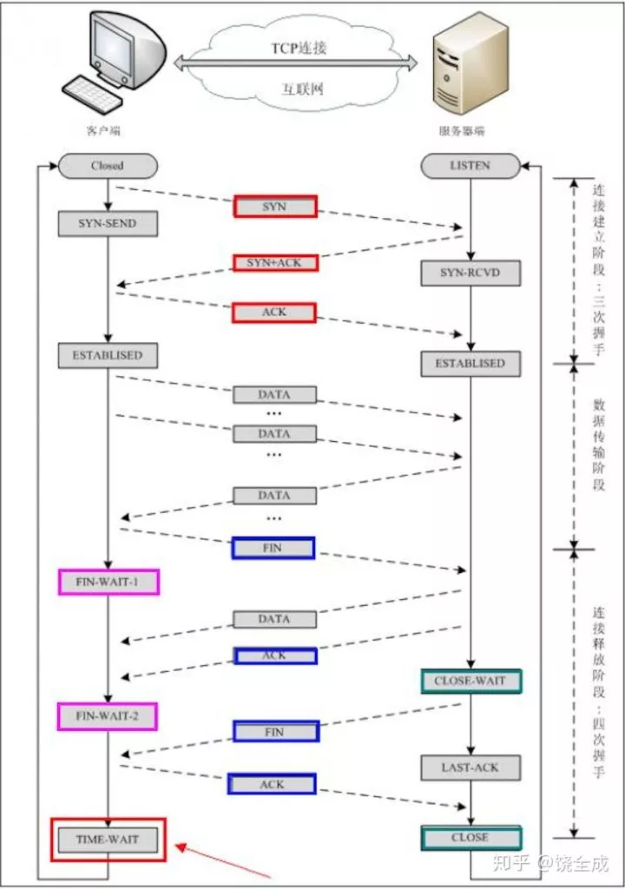
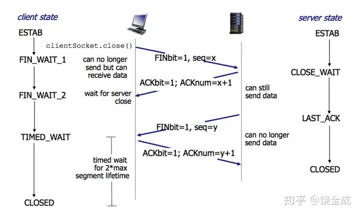

## 什么是“3次握手，4次挥手”

TCP是一种面向连接的单播协议，在发送数据前，通信双方必须在彼此间建立一条连接。所谓的“连接”，其实是客户端和服务器的内存里保存的一份关于对方的信息，如ip地址、端口号等。

TCP可以看成是一种字节流，它会处理IP层或以下的层的丢包、重复以及错误问题。在连接的建立过程中，双方需要交换一些连接的参数。这些参数可以放在TCP头部。

TCP提供了一种可靠、面向连接、字节流、传输层的服务，采用三次握手建立一个连接。采用4次挥手来关闭一个连接。

## TCP服务模型

在了解了建立连接、关闭连接的“三次握手和四次挥手”后，我们再来看下TCP相关的东西。

一个TCP连接由一个4元组构成，分别是两个IP地址和两个端口号。一个TCP连接通常分为三个阶段：启动、数据传输、退出（关闭）。

当TCP接收到另一端的数据时，它会发送一个确认，但这个确认不会立即发送，一般会延迟一会儿。ACK是累积的，一个确认字节号N的ACK表示所有直到N的字节（不包括N）已经成功被接收了。这样的好处是如果一个ACK丢失，很可能后续的ACK就足以确认前面的报文段了。

一个完整的TCP连接是双向和对称的，数据可以在两个方向上平等地流动。给上层应用程序提供一种`双工服务`。一旦建立了一个连接，这个连接的一个方向上的每个TCP报文段都包含了相反方向上的报文段的一个ACK。

序列号的作用是使得一个TCP接收端可丢弃重复的报文段，记录以杂乱次序到达的报文段。因为TCP使用IP来传输报文段，而IP不提供重复消除或者保证次序正确的功能。另一方面，TCP是一个字节流协议，绝不会以杂乱的次序给上层程序发送数据。因此TCP接收端会被迫先保持大序列号的数据不交给应用程序，直到缺失的小序列号的报文段被填满。

## TCP头部

源端口和目的端口在TCP层确定双方进程，序列号表示的是报文段数据中的第一个字节号，ACK表示确认号，该确认号的发送方期待接收的下一个序列号，即最后被成功接收的数据字节序列号加1，这个字段只有在ACK位被启用的时候才有效。

当新建一个连接时，从客户端发送到服务端的第一个报文段的SYN位被启用，这称为SYN报文段，这时序列号字段包含了在本次连接的这个方向上要使用的第一个序列号，即初始序列号`ISN`，之后发送的数据是ISN加1，因此SYN位字段会`消耗`一个序列号，这意味着使用重传进行可靠传输。而不消耗序列号的ACK则不是。

头部长度（图中的数据偏移）以32位字为单位，也就是以4bytes为单位，它只有4位，最大为15，因此头部最大长度为60字节，而其最小为5，也就是头部最小为20字节（可变选项为空）。

ACK —— 确认，使得确认号有效。 RST —— 重置连接（经常看到的reset by peer）就是此字段搞的鬼。 SYN —— 用于初如化一个连接的序列号。 FIN —— 该报文段的发送方已经结束向对方发送数据。

当一个连接被建立或被终止时，交换的报文段只包含TCP头部，而没有数据。

## 状态转换

三次握手和四次挥手的状态转换如下图。

## 为什么要“三次握手，四次挥手”

## 三次握手

换个易于理解的视角来看为什么要3次握手。

客户端和服务端通信前要进行连接，“3次握手”的作用就是`双方都能明确自己和对方的收、发能力是正常的`。

`第一次握手`：客户端发送网络包，服务端收到了。这样服务端就能得出结论：客户端的发送能力、服务端的接收能力是正常的。

`第二次握手`：服务端发包，客户端收到了。这样客户端就能得出结论：服务端的接收、发送能力，客户端的接收、发送能力是正常的。 从客户端的视角来看，我接到了服务端发送过来的响应数据包，说明服务端接收到了我在第一次握手时发送的网络包，并且成功发送了响应数据包，这就说明，服务端的接收、发送能力正常。而另一方面，我收到了服务端的响应数据包，说明我第一次发送的网络包成功到达服务端，这样，我自己的发送和接收能力也是正常的。

`第三次握手`：客户端发包，服务端收到了。这样服务端就能得出结论：客户端的接收、发送能力，服务端的发送、接收能力是正常的。 第一、二次握手后，服务端并不知道客户端的接收能力以及自己的发送能力是否正常。而在第三次握手时，服务端收到了客户端对第二次握手作的回应。从服务端的角度，我在第二次握手时的响应数据发送出去了，客户端接收到了。所以，我的发送能力是正常的。而客户端的接收能力也是正常的。

经历了上面的三次握手过程，客户端和服务端都确认了自己的接收、发送能力是正常的。之后就可以正常通信了。

每次都是接收到数据包的一方可以得到一些结论，发送的一方其实没有任何头绪。我虽然有发包的动作，但是我怎么知道我有没有发出去，而对方有没有接收到呢？

而从上面的过程可以看到，最少是需要三次握手过程的。两次达不到让双方都得出自己、对方的接收、发送能力都正常的结论。其实每次收到网络包的一方至少是可以得到：对方的发送、我方的接收是正常的。而每一步都是有关联的，下一次的“响应”是由于第一次的“请求”触发，因此每次握手其实是可以得到额外的结论的。比如第三次握手时，服务端收到数据包，表明看服务端只能得到客户端的发送能力、服务端的接收能力是正常的，但是结合第二次，说明服务端在第二次发送的响应包，客户端接收到了，并且作出了响应，从而得到额外的结论：客户端的接收、服务端的发送是正常的。

用表格总结一下：

## 四次挥手

TCP连接是双向传输的对等的模式，就是说双方都可以同时向对方发送或接收数据。当有一方要关闭连接时，会发送指令告知对方，我要关闭连接了。这时对方会回一个ACK，此时一个方向的连接关闭。但是另一个方向仍然可以继续传输数据，等到发送完了所有的数据后，会发送一个FIN段来关闭此方向上的连接。接收方发送ACK确认关闭连接。注意，接收到FIN报文的一方只能回复一个ACK, 它是无法马上返回对方一个FIN报文段的，因为结束数据传输的“指令”是上层应用层给出的，我只是一个“搬运工”，我无法了解`“上层的意志”`。

## “三次握手，四次挥手”怎么完成？

其实3次握手的目的并不只是让通信双方都了解到一个连接正在建立，还在于利用数据包的选项来传输特殊的信息，交换初始序列号ISN。

3次握手是指发送了3个报文段，4次挥手是指发送了4个报文段。注意，SYN和FIN段都是会利用重传进行可靠传输的。

## 三次握手

1. 客户端发送一个SYN段，并指明客户端的初始序列号，即ISN(c).
2. 服务端发送自己的SYN段作为应答，同样指明自己的ISN(s)。为了确认客户端的SYN，将ISN(c)+1作为ACK数值。这样，每发送一个SYN，序列号就会加1. 如果有丢失的情况，则会重传。
3. 为了确认服务器端的SYN，客户端将ISN(s)+1作为返回的ACK数值。

## 四次挥手

1. 客户端发送一个FIN段，并包含一个希望接收者看到的自己当前的序列号K. 同时还包含一个ACK表示确认对方最近一次发过来的数据。
2. 服务端将K值加1作为ACK序号值，表明收到了上一个包。这时上层的应用程序会被告知另一端发起了关闭操作，通常这将引起应用程序发起自己的关闭操作。
3. 服务端发起自己的FIN段，ACK=K+1, Seq=L 4. 客户端确认。ACK=L+1

## 为什么建立连接是三次握手，而关闭连接却是四次挥手呢？

这是因为服务端在LISTEN状态下，收到建立连接请求的SYN报文后，把ACK和SYN放在一个报文里发送给客户端。而关闭连接时，当收到对方的FIN报文时，仅仅表示对方不再发送数据了但是还能接收数据，己方是否现在关闭发送数据通道，需要上层应用来决定，因此，己方ACK和FIN一般都会分开发送。

[转载]：https://mp.weixin.qq.com/s/n0--UphB4SCFOU3k0cTyRw