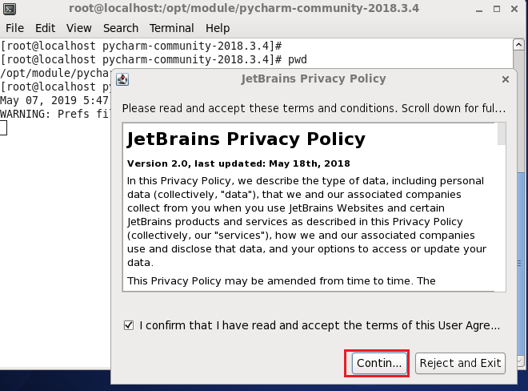
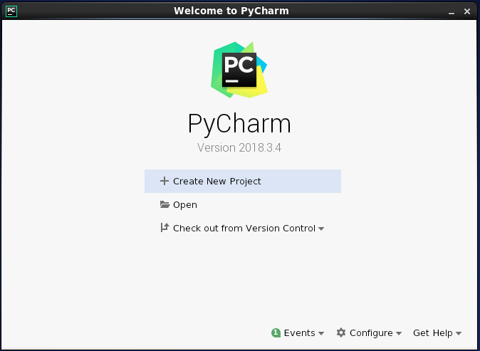
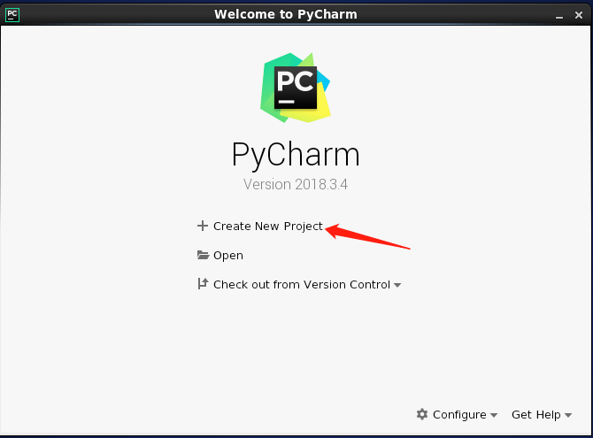
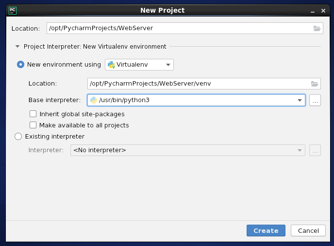
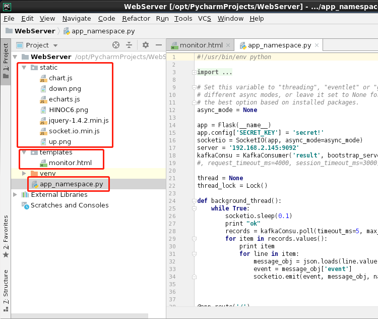

# 安装python3，virtualenv和Pycharm IDE

### 目录


[TOC]

### 1 安装linux虚拟机

- 在VMware上安装Linux系统(ISO镜像文件：CentOS-6.5-x86_64-bin-DVD1.iso)，安装过程参考“01_VM与Linux的安装.pdf”

### 2 配置linux虚拟机

- 进行网络配置、用户配置、主机名配置、关闭防火墙，参考“02_虚拟机配置.md”
- 安装VMware tools，参考“01_VM与Linux的安装  2.3 VMTools 安装 ”，安装完成后重启

### 3 安装python3

> 如果本机安装了python2，尽量不要管它，使用python3运行python脚本就好，因为可能有程序依赖目前的python2环境，比如yum，不要动现有的python2环境！

#### 3.1 安装gcc编译环境

- 没有gcc编译环境，执行./configure --prefix=/opt/module/python3时会报`no acceptable C compiler found in $PATH`

```
sudo yum install -y gcc
```

#### 3.2 安装依赖环境

```
sudo yum -y groupinstall "Development tools"
sudo yum -y install zlib-devel bzip2-devel openssl-devel ncurses-devel sqlite-devel readline-devel tk-devel gdbm-devel db4-devel libpcap-devel xz-devel
```

#### 3.3 下载Python3

```
[hinoc@localhost software]$ wget https://www.python.org/ftp/python/3.6.1/Python-3.6.1.tgz
[hinoc@localhost software]$ ll
total 22016
-rw-r--r--. 1 hinoc hadoop 22540566 Mar 21  2017 Python-3.6.1.tgz
```

##### 3.4 解压

```
[hinoc@localhost software]$ tar -zxvf Python-3.6.1.tgz -C /opt/module/
[hinoc@localhost module]$ ll
total 8
drwxr-xr-x. 17 hinoc hadoop 4096 May  7 16:12 Python-3.6.1
```

#### 3.5 安装

```
[hinoc@localhost module]$ mkdir /opt/module/python3
[hinoc@localhost Python-3.6.1]$ ./configure --prefix=/opt/module/python3/
[hinoc@localhost Python-3.6.1]$ make
[hinoc@localhost Python-3.6.1]$ make install
Installing collected packages: setuptools, pip
Successfully installed pip-9.0.1 setuptools-28.8.0
```

#### 3.6 更新pip到最新版本

```
[hinoc@localhost Python-3.6.1]$ pip3 install --upgrade pip
```

#### 3.7 创建软链接

```
[hinoc@localhost Python-3.6.1]$ sudo ln -s /opt/module/python3/bin/python3 /usr/bin/python3
[hinoc@localhost Python-3.6.1]$ sudo ln -s /opt/module/python3/bin/pip3 /usr/bin/pip3 
```

#### 3.8 测试

```
[hinoc@localhost Python-3.6.1]$ python3 -V
Python 3.6.1
[hinoc@localhost Python-3.6.1]$ python -V
Python 2.6.6
[hinoc@localhost Python-3.6.1]$ pip3 -V
pip 19.1.1 from /opt/module/python3/lib/python3.6/site-packages/pip (python 3.6)
```

### 4 安装virtualenv

```
[hinoc@localhost Python-3.6.1]$ pip3 install virtualenv
```

### 5 安装Pycharm

#### 5.1 下载Pycharm

```
网址：http://www.jetbrains.com/pycharm/download/#section=linux
安装包：pycharm-community-2018.3.4.tar.gz
```


#### 5.2 将安装包复制到/opt/software目录下

- 从Windows向Linux虚拟机传输文件可参考“02_虚拟机配置.md     7.3 导入JDK安装包”

#### 5.3 解压

```
[hinoc@localhost software]$ tar -zxvf pycharm-community-2018.3.4.tar.gz -C /opt/module/
```

#### 5.4 运行安装程序

##### 5.4.1 进入解压后的文件，运行pycharm.sh


##### 5.4.2 勾选同意，点击continue



##### 5.4.3 数据分享，点击Don’t send


##### 5.4.4 进入欢迎界面



##### 5.4.5 Pycharm启动方式

- 在图形界面下进入目录：/opt/module/pycharm-community-2018.3.4/bin
- 鼠标左键双击pycharm.sh,在弹出的对话框点击run


### 6 在Pycharm上构建flask web

#### 6.1 点击”Create New Project”



#### 6.2 项目环境设置，点击“Create”



#### 6.4 添加项目文件

```
[hinoc@hadoop201 opt]$ sudo chown -R hinoc:hadoop PycharmProjects/
```

- 红框内的文件为添加的项目文件



#### 6.5 添加modules

##### 6.5.1 点击File -> Settings


##### 6.5.2 点击Project Interpreter -> +


##### 6.5.3 输入包名，选择版本，点击Install Package


- 包列表：kafka, Flask, Flask-SocketIO