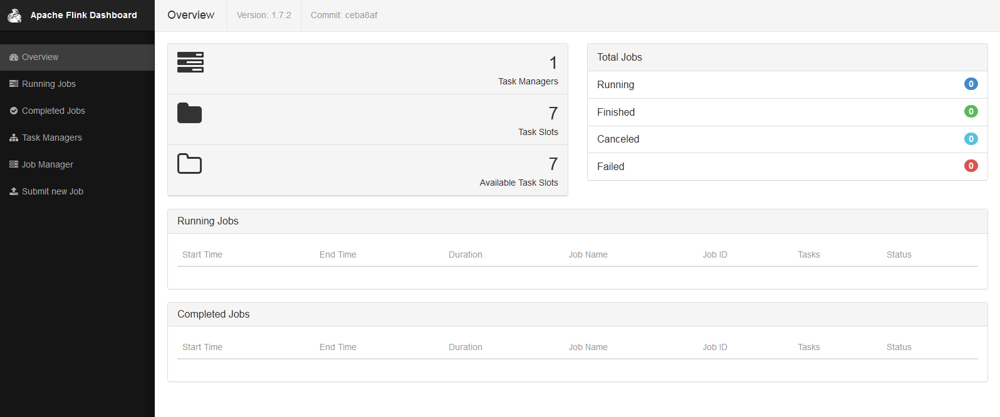

# Flink集群部署(standalone模式)

### 目录

[TOC]

### 1 安装JDK 1.8.x or higher

- 参考“02_虚拟机配置.md   7 安装JDK”

### 2 安装flink

#### 2.1 下载

- 下载地址 https://flink.apache.org/downloads.html#apache-flink-180


- 将flink-1.7.2-bin-hadoop27-scala_2.12.tgz复制到/opt/software目录下

#### 2.2 解压

```
[hinoc@hadoop201 software]$ tar -zxvf flink-1.7.2-bin-hadoop27-scala_2.12.tgz -C /opt/module/
```

#### 2.3 配置

##### 2.3.1 创建存放task manager临时文件的目录

```
[hinoc@hadoop201 flink-1.7.2]$ mkdir tmData
[hinoc@hadoop201 flink-1.7.2]$ cd tmData/
[hinoc@hadoop201 tmData]$ pwd
/opt/module/flink-1.7.2/tmData
```

##### 2.3.2 配置 flink-conf.yaml

```
[hinoc@hadoop201 conf]$ vi flink-conf.yaml 
# JobManager runs.
jobmanager.rpc.address: hadoop201

# The heap size for the JobManager JVM
jobmanager.heap.size: 1024m

# The heap size for the TaskManager JVM
taskmanager.heap.size: 1024m

#Specifies a list of directories into which Flink writes temporary files.
taskmanager.tmp.dirs: /opt/module/flink-1.7.2/tmData

# The number of task slots that each TaskManager offers. Each slot runs one parallel pipeline.
taskmanager.numberOfTaskSlots: 7

# The amount of memory going to the network stack.
taskmanager.network.memory.min: 64mb
taskmanager.network.memory.max: 1gb
```

##### 2.3.3 配置 masters, slaves，配置结果如下

```
[hinoc@hadoop201 conf]$ cat masters 
hadoop201:8081
[hinoc@hadoop201 conf]$ cat slaves 
hadoop201
```

##### 2.3.4  配置免密登录到hadoop201

- 参考 “02_虚拟机配置.md  5 配置ssh免密登陆”

#### 2.4 启动Flink

```
[hinoc@hadoop201 flink-1.7.2]$ ./bin/start-cluster.sh 
```

- 在浏览器地址栏输入`192.168.2.101:8081`，可以看到Flink集群运行状态：
