# Flink应用程序的编写、打包和运行

### 目录

[TOC]

### 1 在IntelliJ IDE中创建DataProcessingFlink项目

#### 1.1 创建项目

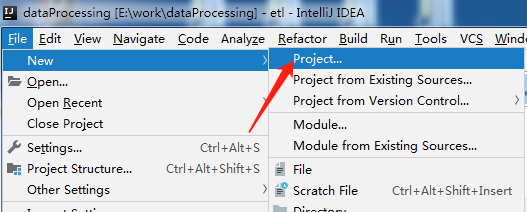

#### 1.2 项目类型

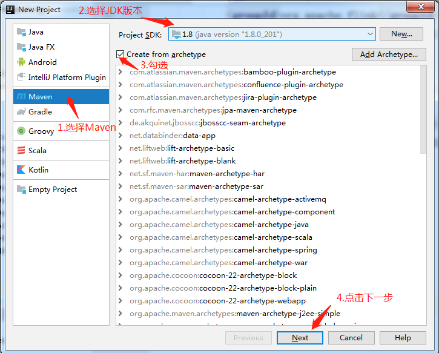

#### 1.3 项目名称

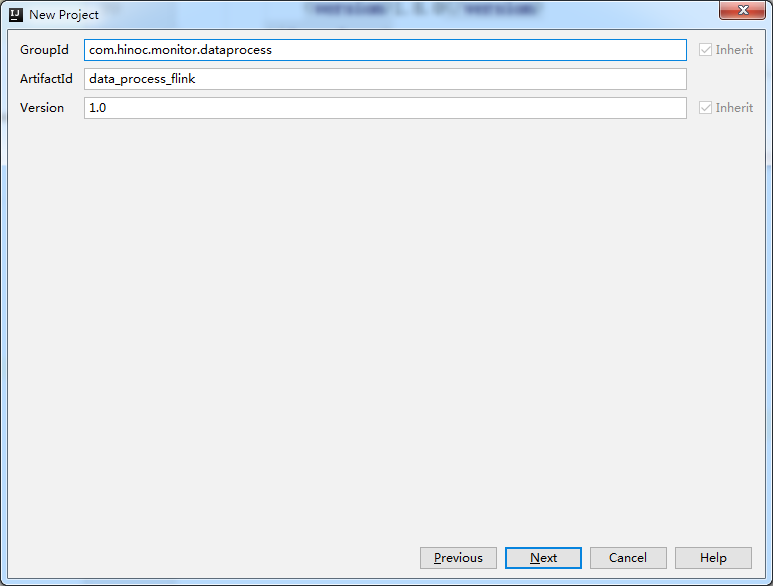

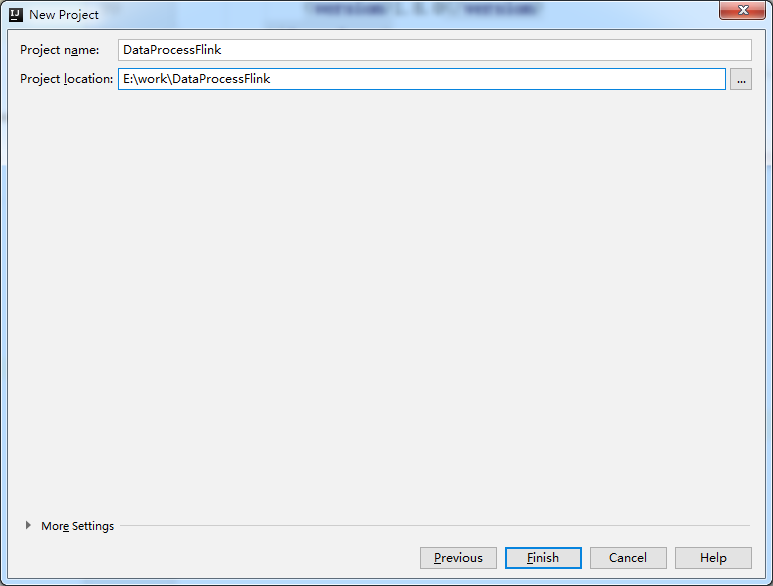

### 2 配置pom.xml

```
<?xml version="1.0" encoding="UTF-8"?>
<project xmlns="http://maven.apache.org/POM/4.0.0"
         xmlns:xsi="http://www.w3.org/2001/XMLSchema-instance"
         xsi:schemaLocation="http://maven.apache.org/POM/4.0.0 http://maven.apache.org/xsd/maven-4.0.0.xsd">
    <modelVersion>4.0.0</modelVersion>

    <groupId>com.hinoc.monitor.dataprocess</groupId>
    <artifactId>data_process_flink</artifactId>
    <version>1.0</version>

    <build>
        <sourceDirectory>src/main/java</sourceDirectory>
        <testSourceDirectory>src/test/java</testSourceDirectory>
        <plugins>
            <plugin>
                <!-- 指定maven编译的jdk版本,如果不指定,maven3默认用jdk 1.5 maven2默认用jdk1.3 -->
                <groupId>org.apache.maven.plugins</groupId>
                <artifactId>maven-compiler-plugin</artifactId>
                <configuration>
                    <!-- 一般而言，target与source是保持一致的，但是，有时候为了让程序能在其他版本的jdk中运行(对于低版本目标jdk，源代码中不能使用低版本jdk中不支持的语法)，会存在target不同于source的情况 -->
                    <source>1.8</source><!-- 源代码使用的JDK版本 -->
                    <target>1.8</target><!-- 需要生成的目标class文件的编译版本 -->
                    <encoding>UTF-8</encoding><!-- 字符集编码 -->
                </configuration>
            </plugin>
            <plugin>
                <!-- 打包（jar）插件，设定 MAINFEST .MF文件的参数 -->
                <groupId>org.apache.maven.plugins</groupId>
                <artifactId>maven-jar-plugin</artifactId>
                <configuration>
                    <archive>
                        <!-- 配置清单（MANIFEST）-->
                        <manifest>
                            <addClasspath>true</addClasspath><!-- 添加到classpath 开关 -->
                            <useUniqueVersions>false</useUniqueVersions><!-- 使用唯一版本 -->
                            <classpathPrefix>lib/</classpathPrefix><!-- classpath 前缀 -->
                            <mainClass>com.hinoc.monitor.dataprocess.EocCltMacRate</mainClass>
                        </manifest>
                    </archive>
                </configuration>
            </plugin>
            <plugin>
                <!-- 打包插件，生成可执行jar包 -->
                <groupId>org.apache.maven.plugins</groupId>
                <artifactId>maven-assembly-plugin</artifactId>
                <version>2.4.1</version>
                <configuration>
                    <!-- get all project dependencies -->
                    <descriptorRefs>
                        <descriptorRef>jar-with-dependencies</descriptorRef>
                    </descriptorRefs>
                    <!-- MainClass in mainfest make a executable jar -->
                    <archive>
                        <manifest>
                            <mainClass>com.hinoc.monitor.dataprocess.EocCltMacRate</mainClass>
                        </manifest>
                    </archive>
                </configuration>
                <executions>
                    <execution>
                        <id>make-assembly</id>
                        <phase>package</phase><!-- bind to the packaging phase -->
                        <goals>
                            <goal>single</goal><!-- 只运行一次 -->
                        </goals>
                    </execution>
                </executions>
            </plugin>
        </plugins>
    </build>

    <dependencies>
        <dependency>
            <!-- java语言单元测试框架 -->
            <groupId>junit</groupId>
            <artifactId>junit</artifactId>
            <version>4.4</version>
            <scope>test</scope>
        </dependency>
        <!-- https://mvnrepository.com/artifact/org.apache.flink/flink-java -->
        <dependency>
            <!-- Flink核心 -->
            <groupId>org.apache.flink</groupId>
            <artifactId>flink-java</artifactId>
            <version>1.8.0</version>
        </dependency>
        <dependency>
            <!-- Flink核心 -->
            <groupId>org.apache.flink</groupId>
            <artifactId>flink-streaming-java_2.11</artifactId>
            <version>1.8.0</version>
            <scope>compile</scope>
        </dependency>
        <!-- https://mvnrepository.com/artifact/org.apache.flink/flink-clients -->
        <dependency>
            <!-- Flink核心 -->
            <groupId>org.apache.flink</groupId>
            <artifactId>flink-clients_2.12</artifactId>
            <version>1.8.0</version>
        </dependency>
        <!-- https://mvnrepository.com/artifact/org.apache.flink/flink-connector-kafka-0.9 -->
        <dependency>
            <!-- kafka连接器 -->
            <groupId>org.apache.flink</groupId>
            <artifactId>flink-connector-kafka-0.9_2.12</artifactId>
            <version>1.8.0</version>
            <scope> compile</scope>
        </dependency>
        <dependency>
            <!-- JSON格式的支持 -->
            <groupId>com.alibaba</groupId>
            <artifactId>fastjson</artifactId>
            <version>1.2.47</version>
        </dependency>
    </dependencies>

</project>
```

### 3 创建package

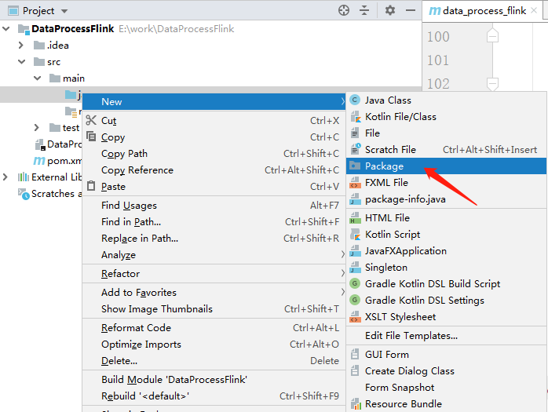


### 4 创建Class

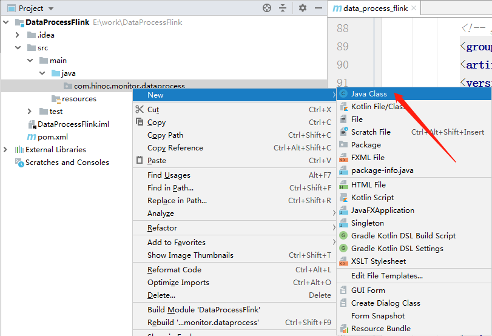

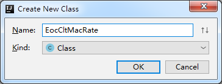

### 5 编写代码

```
package com.hinoc.monitor.dataprocess;

import com.alibaba.fastjson.JSONObject;
import org.apache.flink.api.common.functions.FlatMapFunction;
import org.apache.flink.api.common.serialization.SimpleStringSchema;
import org.apache.flink.api.java.utils.ParameterTool;
import org.apache.flink.streaming.api.datastream.DataStream;
import org.apache.flink.streaming.api.environment.StreamExecutionEnvironment;
import org.apache.flink.streaming.connectors.kafka.FlinkKafkaConsumer09;
import org.apache.flink.streaming.connectors.kafka.FlinkKafkaProducer09;
import org.apache.flink.util.Collector;

import java.util.Arrays;
import java.util.Properties;

//ok
public class EocCltMacRate {

    private static Integer macrate_up = 0;
    private static Integer macrate_down = 0;
    private static Integer count = 0;
    private static int curr_port = 0;
    private static int last_port = 0;

    public static void main(String[] args) throws Exception {

        // create execution environment
        StreamExecutionEnvironment env = StreamExecutionEnvironment.getExecutionEnvironment();

        String brokers;
        ParameterTool param = ParameterTool.fromArgs(args);
        brokers = param.get("bootstrap-server", "localhost:9092");

        System.out.println("bootstrap-server: " + brokers);
        Properties propertiesConsumer = new Properties();
        propertiesConsumer.setProperty("bootstrap.servers", brokers);
        propertiesConsumer.setProperty("group.id", "flink_consumer");
        FlinkKafkaConsumer09<String> consumer = new FlinkKafkaConsumer09<>("eocCltMacRate", new SimpleStringSchema(), propertiesConsumer);
        consumer.setStartFromEarliest();

        Properties propertiesProducer = new Properties();
        propertiesProducer.setProperty("bootstrap.servers", brokers);
        FlinkKafkaProducer09<String> producer = new FlinkKafkaProducer09<>("result", new SimpleStringSchema(), propertiesProducer);
        DataStream<String> stream = env.addSource(consumer);
        stream.flatMap(new FlatMapFunction<String, String>() {

            @Override
            public void flatMap(String s, Collector<String> collector) throws Exception {
                System.out.println(s);
                s = s.replaceAll("\n", "").replaceAll("\t", "");
                JSONObject json = JSONObject.parseObject(s);

                curr_port = json.getInteger("port");
                if(curr_port <= last_port && count != 0){
                    JSONObject macrate_resp = new JSONObject();
                    macrate_resp.put("event", "macrate");
                    macrate_resp.put("data", Arrays.asList(macrate_up / count, macrate_down / count));
                    System.out.println(macrate_resp.toJSONString());
                    collector.collect(macrate_resp.toJSONString());
                    macrate_up = 0;
                    macrate_down = 0;
                    count = 0;
                }

                for(Object o : json.getJSONObject("value").getJSONArray("List")){
                    JSONObject j = (JSONObject)o;
                    macrate_down += j.getInteger("Down-Rate");
                    macrate_up += j.getInteger("Up-Rate");
                    count++;
                }
                last_port = curr_port;
            }
        }).addSink(producer);

        env.execute("EocCltMacRate");
    }
}
```

### 6 本地运行Flink程序

#### 6.1 设置运行参数

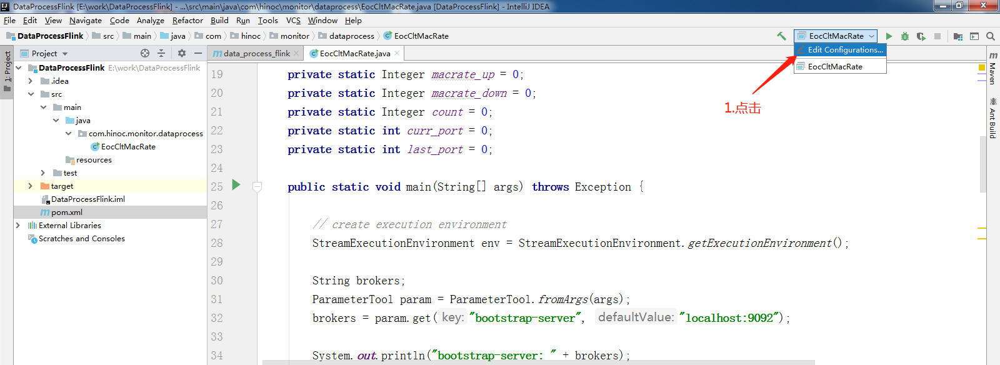

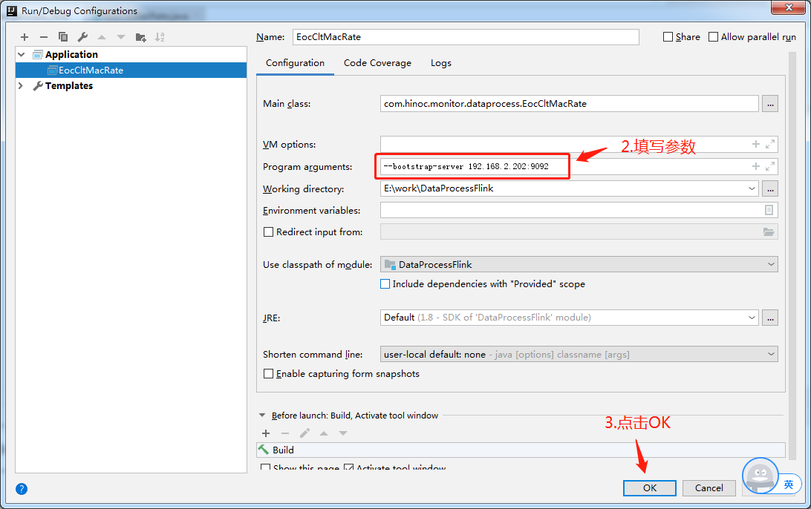

#### 6.2 点击运行

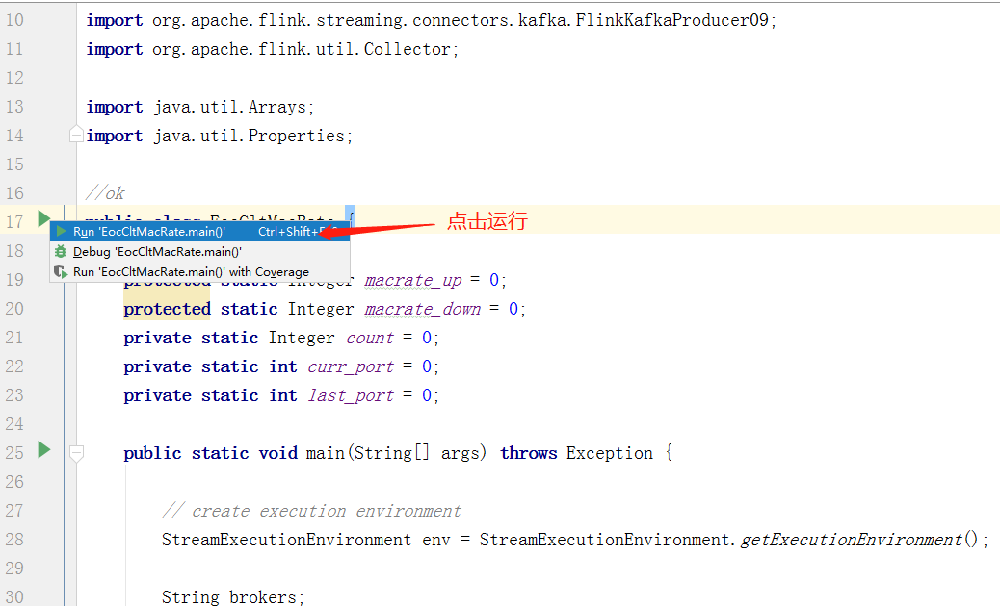

#### 6.3 运行成功


### 7 将任务提交到集群上运行

#### 7.1 启动Flink集群

```
[lxf@hadoop202 ~]$ /opt/module/flink-1.7.2/bin/start-cluster.sh 
```

#### 7.2 启动zookeeper和kafka

```
[lxf@hadoop202 ~]$ /opt/module/zookeeper-3.4.10/bin/zkServer.sh start
[lxf@hadoop202 ~]$ /opt/module/kafka_2.12-2.2.0/bin/kafka-server-start.sh /opt/module/kafka_2.12-2.2.0/config/server.properties
```

#### 7.3 启动数据采集程序，内含producer

```
[lxf@hadoop202 ~]$ /opt/module/agent/agent-pc
ifname:eth0
Socket init...ok!
oam_sdk_init...OK!
*********************************************************
*                                                       *
*       OAM Network Management Application              *
*                                                       *
*********************************************************
scan device...Add mac [00:00:00:00:01:01]

Network-1@HNSEMI> monitor on config.json 192.168.2.202:9092
```

#### 7.4 将程序打成JAR包

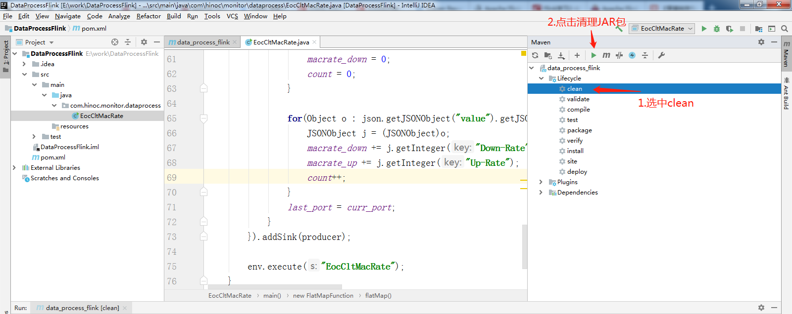

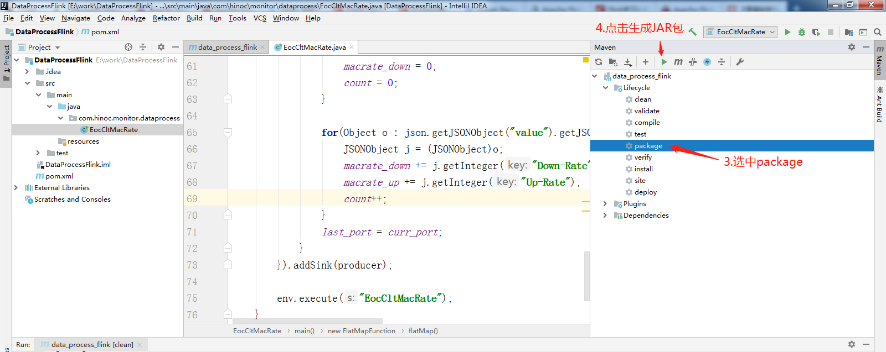

#### 7.5 将程序拷贝到hadoop202的/opt/module/DataProcessFlink目录下

- 拷贝方法参考 “02_虚拟机配置.md  7.3 导入JDK安装包”

#### 7.6 运行JAR包

```
[lxf@hadoop202 ~]$ /opt/module/flink-1.7.2/bin/flink run -c com.hinoc.monitor.dataprocess.EocCltMacRate /opt/module/DataProcessFlink/data_process_flink-1.0-jar-with-dependencies.jar -bootstrap-server 192.168.2.202:9092
```

#### 7.7 查看运行是否成功

```
//开启一个kafka consumer,如果Flink程序运行成功，result会有新的消息
[lxf@hadoop202 ~]$./bin/kafka-console-consumer.sh --bootstrap-server 192.168.2.202:9092 --topic result
```


